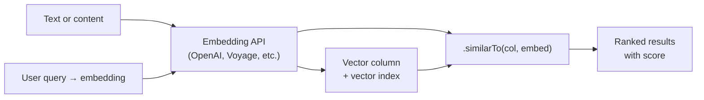

Semantic search asks *"what's like this?"* instead of *"what equals this?"* It works by turning text (or images, audio, anything you can embed) into numeric vectors and querying by **distance** — closest vectors are most similar. Cascade gives you the column type, the index, and the query method. Generating embeddings is your AI provider's job.

This guide walks the full path: declare a vector column with its index, generate embeddings, query with `.similarTo()`, and combine with regular filters. By the end you have semantic search running on your own data.

**Driver coverage.** In practice this is **Postgres + pgvector**. MongoDB supports vector search via **Atlas Vector Search** (`$vectorSearch`) — Cascade's `.similarTo()` works there too, but it requires an Atlas-managed cluster with a pre-created vector search index. Self-hosted MongoDB doesn't offer vector search at all.

## The workflow



Four moving parts: text in, embedding out, vector stored alongside its source row, query embedding compared against the stored vectors at read time.

## Step 1 — Declare the vector column

In your migration, declare a fixed-dimension vector column and attach its similarity index inline:

```ts
import { Migration, text, vector } from "@warlock.js/cascade";
import { Vector } from "../vector.model";

export default Migration.create(Vector, {
  content_id: text().notNullable(),
  content_type: text().notNullable(),
  embedding: vector(1536).notNullable().vectorIndex({
    similarity: "cosine",
  }),
});
```

What each piece does:

- **`vector(dim)`** declares a fixed-dimension vector column. The dimension must match the embedding model you'll use — OpenAI's `text-embedding-3-small` is 1536, Voyage's models vary, custom models pick their own. Pin it once and don't change it without a re-embedding plan.
- **`.vectorIndex({ similarity })`** chained on the column builds the similarity index inline. Without an index, similarity search does a sequential scan of every row — fine at 1k rows, dead at 1M.
- **`similarity`** picks the distance metric. Cascade supports `"cosine"` (most common for text embeddings — it's what OpenAI's models recommend), `"euclidean"` (L2 distance, for when magnitude matters), and `"dotProduct"` (inner product, when vectors are already normalised). Pick once per column; changing later means rebuilding the index.
- **`name`** lets you set an explicit index name; **`lists`** is a pgvector tuning knob for the cluster count (IVFFlat builds `lists`-many partitions). The defaults are fine for most apps — tune `lists` when you've grown past 100k rows and benchmarked.

:::tip — index creation cost at scale

For large initial seeds, vector index creation is expensive. If you're bulk-loading millions of rows from a backfill, declare the column without the index in the initial migration, load the data, then add the index in a follow-up migration. The cost is amortised instead of paid at every insert.

:::

## Step 2 — Generate embeddings

Cascade stores embeddings; it doesn't generate them. That's the AI provider's job — OpenAI, Voyage, Cohere, a local model, whatever you use. From Cascade's perspective, an embedding is just a `number[]` of the dimension you declared.

```ts
// pseudo-code — your real call goes through your AI module
const embedding: number[] = await aiProvider.embed(
  "how do I refund an order?",
);

await Vector.create({
  content_id: order.id,
  content_type: "order",
  embedding,
});
```

The embedding generation API and its cost story live in your AI module's docs. From here we assume you have a `number[]` ready to store or query against.

## Step 3 — Query with `.similarTo()`

```ts
const results = await Vector.query()
  .where({ organization_id: orgId, content_type: "order" })
  .similarTo("embedding", queryEmbedding)
  .limit(5)
  .get<VectorRow & { score: number }>();

// each result has a `.score` field — higher = more similar
```

What `.similarTo(column, embedding, alias?)` does, mechanically:

- **Adds a `score` field to the SELECT** — `1 - (column <=> embedding)` on Postgres, the Atlas-emitted score on MongoDB. Default alias is `"score"`; pass a third arg to rename it.
- **Adds an ORDER BY on the same expression** — this is what lets the database use the vector index instead of scoring every row. If you `.orderBy()` on the alias afterwards, you break index usage. Don't.
- **Cosine similarity returns 0 to 1**; higher means more similar. Euclidean gets transformed into the same 0-to-1 score by Cascade, so the same threshold logic applies regardless of metric.

`.limit()` is essentially required — vector search is built around *"top-K nearest"*. Without a limit you'll get every row in the table, sorted by distance. Pick a `limit` that fits your usage: 5 for a top-N recommendation, 50 for a candidate set you'll re-rank in the app.

## Step 4 — Combine with regular filters

The cheapest vector query narrows the candidate set with regular filters *before* the similarity scan kicks in:

```ts
// Narrow first, then rank
const matches = await Vector.query()
  .where("organization_id", orgId)      // filter — uses regular index
  .where("content_type", "summary")     // filter — uses regular index
  .similarTo("embedding", queryEmbedding)
  .limit(10)
  .get();
```

Filtering on indexed columns first lets the database eliminate non-matching rows entirely before the vector scan. The difference at scale is enormous — a 10M-row table with one tenant of 50k rows shouldn't pay to score the other 9.95M.

Treat filters as the cheap gate, `.similarTo()` as the expensive ranker. Always apply both when you can.

## Score thresholds

Sometimes you want *"things similar enough"* instead of *"top K"*. Cascade doesn't currently expose a query-level score filter — the recommended pattern is to over-fetch and filter in app code:

```ts
const candidates = await Vector.query()
  .where({ organization_id: orgId })
  .similarTo("embedding", queryEmbedding)
  .limit(50)
  .get<VectorRow & { score: number }>();

const close = candidates.filter(r => r.score > 0.75);
```

Pick a `limit` larger than your worst-case useful result count; trim by score in JS. The cost is the extra rows transferred over the wire, which is cheap compared to a second round-trip.

## A complete end-to-end example

Take a user's search query, embed it, run `.similarTo()` against a `Vector` table that mirrors your content, and hydrate the linked source records:

```ts
async function semanticSearch(query: string, orgId: string) {
  const queryEmbedding = await aiProvider.embed(query);

  // 1. Vector candidates, scoped to this org's summaries
  const hits = await Vector.query()
    .where({ organization_id: orgId, content_type: "summary" })
    .similarTo("embedding", queryEmbedding)
    .limit(10)
    .get<{ content_id: string; score: number }>();

  // 2. Filter by score threshold (app-level)
  const relevant = hits.filter(h => h.score > 0.70);
  if (relevant.length === 0) return [];

  // 3. Hydrate the actual source records
  const summaries = await Summary.whereIn(
    "id",
    relevant.map(h => h.content_id),
  ).get();

  // 4. Re-attach scores so the caller can sort/render them
  const scoreById = new Map(relevant.map(h => [h.content_id, h.score]));
  return summaries.map(s => ({
    summary: s,
    score: scoreById.get(s.id) ?? 0,
  }));
}
```

A few patterns worth noticing:

- The vector table stores `content_id` + `content_type`. That's enough to point back at the real row without coupling the vector index to a specific model.
- We over-fetch (limit 10) and filter by score in app code, which is the score-threshold pattern from above.
- We hydrate the actual `Summary` rows in a separate query. The vector table is light (id + score); the source table is where the rich data lives.

This separation keeps the vector index lean (a single dense table, easier to rebuild on embedding upgrades) and decouples the storage of embeddings from the storage of content.

## MongoDB Atlas note

`.similarTo()` works on MongoDB **only if** the cluster is Atlas and you've pre-created a vector search index named `${column}_index` (so for the snippets above, `embedding_index`). The query gets emitted as a `$vectorSearch` stage with `numCandidates` defaulted to 10× the `limit`.

Self-hosted MongoDB (community or enterprise without Atlas) does not have vector search — `.similarTo()` will throw `UnsupportedOperationError`. If you're on a non-Atlas Mongo and need vector search, you'll need to either move the embeddings to Postgres + pgvector or run a dedicated vector store alongside.

A dedicated MongoDB Atlas vector-search recipe is planned — it covers the index manifest, the embedding pipeline, and the `numCandidates` tuning knob in full.

## Going further

- **Embedding model selection and cost** — your AI module's docs
- **RAG patterns** (vector search + LLM completion) — RAG recipe
- **Hybrid search** (vector + full-text re-ranking) — hybrid search recipe
- **Index tuning** (`lists`, distance metrics, rebuilding without downtime) — migrations guide
