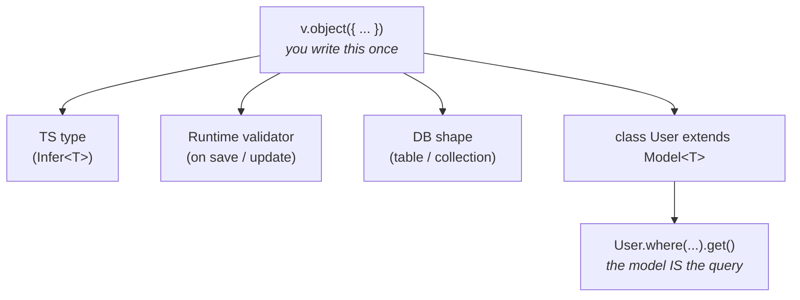

Most ORMs ask you to reach through something — a query builder, a client, a repository — before you can talk to your data. Cascade skips the middleman. `User.where("status", "active").get()` runs straight off the model. And the same schema definition you write once does triple duty: your TypeScript type, your runtime validator, and your database shape. One source of truth, three jobs.

This page shows what makes Cascade different in 30 seconds, the mental model that explains everything else, and points at what's *not* in scope so you know what you're signing up for.

## The 30-second look

```ts
import { Model, RegisterModel } from "@warlock.js/cascade";
import { v, type Infer } from "@warlock.js/seal";

// 1. Define the schema once — it's your type, validator, and DB shape.
const userSchema = v.object({
  name: v.string(),
  email: v.string().email(),
  status: v.enum(["active", "inactive"]).default("active"),
});

type UserSchema = Infer<typeof userSchema>;

// 2. Wrap it in a model. The class IS the query handle.
@RegisterModel()
export class User extends Model<UserSchema> {
  public static table = "users";
  public static schema = userSchema;
}

// 3. Write, then query — straight off the class, fully typed.
await User.create({ name: "Ada Lovelace", email: "ada@example.com" });

const activeUsers = await User.where("status", "active").get();
const first = activeUsers[0];

first.get("email"); // string — typed from your schema
first.id; // generated id, exposed directly
```

Three things to notice before we move on:

1. `userSchema` is your runtime validator. `UserSchema` is your TypeScript type. Same definition, no duplication — change a field once and both update.
2. `User.create(...)` and `User.where(...)` run *on the class*. No client to import, no repository to wire up, no query builder to instantiate. The model is the query entry point, and what comes back is typed against your schema.
3. The driver is configuration. Point Cascade at MongoDB or Postgres — that code block doesn't change.

## What you'll get

- **Models that query themselves.** Every model is its own query builder. `Model.where(...)`, `Model.first(...)`, `Model.paginate({...})` — all static, all typed.
- **One schema, three jobs.** A single `v.object` definition produces your TypeScript type (via `Infer`), your runtime validation on save and update, and your database shape.
- **Same code, MongoDB or Postgres.** The driver lives in configuration, not in your model files. Swap it without rewriting a single query.
- **Batteries on by default.** Soft delete, lifecycle events, dirty tracking, migrations, sync — all first-class. No plugin shopping.

## The mental model

The schema is the center. Everything else derives from it.



Three sentences for the diagram:

The schema is your single declaration of what a record looks like. Cascade derives the TypeScript type, applies the validator on every write, and uses the shape to drive table/collection definitions and migrations.

The class wraps the schema and inherits the query API. There's no separate `db.collection("users")` or `prisma.user` to hold onto — `User` itself is the handle to your data, statically typed against your schema.

Switching the driver is configuration, not code. Point Cascade at MongoDB or Postgres; the schema, the class, and every query you wrote against it stay exactly where they are.

## What Cascade is *not*

Three things worth being explicit about, so you know what you're signing up for:

- **Not a query DSL on top of an existing ORM.** Cascade is the data layer end-to-end — driver, models, migrations, query builder, all in one package. You're not bolting it onto Prisma or TypeORM.
- **Not schema-less.** The schema is mandatory and load-bearing. It's what powers types, validation, and migrations together. If you're looking for "just give me a thin client over MongoDB," that's not this.
- **Not framework-locked.** Cascade is a Warlock.js package, but it's a standalone ORM by design — the rest of Warlock isn't required. The decoupling is intentional, not incidental. Use Cascade in a Next.js app, a NestJS service, a plain Express server, a Bun script. Same package, same shape.

## Where to next

You've got the shape. Next stop is **[Installation](./02-installation.md)** — the five-minute path from zero to a project that loads Cascade.

If you'd rather see the query API up close first, jump ahead to **[Querying](../the-basics/02-querying.md)** in the essentials — it's the page that delivers on the model-as-query-builder promise above.
