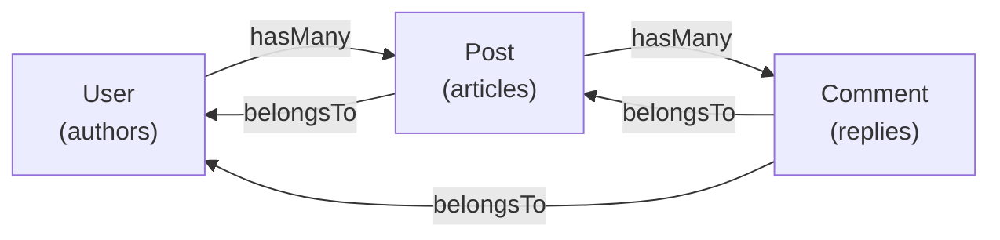

Querying one model is half the story. Real apps have models that *point at each other* — every post has an author, every author has many posts, every comment belongs somewhere. Cascade lets you declare those connections on the model class, load them efficiently, and query through them with the same vocabulary you already know.

This page introduces three models, walks the four relation types, shows the two ways to load related data, and surfaces the mental model that explains why `user.organization` looks like a property but isn't a column.

## Prerequisites

- A working `User` model (from [Your first model](../getting-started/05-your-first-model.md))
- Comfort with [`User.where(...)`](./02-querying.md) and the rest of the querying vocabulary
- Foreign key columns declared in your migrations (`author_id`, `post_id`, etc.) — see the [migrations intro](../getting-started/04-migrations-intro.md#foreign-keys--a-brief-taste) for the shape

## The cast

We need more than one model to talk about relationships. Meet **Post** (which an author writes) and **Comment** (which lives on a post):



Three models, four relations to declare. Cascade uses **TypeScript decorators on typed properties** for relations — the decorator names the relation type, the property name *is* the relation name, and the property's type tells TypeScript what to expect when the relation loads.

```ts
// src/app/posts/models/post/post.model.ts
import { lazy } from "@mongez/reinforcements";
import { BelongsTo, HasMany, Model, RegisterModel } from "@warlock.js/cascade";
import { v, type Infer } from "@warlock.js/seal";
import { Comment } from "app/comments/models/comment/comment.model";
import { User } from "app/users/models/user/user.model";

export const postSchema = v.object({
  title: v.string(),
  body: v.string(),
  author_id: v.string(),
});

type PostSchema = Infer<typeof postSchema>;

@RegisterModel()
export class Post extends Model<PostSchema> {
  public static table = "posts";
  public static schema = postSchema;

  @BelongsTo(lazy(() => User))
  public author?: User;

  @HasMany(lazy(() => Comment))
  public comments?: Comment[];
}
```

```ts
// src/app/comments/models/comment/comment.model.ts
import { lazy } from "@mongez/reinforcements";
import { BelongsTo, Model, RegisterModel } from "@warlock.js/cascade";
import { v, type Infer } from "@warlock.js/seal";
import { Post } from "app/posts/models/post/post.model";
import { User } from "app/users/models/user/user.model";

export const commentSchema = v.object({
  body: v.string(),
  post_id: v.string(),
  author_id: v.string(),
});

type CommentSchema = Infer<typeof commentSchema>;

@RegisterModel()
export class Comment extends Model<CommentSchema> {
  public static table = "comments";
  public static schema = commentSchema;

  @BelongsTo(lazy(() => Post))
  public post?: Post;

  @BelongsTo(lazy(() => User))
  public author?: User;
}
```

And the `User` from getting-started picks up the inverse — one new decorated property:

```ts
// src/app/users/models/user/user.model.ts (add)
import { lazy } from "@mongez/reinforcements";
import { HasMany } from "@warlock.js/cascade";
import { Post } from "app/posts/models/post/post.model";

// inside the User class:
@HasMany(lazy(() => Post), "author_id")
public posts?: Post[];
```

That `"author_id"` second argument is the foreign key column on `Post`. We pass it explicitly here because Post's FK column is named after its `author` relation, not after the `User` class. We'll explain when defaults match (and when they don't) under each relation type below.

The shape that matters across all three:

- **Decorator** — `@BelongsTo`, `@HasMany`, `@HasOne`, `@BelongsToMany` — names the relation type. The decorator hoists the relation metadata onto the class at load time; you don't write a separate `static relations = {...}` block.
- **Property name** — `author`, `comments`, `posts` — is the **relation name**. That's what `.with("author")`, `.has("posts", ">", 0)`, etc. reference. Renaming the property renames the relation.
- **Property type** — `User`, `Post[]`, `Comment[]` — is what your IDE autocompletes when the relation has been loaded. It's also what TypeScript checks the related model against.

### Three ways to point at the related model

Every relation decorator accepts the related model in one of **three forms**, and the choice has consequences:

| Form | Type-safe | Cycle-safe | When to reach for it |
| ---- | --------- | ---------- | -------------------- |
| `"Post"` (string) | ❌ | ✅ | Cross-package refs, or when the related class can't be imported at all |
| `Post` (direct class) | ✅ | ❌ | Cleanest — use when there's no import cycle between the two model files |
| `lazy(() => Post)` | ✅ | ✅ | The canonical answer for **circular imports** (User↔Organization, Post↔Comment) |

The `lazy()` form ships from `@mongez/reinforcements` and defers reading the class binding until query time — that sidesteps the ESM partial-load gotcha that breaks direct class refs when two modules import each other. Most real apps have at least one such cycle (a user is the author of posts, a post belongs to a user) so `lazy(() => Model)` is the form you'll see most often. Reach for the direct class when you can; reach for the string when you must.

The examples above all use `lazy()` because User, Post, and Comment all reference each other. Single-cycle-free relationships (Order belongs to Customer where Customer doesn't reference Order) can use the direct class.

## The four relation types

### `@BelongsTo` — "this model points at another"

The relation that owns the foreign key. `Post.author_id` points at `User.id`, so `Post belongsTo User`:

```ts
@BelongsTo(lazy(() => User))
public author?: User;
```

When you don't pass a foreign key, Cascade infers one. **For `@BelongsTo`, the default FK is the *property name* in snake_case + `_id`** — so an `author` property looks for `author_id` on this model. That's why the bare form works above: Post's schema has `author_id`, the property is named `author`, the default lines up.

When the column isn't named after the property — or you want to be explicit — pass it as the second argument:

```ts
@BelongsTo(lazy(() => Category), "category_id")
public parent?: Category;
```

Or as an options object when you need more control, like targeting a custom primary key on the related model:

```ts
@BelongsTo(lazy(() => User), { foreignKey: "author_id", ownerKey: "uuid" })
public author?: User;
```

`ownerKey` defaults to the related model's `static primaryKey ?? "id"`, so it only needs an override when you're pointing at a non-primary unique column. For composite keys, polymorphic relations, and custom resolution, see the [Relationships guide](../digging-deeper/relationships.md).

### `@HasMany` — "this model owns many of another"

The inverse of `@BelongsTo`. `User` has many `Post`s, so on the `User` side:

```ts
@HasMany(lazy(() => Post))
public posts?: Post[];
```

**For `@HasMany` (and `@HasOne`), the default FK is *this model's* class name in snake_case + `_id`** — so `User`'s `@HasMany(Post)` looks for `user_id` on Post. The asymmetry from `@BelongsTo` is real: `@BelongsTo` defaults are named after the *property*, `@HasMany`/`@HasOne` after *this* model. One side of the relationship is named for the role, the other for the entity.

In our example, Post's FK is `author_id` (matching its `author` belongsTo), not `user_id` — which is why `@HasMany(lazy(() => Post), "author_id")` above passes the FK explicitly. The bare form would look for `user_id` and silently return nothing. As a rule: when the property name on the *other* side matches *this* model's name, the bare form works. When it doesn't, pass the FK.

Pass it as a string for the bare case, or as `{ foreignKey, localKey }` when you need more control (`localKey` defaults to this model's `static primaryKey ?? "id"`).

### `@HasOne` — "this model owns exactly one of another"

Mechanically similar to `@HasMany`, but resolves to a single record instead of an array. Use it for one-to-one relationships where the other side owns the foreign key — `User hasOne Profile`, `Order hasOne Invoice`:

```ts
@HasOne(lazy(() => Profile))
public profile?: Profile;
```

Same default-FK convention as `@HasMany` — `{snake(thisModelName)}_id` on the related model. One small difference: `@HasOne` takes the options-object form only for overrides (`@HasOne(lazy(() => Profile), { foreignKey: "owner_id" })`), no string shorthand.

### `@BelongsToMany` — many-to-many through a pivot

When two models connect through a third table:

```ts
@BelongsToMany(lazy(() => Role))
public roles?: Role[];
```

Cascade **infers the pivot table name and columns** from the two model names — both sides resolve to the same pivot regardless of which side declares the relation:

- **Pivot table** — alphabetical snake-join of the two model names. `User` + `Role` → `role_user`. `User` + `Post` → `post_user`.
- **Pivot columns** — `<model_snake>_id` on each side. `role_id` and `user_id` in the example above.

That symmetry is load-bearing: declare `@BelongsToMany(Role)` on User and `@BelongsToMany(User)` on Role, and they automatically share the `role_user` pivot. No mismatched pivot names, no team coordination required.

When the convention doesn't match — your pivot is named `user_roles` (legacy schema, or you want plural names) or uses non-default columns — override with the options object:

```ts
@BelongsToMany(lazy(() => Role), {
  pivot: "user_roles",
  localKey: "user_id",
  foreignKey: "role_id",
})
public roles?: Role[];
```

`@BelongsToMany` relations come with **pivot operations** for managing membership. They all hang off `model.pivot(relation)`:

```ts
await user.pivot("roles").attach([adminId, editorId]);              // add (skip existing)
await user.pivot("roles").attach([adminId], { addedBy: currentUserId }); // + pivot columns
await user.pivot("roles").detach([editorId]);                       // remove subset
await user.pivot("roles").detach();                                 // remove all
await user.pivot("roles").sync([adminId]);                          // replace the whole set
await user.pivot("roles").toggle([adminId]);                        // flip each
```

`model.pivot(relation)` returns the pivot-operations object for that `@BelongsToMany` relation. The `.pivot("roles")` qualifier is deliberate — it keeps `model.pivot("roles").sync(...)` (set-replace on the join table) unambiguous against `Model.sync(...)`, which is the unrelated [denormalization-embed feature](../digging-deeper/sync.md). Passing a non-`@BelongsToMany` relation throws.

Extra pivot columns (timestamps, role metadata, ordering) and the deep mechanics earn their own coverage in the [Relationships guide](../digging-deeper/relationships.md).

## The four-layer mental model

Before we load anything, take a minute on this — it's the single most useful concept in the page.

A Cascade model instance has **four distinct places state can live**, and they have different APIs because they have different jobs:

| Layer | API | Lives where | Notes |
| ----- | --- | ----------- | ----- |
| **Schema columns** (persisted state) | `user.get("field")` / `.set()` / `.merge()` / `.unset()` | Internal data store, dirty-tracked | Mutations fire validation, events; dot-notation supported |
| **Universal ID convenience** | `user.id`, `user.uuid` | Built-in getters on `Model` | Ubiquitous, read-only, type-stable |
| **Developer-defined accessors** | `public get organizationId()` (you write the getter) | Manual on the class | Opt-in shortcut; still routes through `.get()` |
| **Loaded relations** | `user.posts`, `post.author` | Class instance properties, *not* in schema data | Hydrated instances, only present after `.with()` or `.load()` |

The key thing: **schema columns and loaded relations look similar but behave differently.**

```ts
user.get("name");      // column — lives in the model's tracked data
user.posts;            // a different model entirely, attached as a property
```

`user.posts` isn't a column on the user. It's an array of fully hydrated `Post` instances that Cascade stapled onto the user object after running a separate query. Set `user.posts = []` and nothing persists — it's not part of the user's data. Mutate `user.set("name", "x")` and dirty tracking kicks in — because `name` *is* part of the user's data.

That separation is why Cascade resists the urge to expose every schema field as a property accessor. Property assignments are invisible to grep, side-effect-free in JS, and would erase the distinction between "I changed a column" (write-back semantics) and "I attached related data" (no write-back). The current API surfaces the difference so the difference stays visible.

## Loading relations — `.with()`

Relations don't load by default. Fetch a user and `user.posts` is `undefined`. To get the posts alongside, ask for them:

```ts
const user = await User.query().with("posts").find(id);
user.posts; // Post[]
```

`.with("posts")` runs a separate, optimized query for the posts after fetching the user. No N+1 — Cascade batches related queries.

### Multiple relations

```ts
const user = await User.query().with("posts", "organization").find(id);
user.posts;         // Post[]
user.organization;  // Organization
```

Pass each relation name as a separate argument.

### Nested relations

```ts
const user = await User.query().with("posts.comments.author").find(id);
user.posts[0].comments[0].author; // User
```

Dot-notation walks down the relation graph. Cascade loads each level efficiently.

### Constraints on the related query

Sometimes you don't want *every* related record — you want *some* of them. Pass a callback that receives the related query builder:

```ts
const user = await User.query()
  .with("posts", (query) => {
    query.where("status", "published").orderBy("created_at", "desc").limit(5);
  })
  .find(id);
```

The callback gives you the same query API on the related model — `.where()`, `.orderBy()`, `.limit()`, the whole vocabulary. Use it for "load the 5 most recent published posts."

For multiple relations with different constraints, use the object form:

```ts
const user = await User.query()
  .with({
    posts: (q) => q.where("status", "published"),
    organization: true,                          // no constraint
    roles: (q) => q.orderBy("priority"),
  })
  .find(id);
```

## Loading relations — `.joinWith()`

`.with()` runs separate queries. That's the right default — it's safe, it works for every relation type, and it doesn't blow up the row shape.

But for `belongsTo` and `hasOne` relations specifically, where the related record is a single thing, you can sometimes save a round trip by JOINing instead:

```ts
const post = await Post.joinWith("author").first();
post.author; // User model instance — pulled in via JOIN
```

`.joinWith()` uses `LEFT JOIN` on SQL or `$lookup` on MongoDB, single query, related data hydrated into a proper model instance.

### When to reach for which

| Situation | Use |
| --------- | --- |
| `hasMany` relations | `.with()` — JOINing would multiply the row count |
| `belongsToMany` relations | `.with()` — same reason |
| `belongsTo` or `hasOne`, want a round-trip optimization | `.joinWith()` |
| Loading nested relations (`posts.comments.author`) | `.with()` with dot-notation |
| You need a constraint callback on the related query | `.with(rel, cb)` — `.joinWith()` doesn't take constraint callbacks |
| You're not sure | Start with `.with()`. Measure if it matters. |

### Lazy loading after fetch — `.load()`

What if you've already fetched the user without relations, and now you decide you want the posts?

```ts
const user = await User.first();
await user.load("posts");
user.posts; // Post[]
```

`.load()` is the lazy equivalent of `.with()` — same arguments, same behavior, but runs after the fact instead of as part of the original query.

Useful sparingly — if you know up front you'll need the relation, prefer `.with()` so the loading happens in one go. `.load()` is for the cases where the need only becomes clear later (conditional logic, optional enrichment).

### Helpers around loading

A few short ones worth knowing:

```ts
user.isLoaded("posts");        // boolean — has it been loaded?
user.getRelation("posts");     // safe accessor for the loaded relation (or undefined)
```

These exist for the times when you can't trust your code path — middleware, conditional branches, debugging output. Most of the time, `user.posts` is exactly the property you want.

## Querying through relations

The query builder has methods that work *because* relations are declared. You can filter parents by what their children look like.

### `.has()` — "rows with at least one related record"

```ts
const usersWithPosts = await User.query().has("posts").get();
```

Returns only users who have at least one post. Skips users with empty `posts`.

You can also constrain by count:

```ts
const prolificUsers = await User.query().has("posts", ">=", 5).get();
```

### `.whereHas()` — "rows where the related records match conditions"

When `.has()` isn't enough — you don't just want "users with posts," you want "users with *published* posts":

```ts
const users = await User.query()
  .whereHas("posts", (query) => {
    query.where("status", "published");
  })
  .get();
```

The callback gives you the query builder on the *related* model. Use the full query vocabulary inside.

### `.doesntHave()` / `.whereDoesntHave()`

The inverses — "users without posts" or "users without published posts":

```ts
const inactive = await User.query().doesntHave("posts").get();

const drafters = await User.query()
  .whereDoesntHave("posts", (q) => q.where("status", "published"))
  .get();
```

### `.withCount()` — count without loading

Sometimes you want *how many* related records each row has, not the records themselves:

```ts
const users = await User.query().withCount("posts").get();
users[0].postsCount; // number
```

Cascade adds a virtual `{relation}Count` field on each result. Cheaper than `.with()` when you only need the size.

## Recap

- **Four relation decorators**: `@BelongsTo`, `@HasMany`, `@HasOne`, `@BelongsToMany` — placed on typed properties; the property name is the relation name
- **Three model-ref forms**: string `"Post"` (cycle-safe), direct class `Post` (type-safe, no cycle), `lazy(() => Post)` (both — canonical for circular imports)
- **The four-layer model**: schema columns (`.get`/`.set`), universal getters (`.id`), developer accessors, and loaded relations — same model instance, different state lives in different places, different APIs
- **Eager load with `.with(relation)`** — separate query, works for every relation type, supports nested (`posts.comments.author`) and constrained (`(q) => q.where(...)`) forms
- **JOIN-load with `.joinWith()`** — single-query optimization for `@BelongsTo` and `@HasOne` only
- **Lazy load with `.load()`** after fetching — same shape as `.with()`, runs later
- **Query through relations** with `.has()`, `.whereHas()`, `.doesntHave()`, `.whereDoesntHave()`, `.withCount()`
- **Pivot operations** for `@BelongsToMany`: `model.pivot(rel).attach/detach/sync/toggle(ids)` — one accessor, disambiguated from `Model.sync()`

## Where to next

Congratulations — you've finished the **junior path**. You can model your data, write it, query it, relate models to each other, and shape what goes out over HTTP. That's a feature-shippable surface against any Cascade-backed database.

From here, the docs split by interest:

- **Tune behavior**: the **Digging Deeper** section covers validation, delete strategies, events & hooks, resources, scopes, dirty tracking, transactions, and more — pick by topic in the sidebar
- **Solve specific problems**: the **Recipes** section is task-shaped — "build a paginated search," "audit trail via events," "multi-tenant scoping"
- **Reach for power tools**: [Joins](../digging-deeper/joins.md), [Aggregates](../digging-deeper/aggregates.md), [JSON fields](../digging-deeper/json-fields.md), [Vector search](../digging-deeper/vector-search.md), [Expressions](../digging-deeper/expressions.md), and the [Query Builder API reference](../reference/query-builder-api.md)
- **Look up a method**: the **Reference** section gives you the flat API surface for `Model`, the query builder, and relations

## Going further

- **Polymorphic relations, custom keys, composite foreign keys, deferred constraints**: [Relationships guide](../digging-deeper/relationships.md)
- **`belongsToMany` deep dive** — pivot extras, syncing membership, pivot timestamps: [Relationships guide](../digging-deeper/relationships.md)
- **N+1 detection and debugging**: [Relationships guide](../digging-deeper/relationships.md)
- **Resources composing across loaded relations**: [Resources guide](../the-basics/resources.md)
