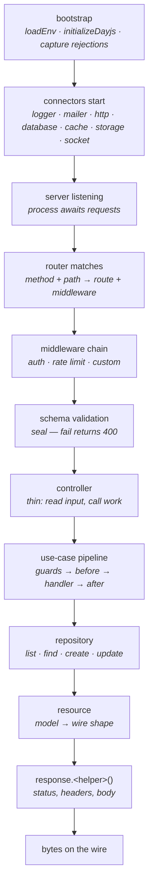

Knowing the lifecycle is knowing Warlock. Every other primitive — controllers, use-cases, repositories, resources — lives at a specific point on this spine. Once you can picture the spine, you can place anything new on it without thinking.

This page walks the journey end-to-end: from `yarn dev` to a JSON body landing in a browser. We'll keep the prose tight and lean on the diagram for the shape.

## The spine



The arrows go one way. A repository never calls a service. A resource never fetches data. If you find yourself wanting to reverse a step, you've probably picked the wrong layer.

## Phase 1 — Bootstrap

Before any subsystem starts, the framework runs a tiny prelude:

```ts title="bootstrap() — the prelude"
export async function bootstrap() {
  await loadEnv();

  initializeDayjs();
  captureAnyUnhandledRejection();
}
```

Three things happen:

1. **`loadEnv`** reads `.env`, `.env.<environment>`, and any local overrides into `process.env`. Every later step assumes env is already loaded.
2. **`initializeDayjs`** wires the time library's plugins (relative time, timezone, UTC). Models that store dates rely on this happening before any record is fetched.
3. **`captureAnyUnhandledRejection`** hooks unhandled promise rejections into the framework logger so a forgotten `await` in your code lands in your log stream instead of vanishing.

You never call `bootstrap()` directly. The CLI does it before importing your app.

## Phase 2 — Connectors

A *connector* is the framework's word for a subsystem that has a lifecycle (connect, restart, shutdown). Each ships with a priority so they start in the right order:

| Priority | Connector       | Lifecycle phase | Why this order                                                  |
| -------- | --------------- | --------------- | --------------------------------------------------------------- |
| 0        | logger          | early           | Everything else logs                                            |
| 1        | mailer          | early           | Other connectors may queue startup emails                       |
| 2        | database        | early           | Models register at import time and need the connection ready    |
| 3        | herald          | early           | Message broker (queues, event fan-out); up before app code      |
| 4        | cache           | early           | Repositories cache lookups; needs to exist before they're used  |
| 5        | http            | late            | Reads the router; only safe after `routes.ts` is imported       |
| 6        | storage         | early           | Apps reference storage at import time                           |
| 7        | socket          | late            | Wraps http's Fastify instance after it's been created           |
| 8        | notifications   | early           | Wires `@warlock.js/notifications` from its config (lazy import)  |
| 9        | access          | early           | Wires `@warlock.js/access`; fails fast on a bad auth config      |

Each connector boots in two halves around your app code:

- **Early phase** runs first: logger, mailer, database, herald, cache, storage, notifications, access. These are services your code needs *at import time* — a model registers itself against the database connection when its file loads.
- **App code imports** — `src/app/**/main.ts`, every `routes.ts`, every `events.ts`. Models, routes, and event listeners are all registered now.
- **Late phase** runs second: http and socket. Both read state your code just registered; http scans the router, socket reads http's listening server.

If you ever see a "model not registered" or "no routes" error at boot, you're almost certainly looking at a connector that ran before the code it depends on. Check the lifecycle phase.

## Phase 3 — The request lands

Once http is listening, every incoming request follows the same path. Here's what happens between Fastify's accept and `response.success(...)` writing bytes.

### Step 1 — Router match

Fastify hands the incoming request to Warlock's wildcard handler, which delegates to the router. The router finds the route by method + path, extracts URL params (`:id` → `request.params.id`), and attaches the route to the request object.

If no route matches, Warlock returns a 404 immediately — no middleware, no controller, no logging beyond an info line.

### Step 2 — Middleware chain

The route carries a `middleware` array (from `router.group({ middleware }, ...)`, the `guarded(...)` helper, or per-route options). They run in array order, each receiving the same `request` and `response`:

```ts
const authMiddleware: Middleware = async (request, response) => {
  const token = request.accessToken;

  if (!token) {
    return response.unauthorized({ error: "auth.tokenRequired" });
  }

  request.user = await loadUserFromToken(token);
  // returning nothing → continue to next middleware
};
```

Two return contracts:

- **Return nothing (or `undefined`)** → the next middleware runs.
- **Return a response** (from `response.<helper>()`) → the chain halts and the response is sent. The controller never runs.

This is how `authMiddleware`, rate limiting, and CORS preflight short-circuit when the request doesn't pass their check.

### Step 3 — Schema validation

If the route's handler has `handler.validation = { schema }`, the framework runs `v.validate(schema, data)` against the request body + query. By default it does **not** include URL params — pass `validating: ["body", "query", "params"]` to include them.

On failure, the framework calls `response.failedSchema(result)`, which sends a 400 with the configured error envelope:

```json
{
  "errors": [
    { "input": "email", "error": "Email is required" },
    { "input": "password", "error": "Password must be at least 8 characters" }
  ]
}
```

The controller never runs. On success, the validated data is stored on the request and is available via `request.validated()`.

### Step 4 — Controller

Now the handler runs. The controller is *thin*: read inputs, call work, return through `response.<helper>(...)`. No business logic, no database queries.

```ts
export const createFaqController: RequestHandler = async (
  request: CreateFaqRequest,
  response,
) => {
  const faq = await createFaqService({
    ...request.validated(),
    organization_id: request.user.organizationId,
    created_by: request.user.uuid,
  });

  return response.success({ faq });
};
```

For anything beyond a one-call delegation, the controller hands off to a use-case.

### Step 5 — Use-case pipeline

A use-case is the framework's structured pipeline for a unit of business work. The order is fixed: **guards → schema validation → before → handler → after**. Each phase can enrich a shared `ctx` object that all later phases read.

```ts
const placeOrder = useCase<Order, PlaceOrderInput>({
  name: "orders.place",
  guards: [authGuard, hasActiveSubscription],
  schema: placeOrderSchema,
  before: [normalizeAddress, calculateTax],
  handler: async (data, ctx) => orderService.place(data, ctx.currentUser),
  after: [sendConfirmationEmail, refreshAnalytics],
  retries: { count: 2, delay: 500 },
});
```

Guards throw to abort. Before middleware transforms. The handler does the work. After middleware runs on success, fire-and-forget — its errors are logged but never re-thrown.

Use-cases are also transport-agnostic — a queue worker, CLI command, or another use-case can call the same `placeOrder(input)` you call from the controller.

### Step 6 — Repository

The handler (or service it called) reaches for the repository to read or write data. Repositories own filtering, pagination, and caching:

```ts
const { data: faqs, pagination } = await faqsRepository.listCached({
  organization_id: ctx.currentUser.organizationId,
  page: 1,
  limit: 20,
});
```

The `listCached` variant checks the cache first; on miss it queries, then writes back. Plain `list()` always hits the database. Both return the same `{ data, pagination }` shape.

### Step 7 — Resource

The result needs shaping for the wire. Resources are pure output mappers — model field → wire field, with optional cast (date, localized, nested resource):

```ts
export const FaqResource = defineResource({
  schema: {
    id: "string",
    question: "object",
    answer: "object",
    created_by: "string",
    last_summarized_at: "date",
  },
});
```

A model's `toJSON()` runs the resource automatically when the response serializes it — you almost never call `new FaqResource(faq).toJSON()` by hand. The framework does it for you on the way out.

### Step 8 — Response

The controller returns `response.success(payload)` (or `successCreate`, `notFound`, `badRequest`, …). The matching helper carries the status code and sends the JSON body. Streaming, SSE, file downloads, and React-rendered HTML all go through the same `Response` object — see [`guides/http-response.md`](../the-basics/http-response.md) for the full surface.

## Where errors live

```mermaid
flowchart LR
    request[request] --> middleware
    middleware --> schema[schema validation]
    schema --> controller
    controller --> handler
    handler --> result[response]

    middleware -. fails .-> mw_err[middleware returns 4xx<br/>chain halts]
    schema -. fails .-> schema_err[400 with errors[]]
    controller -. throws .-> http_err[HttpError → status + payload]
    controller -. throws .-> unknown_err[unknown → 500]
    handler -. throws .-> http_err
```

Five distinct error paths, each handled differently:

| Where it fails               | What happens                                                                      |
| ---------------------------- | --------------------------------------------------------------------------------- |
| Middleware returns 4xx       | Response sent, chain halts, controller never runs                                 |
| Schema validation fails      | Framework sends 400 with `{ errors: [{ input, error }] }`. Controller never runs. |
| Controller throws `HttpError`| Status code + payload from the error class (e.g. `ForbiddenError` → 403)          |
| Controller throws `Error`    | 500 with a generic body; full stack lands in the logger                           |
| Use-case `*-ing` event throws| Pipeline aborts; same propagation as a controller throw                           |

The framework's catch-all sits at the outer request handler in `router.handleRoute`. If a controller throws an `HttpError` subclass (`BadRequestError`, `ResourceNotFoundError`, `ForbiddenError`, `ConflictError`, `ServerError`), the framework maps it to the right status code. Throwing a plain `Error` becomes a 500.

The general rule: **prefer `response.<helper>()` over `throw`** for HTTP-shaped outcomes. Reserve throws for unrecoverable conditions or for use-case guards that need to short-circuit the pipeline.

## Translation and locale

The lifecycle stamps a locale on the request from the `locale` header (or `?locale=` query param). Two helpers tap into it:

- **`request.t("key.path", placeholders?)`** — request-scoped, automatically uses the caller's locale.
- **`t("key.path", placeholders?)`** — module-scoped helper imported from `@warlock.js/core`. Uses the current request's locale via the request context.

```ts
import { t } from "@warlock.js/core";

if (!product) {
  return response.notFound({ error: t("product.notFound") });
}
```

Translation happens at the controller or response layer, never in repositories or services — they shouldn't know what language the caller speaks.

## What you can rely on at each step

A quick cheat-sheet of which properties are available where:

| Step              | `request.user` | `request.validated()` | `request.params` | `ctx` (use-case) |
| ----------------- | -------------- | --------------------- | ---------------- | ---------------- |
| Middleware        | maybe          | not yet               | yes              | n/a              |
| Schema validation | yes (if auth)  | not yet               | yes              | n/a              |
| Controller        | yes (if auth)  | yes (if schema)       | yes              | n/a              |
| Use-case guard    | n/a            | data is `Readonly`    | n/a              | yes (empty)      |
| Use-case handler  | n/a            | data is validated     | n/a              | yes (enriched)   |

`request.user` is populated by `authMiddleware` — without that middleware on the route, it's undefined.

## See also

- **[Routing](../the-basics/02-routing.md)** — how routes are declared and grouped.
- **[Controllers](../the-basics/03-controllers.md)** — the handler shape and the validation hookup.
- **[Use-cases](../the-basics/04-use-cases.md)** — the structured pipeline up close.
- **[Repositories](../the-basics/05-repositories.md)** — data access and pagination.
- **[Resources](../the-basics/06-resources.md)** — wire shape and field casts.
- **[How it works](../architecture-concepts/how-it-works.md)** — internals: dev server, transpile cache, manifest.

## Next

Continue to **[Routing](../the-basics/02-routing.md)** to see how the router resolves URLs to handlers.
