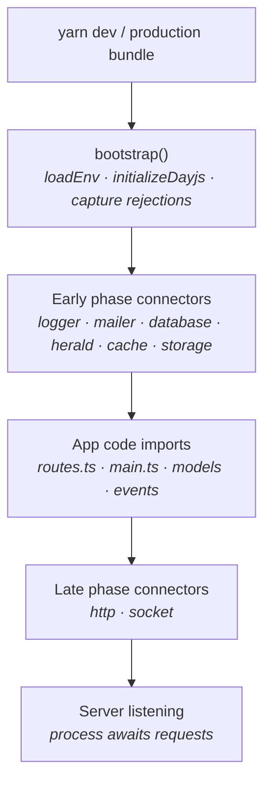

Every Warlock app starts the same way. A tiny prelude prepares the process, then a sequence of *connectors* spin up each subsystem in priority order, around the app code that depends on them. By the time the first request hits the router, the database is connected, the logger is flushing, the storage adapter is wired, and the HTTP server is listening.

This guide walks the boot sequence end-to-end, names every built-in connector and what it owns, and shows you how to plug in a custom one when "we have one more subsystem with a lifecycle" lands on your plate.

## The 30-second look



Three takeaways:

1. **`bootstrap()` is a tiny prelude** — three calls, no subsystems. Loads env, wires dayjs, hooks unhandled rejections into the logger.
2. **Connectors run in two phases around app code.** Early-phase connectors start before your routes/models/events import (because those imports DEPEND on them). Late-phase connectors start after, because they read what your code just registered.
3. **You almost never call any of this.** The CLI does. Your code shows up between the phases.

## Phase 0 — bootstrap()

```ts title="@warlock.js/core/src/bootstrap.ts"
import { loadEnv } from "@mongez/dotenv";
import { initializeDayjs } from "@mongez/time-wizard";
import { captureAnyUnhandledRejection } from "@warlock.js/logger";

export async function bootstrap() {
  await loadEnv();

  initializeDayjs();
  captureAnyUnhandledRejection();
}
```

Three things, no more:

| Step                              | What it does                                                                          | Comes from           |
| --------------------------------- | ------------------------------------------------------------------------------------- | -------------------- |
| `await loadEnv()`                 | Reads `.env` (plus `.env.<environment>` and local overrides) into `process.env`       | `@mongez/dotenv`     |
| `initializeDayjs()`               | Wires dayjs plugins: relative time, timezone, UTC, locale support                     | `@mongez/time-wizard`|
| `captureAnyUnhandledRejection()`  | Routes any unhandled promise rejection into the framework logger instead of crashing  | `@warlock.js/logger` |

`loadEnv` is awaited because reading a file is async. The other two are synchronous.

Nothing else happens here. No database connections, no HTTP server, no router scans. Bootstrap is intentionally tiny — every later step assumes env is loaded, dayjs is ready, and unhandled rejections won't vanish silently.

You don't call `bootstrap()` from app code. The CLI invokes it before importing your app.

## Phase 1 — Early-phase connectors

Once bootstrap is done, the framework starts every connector marked `ConnectorLifecyclePhase.Early`. These are subsystems your code needs **at import time** — a model registers itself against the database connection the moment its file is imported, a logger annotation expects the log channel to exist, the storage adapter expects the driver to be initialized.

Each connector implements three lifecycle hooks: `boot()`, `start()`, `shutdown()`. Within a phase, the framework calls every connector's `boot()` first, then every connector's `start()` — that lets connectors set up dependencies between each other (HTTP creates a Fastify instance in boot; socket reads it in start).

Connectors run in **priority order** (lower number first):

| Priority | Connector       | Class               | Watches                          | Lives in                                             |
| -------- | --------------- | ------------------- | -------------------------------- | ---------------------------------------------------- |
| 0        | `logger`        | `LoggerConnector`   | `src/config/log.ts`              | `@warlock.js/core/src/connectors/logger-connector.ts`|
| 1        | `mailer`        | `MailerConnector`   | `src/config/mail.ts`, `.env`     | `mail-connector.ts`                                  |
| 2        | `database`      | `DatabaseConnector` | `src/config/database.ts`         | `database-connector.ts`                              |
| 3        | `herald`        | `HeraldConnector`   | `src/config/herald.ts`           | `herald-connector.ts` (message broker / queues)      |
| 4        | `cache`         | `CacheConnector`    | `src/config/cache.ts`            | `cache-connector.ts`                                 |
| 6        | `storage`       | `StorageConnector`  | `src/config/storage.ts`          | `storage.connector.ts`                               |

Each connector reads its own subsystem's config (via `config.get("<name>")`) and bails quietly if it's missing — you only pay for the subsystems you configured.

### logger (priority 0)

Reads `config.get("log")`, calls `setLogConfigurations(...)`. On shutdown, calls `log.flushSync()` so the final log lines hit disk even if the process is being killed.

It's first because every other connector logs.

### mailer (priority 1)

Reads `config.get("mail")`, calls `setMailConfigurations(...)`. On shutdown, calls `closeAllMailers()` to release SMTP connection pools gracefully.

It's second because other connectors may queue a startup email (uncommon, but possible — a "deploy complete" notification, for instance).

### database (priority 2)

Reads `config.get("database")`, calls `connectToDatabase(...)` (from `@warlock.js/cascade`). Stores the resulting `DataSource` in the container under `"database.source"`.

On shutdown, walks `dataSourceRegistry.getAllDataSources()` and disconnects each driver that's still connected. Multiple data sources are supported — replicas, separate databases, the lot.

It's third because models import their schemas (via `@RegisterModel()`) at import time and the connection must exist by then.

### herald (priority 3, message broker)

Reads `config.get("herald")`, dynamically imports `@warlock.js/herald`, calls `connectToBroker(...)`. On shutdown, walks `brokerRegistry.getAll()` and disconnects each broker, then clears the registry for a clean restart.

The name `herald` is internal — the connector's public name in the registry is also `"herald"`. The priority constant is `ConnectorPriority.COMMUNICATOR` because herald is the project's message broker (the channel that communicates with the outside world for queue work, event fan-out, etc.).

### cache (priority 4)

Reads `config.get("cache")`, calls `cache.setCacheConfigurations(...)` then `await cache.init()`. Cache drivers (memory, redis, file) initialize whatever sockets/pools they need here.

It's fourth because repositories cache lookups; the cache must exist before the first model write triggers an invalidation.

### storage (priority 6)

Calls `loadS3()` (lazy-loads the AWS SDK only if s3 driver is configured) then `await storage.init()`. On shutdown, calls `storage.reset()` to release whatever the driver was holding.

Storage doesn't need a config check to bail — `loadS3` and `storage.init` no-op themselves when no disks are configured.

## Phase 2 — App code imports

Between the early and late phases, the framework imports your code:

- Every `src/app/<module>/main.ts` (auto-loaded, one-time module setup)
- Every `src/app/<module>/routes.ts` (auto-loaded, route registration)
- Every `src/app/<module>/events.ts` (auto-loaded, event listeners)
- Every model file (triggers `@RegisterModel()` decorators)

The order within the app code is structured but not user-controlled — `main.ts` first (it's where module-level wiring lives), then routes and events. By the end of this phase, every route is in the router's internal list and every model is registered against the database.

This is also where seed data, custom CLI commands, and module-specific event subscriptions get wired up. The thing that all these have in common: they DEPEND on the early phase (the database is ready, the logger works) and they're CONSUMED by the late phase (HTTP scans the router).

## Phase 3 — Late-phase connectors

After app code is imported, the framework starts late-phase connectors:

| Priority | Connector | Class            | Watches                 |
| -------- | --------- | ---------------- | ----------------------- |
| 5        | `http`    | `HttpConnector`  | `src/config/http.ts`    |
| 7        | `socket`  | `SocketConnector`| `src/config/socket.ts`  |

### http (priority 5)

Two-stage startup:

- **`boot()`**: reads `config.get("http")`, creates a Fastify instance with `startHttpServer(...)`, registers HTTP plugins (CORS, cookies, file upload, rate limiting, etc.), and stores the instance in the container under `"http.server"`. Also calls `setBaseUrl(...)` so utilities like `url("/api/foo")` produce absolute URLs.
- **`start()`**: scans the router. In development the framework uses `router.scanDevServer(...)` (a wildcard route that delegates to find-my-way so HMR can swap routes without re-registering); in production it uses `router.scan(...)` (registers each route directly with Fastify). Then `await this.http.listen(...)` opens the port.

Two-stage startup matters because the socket connector's `boot()` runs in between and needs the Fastify instance.

### socket (priority 7)

In `boot()`, it pulls the Fastify instance from the container (so Socket.IO can share the underlying Node HTTP server) and constructs a new `Server(server, options)`. It stores the socket server in the container under `"socket"` so route handlers can emit through it.

If HTTP isn't configured, socket creates its own raw Node server on the configured port and binds Socket.IO to that.

## Graceful shutdown

The connectors manager hooks into `SIGINT` and `SIGTERM` (plus `SIGHUP` on Windows, where Ctrl+C is unreliable in child processes) and shuts down every connector in **reverse priority order**:

```mermaid
flowchart LR
    sig["SIGINT / SIGTERM / SIGHUP"]
    socket["socket.shutdown()"]
    storage["storage.shutdown()"]
    http["http.shutdown()"]
    cache["cache.shutdown()"]
    herald["herald.shutdown()"]
    database["database.shutdown()"]
    mailer["mailer.shutdown()"]
    logger["logger.shutdown()"]
    exit["process.exit(0)"]

    sig --> socket
    socket --> storage
    storage --> http
    http --> cache
    cache --> herald
    herald --> database
    database --> mailer
    mailer --> logger
    logger --> exit
```



Reverse order is important: HTTP closes its socket before the database disconnects (so in-flight requests don't read a dead connection), and the logger flushes LAST so every other connector's shutdown error makes it to disk.

A re-entrant signal (Ctrl+C twice while shutdown is in progress) is ignored — the `isShuttingDown` flag prevents a second sweep from corrupting the first one.

## Writing a custom connector

Every subsystem with a lifecycle has the same shape — connect, restart on config change, disconnect cleanly. If your app integrates one (a message broker the framework doesn't ship with, a feature-flag service, an APM agent), wrap it in a connector and let the framework manage it for you.

### Step 1 — Extend `BaseConnector`

```ts title="src/connectors/feature-flags.connector.ts"
import type { ConnectorName } from "@warlock.js/core";
import { BaseConnector, config } from "@warlock.js/core";
import { ConnectorLifecyclePhase } from "@warlock.js/core";

export class FeatureFlagsConnector extends BaseConnector {
  public readonly name: ConnectorName = "featureFlags";
  public readonly priority = 10;
  public readonly lifecyclePhase = ConnectorLifecyclePhase.Early;

  protected readonly watchedFiles = ["src/config/feature-flags.ts"];

  public async start(): Promise<void> {
    const flagsConfig = config.get("featureFlags");

    if (!flagsConfig) {
      return;
    }

    await featureFlagsClient.connect(flagsConfig);
    this.active = true;
  }

  public async shutdown(): Promise<void> {
    if (!this.active) {
      return;
    }

    await featureFlagsClient.disconnect();
    this.active = false;
  }
}
```

Four properties, two methods. That's the whole contract.

| Property         | Type                       | Purpose                                                                  |
| ---------------- | -------------------------- | ------------------------------------------------------------------------ |
| `name`           | `ConnectorName`            | Unique identifier — used in logs and the registry                        |
| `priority`       | `number`                   | Sort order in the boot sequence; lower runs first                        |
| `lifecyclePhase` | `ConnectorLifecyclePhase`  | `Early` (before app code) or `Late` (after — only for HTTP/socket-like)  |
| `watchedFiles`   | `string[]`                 | Relative paths whose changes trigger this connector's restart in dev     |

| Method       | Purpose                                                                                  |
| ------------ | ---------------------------------------------------------------------------------------- |
| `start()`    | Bring the subsystem up. Read config, open connections, set `this.active = true`.         |
| `shutdown()` | Take the subsystem down. Close connections, release resources, set `this.active = false`.|
| `boot()`     | Optional. Pre-start construction (rare; HTTP uses this to create Fastify before scan).   |

The watched files matter only in development — when one of them changes, the dev server tells this connector to restart itself. Use it for the connector's own config file plus any other file whose change should refresh the connection (`.env` if you read env vars in `start()`).

### Step 2 — Register it

A custom connector must be registered with the connectors manager before the boot sequence runs. Connect it in your app's main entry:

```ts title="src/app/main.ts"
import { connectorsManager } from "@warlock.js/core";
import { FeatureFlagsConnector } from "src/connectors/feature-flags.connector";

connectorsManager.register(new FeatureFlagsConnector());
```

The manager re-sorts by priority on every `register(...)` call, so the order you register doesn't matter — only the `priority` property does.

### Step 3 — Pick a priority

The built-in priorities are:

```
0  LOGGER
1  MAILER
2  DATABASE
3  COMMUNICATOR (herald)
4  CACHE
5  HTTP
6  STORAGE
7  SOCKET
```

For a custom connector, pick a number that fits the dependency story:

- **Need the database to be up before you start?** Pick `> 2`.
- **Need to be up before HTTP listens?** Pick `< 5`.
- **Don't care about ordering?** Pick something high like `100` — it runs last.

There's no clash detection — two connectors with the same priority just run in registration order. The number is purely advisory.

### Step 4 — Pick a lifecycle phase

`Early` for almost everything. `Late` only when your connector reads state the user code REGISTERED (the way HTTP reads the router and socket reads the HTTP instance). If unsure, use `Early`.

### Where the file lives

By convention: `src/connectors/<name>.connector.ts`. The framework doesn't enforce this — register from anywhere — but co-locating connectors in one folder makes them easy to find:

```
src/connectors/
  feature-flags.connector.ts
  apm.connector.ts
```

A minimal real example from this codebase:

```ts title="src/connectors/custom-connector.ts"
import type { ConnectorName } from "@warlock.js/core";
import { BaseConnector } from "@warlock.js/core";

export class CustomConnector extends BaseConnector {
  public readonly name: ConnectorName = "custom";
  public readonly priority = -10;

  protected readonly watchedFiles = [".env", "src/config/cache.ts"];

  public async start(): Promise<void> {
    this.active = true;
  }

  public async shutdown(): Promise<void> {
    if (!this.active) {
      return;
    }

    this.active = false;
  }
}
```

Negative priorities are valid — `-10` runs even before the logger. Use that range when you have a connector that EVERY built-in needs (an APM SDK that hooks into log/db/http instrumentation, for instance).

## Restart on config change

In development, the dev server watches files. When one of a connector's `watchedFiles` changes, the manager calls `connector.restart()`, which by default does `shutdown(); start();`.

The HTTP connector overrides `restart()` to also re-run `boot()`, because `start()` re-scans the router — re-scanning the same Fastify instance would register every route twice. Other connectors don't need this because their `start()` is idempotent.

You can override `restart()` in your own connector if `shutdown(); start();` doesn't get you the behaviour you want — for instance, if the underlying client supports a hot reconfigure that's cheaper than disconnect/reconnect:

```ts
public async restart(): Promise<void> {
  const newConfig = config.get("featureFlags");
  await featureFlagsClient.reconfigure(newConfig);
}
```

## Gotchas

- **Connectors silently no-op when their config is missing.** A `database` connector with no `config.get("database")` simply doesn't connect — no error, no warning. If you expected a connection and didn't get one, check that `src/config/database.ts` exists and exports a default config.
- **Models register at import time.** If you write a custom connector that depends on a model being registered, your connector MUST be `Late` phase — otherwise the model doesn't exist yet. (This is rare; the built-in DATABASE connector handles the registration story for you.)
- **`Application.runtimeStrategy` is set by the framework's dev or prod entry point** before the connectors start. Connectors that branch on it (HTTP does) read the value during `start()`, not at module load time.
- **Shutdown failures are caught and logged, never thrown.** If your connector's `shutdown()` throws, the framework keeps walking the rest of the connectors. This is intentional — one broken connector shouldn't take down a clean shutdown.
- **Don't `register` a connector from inside another connector's `start()`.** The manager has already taken the snapshot it's iterating; new registrations land in the list but won't start in this boot. Register before bootstrap kicks off.
- **The `Socket` connector reads HTTP's instance via the container.** If you write a connector that wants the Fastify server, pull it from `container.get("http.server")` — and make sure your priority is greater than `5` so HTTP has booted first.

## See also

- **[`application.md`](./application.md)** — the static gateway to environment, paths, and runtime mode that connectors and config files both lean on.
- **[`configuration-deep.md`](./configuration-deep.md)** — how `config.get(...)` reads the values each connector consults during `start()`.
- **[`warlock-config.md`](./warlock-config.md)** — project-level config that runs before any connector starts.
- **[`getting-started/03-configuration.md`](../getting-started/03-configuration.md)** — the two-layer config overview.
- **[The request lifecycle](../architecture-concepts/01-the-request-lifecycle.md)** — what happens AFTER the connectors are up.
