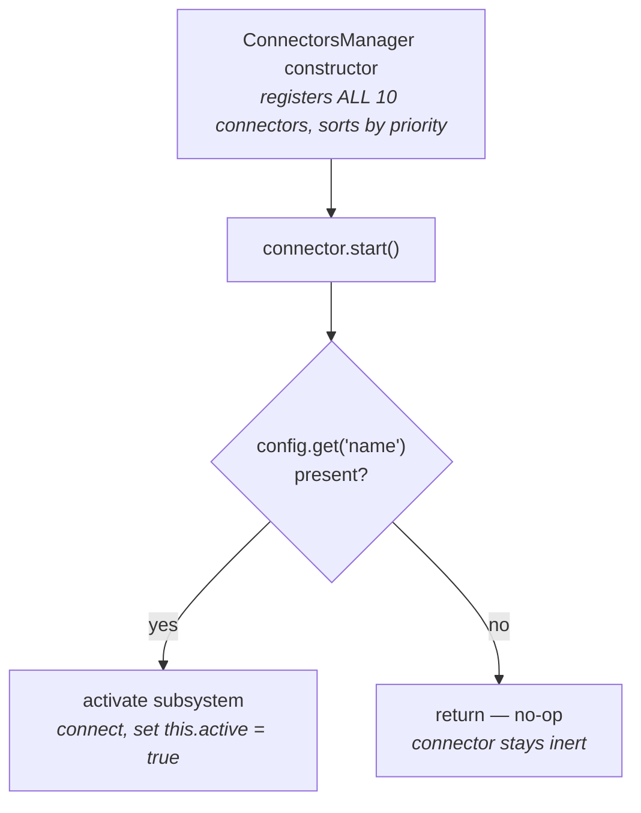
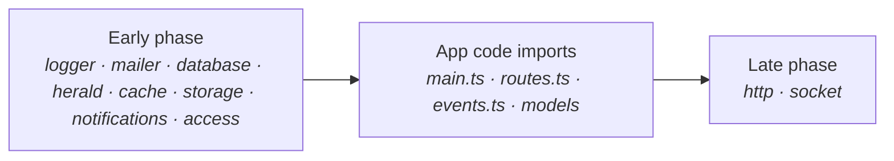
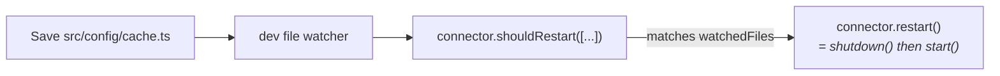

A **connector** is the framework's adapter for a subsystem that has a lifecycle — connect at boot, restart on config change, disconnect cleanly at exit. The database, the HTTP server, the cache, storage, the mailer, the logger, the message broker (herald), the socket server, notifications, and the authorization layer (access) are each owned by one. The framework starts them in priority order around your app code, and tears them down in reverse order on shutdown.

This is the catalog page: it names every built-in, tells you the one rule that governs whether a connector does anything (the config file), and lists the priorities and phases at a glance. For the boot *sequence* in detail — and for writing your own connector — see [Bootstrap and connectors](./bootstrap-and-connectors.md).

## The 30-second look

Two facts do most of the work:

1. **All ten built-in connectors are ALWAYS registered.** The `ConnectorsManager` constructor instantiates every one of them, unconditionally. Your config files do **not** add or remove connectors.
2. **The config file is the declarative on/off switch.** Each connector's `start()` calls `config.get("<name>")` and returns immediately if that config is absent. Present config → the subsystem activates. Missing config → the connector is registered but no-ops. You pay only for the subsystems you actually configure.



So you never "attach" a connector to enable a feature. You drop the matching `src/config/<name>.ts` file (database, cache, socket, access, …), and the always-present connector picks it up on the next boot.

## Connectors are always registered — config activates the subsystem

This is the point people get wrong, so it's worth being blunt: there is **no config flag that detaches a connector**. The constructor of `ConnectorsManager` runs `this.register(new LoggerConnector())`, `new DatabaseConnector()`, and so on through all ten — every time, in every app.

What the config file controls is whether the connector *does anything when its `start()` runs*:

```ts title="src/connectors/database-connector.ts (shape)"
public async start(): Promise<void> {
  const databaseConfig = config.get("database");

  if (!databaseConfig) {
    return; // no config file → connector stays inert
  }

  const source = await connectToDatabase(databaseConfig);
  container.set("database.source", source);
  this.active = true;
}
```

Every built-in follows this pattern. The storage connector (`storage`) skips the explicit `config.get` check and instead relies on its driver's own no-op when no disks are configured, but the effect is the same: no configuration, no side effect.

## The built-in catalog

All ten connectors, in priority order (lower starts first). The **public name** is the value the connector registers under (used in logs and the registry) — note that the priority **constant** for herald is `COMMUNICATOR`, but the connector's runtime name is `"herald"`.

| Priority | Public name     | Class                    | Phase | Watches                          | What it wires                                                                                 |
| -------- | --------------- | ------------------------ | ----- | -------------------------------- | --------------------------------------------------------------------------------------------- |
| 0        | `logger`        | `LoggerConnector`        | Early | `src/config/log.ts`              | `setLogConfigurations(...)`; flushes synchronously on shutdown so final lines hit disk        |
| 1        | `mailer`        | `MailerConnector`        | Early | `src/config/mail.ts`, `.env`     | `setMailConfigurations(...)`; `closeAllMailers()` on shutdown to release SMTP pools           |
| 2        | `database`      | `DatabaseConnector`      | Early | `src/config/database.ts`         | `connectToDatabase(...)` (Cascade); stores the `DataSource` in the container at `"database.source"` |
| 3        | `herald`        | `HeraldConnector`        | Early | `src/config/herald.ts`           | lazy-imports `@warlock.js/herald`, `connectToBroker(...)` (message broker / queues)           |
| 4        | `cache`         | `CacheConnector`         | Early | `src/config/cache.ts`            | `cache.setCacheConfigurations(...)` then `await cache.init()`                                  |
| 5        | `http`          | `HttpConnector`          | Late  | `src/config/http.ts`             | builds Fastify in `boot()`, scans the router in `start()`, stores the instance at `"http.server"` |
| 6        | `storage`       | `StorageConnector`       | Early | `src/config/storage.ts`          | `loadS3()` (lazy AWS SDK) then `await storage.init()`                                          |
| 7        | `socket`        | `SocketConnector`        | Late  | `src/config/socket.ts`           | lazy-imports `socket.io`, builds the Socket.IO `Server` in `boot()`, stores it at `"socket"`   |
| 8        | `notifications` | `NotificationsConnector` | Early | `src/config/notifications.ts`    | lazy-imports `@warlock.js/notifications`, `setNotificationConfig(...)`                          |
| 9        | `access`        | `AccessConnector`        | Early | `src/config/access.ts`           | lazy-imports `@warlock.js/access`, `setAccessConfig(...)` — validates a resolver is present so a misconfigured authorization layer fails at STARTUP |

A few notes worth calling out:

- **`herald`** — the priority constant is `ConnectorPriority.COMMUNICATOR` (= 3) because herald is the project's outbound channel (broker, queues, event fan-out), but the connector's public name in the registry is `"herald"`. The package is dynamically imported, so core carries no hard dependency on it.
- **`http`** is the only `Late` connector that other connectors read from. It builds the Fastify instance in `boot()` and stores it at `"http.server"` so the `socket` connector (which boots after it within the Late phase) can share the underlying Node HTTP server.
- **`socket`** lazy-imports `socket.io`; if a `socket` config is present but the optional `socket.io` peer isn't installed, `boot()` throws with install instructions.
- **`notifications`** and **`access`** are the newest built-ins. Both follow the same lazy-import-on-config pattern as herald. `access` additionally validates its resolver at startup — a broken authorization config surfaces during boot rather than on the first protected request.

## What each connector adapts (the driver layer)

Each connector is a thin lifecycle adapter — it reads its config and hands it to one subsystem's setup function. The actual DRIVER selection (which cache store, which storage disk, which mail transport, which database/broker driver) happens INSIDE that subsystem via its config, not in the connector. The herald/notifications/access connectors additionally lazy-import their package, which is what keeps those packages optional peers.

| Connector       | Adapts (package / runtime) | Driver layer (selected via config)            | Driver docs                                                  |
| --------------- | -------------------------- | --------------------------------------------- | ----------------------------------------------------------- |
| logger          | `@warlock.js/logger`       | log channels                                  | Logger topic / [Logging](../digging-deeper/logging.md)      |
| mailer          | core mail layer            | SMTP / AWS SES transports                     | [Mail](../digging-deeper/mail.md)                           |
| database        | `@warlock.js/cascade`      | DataSource driver (mongodb/postgres/mysql)    | Cascade topic                                               |
| herald          | `@warlock.js/herald`       | broker driver (`heraldConfig.driver`)         | Herald topic                                                |
| cache           | `@warlock.js/cache`        | cache driver (memory/redis/file/pg/…)         | Cache topic                                                 |
| http            | Fastify                    | — (plugins: cors/cookies/upload/rate-limit)   | [Request lifecycle](./01-the-request-lifecycle.md)          |
| storage         | core storage layer         | disk driver (local/s3/r2/spaces)              | [Storage](../digging-deeper/storage.md)                     |
| socket          | socket.io                  | —                                             | [Sockets](../digging-deeper/socket.md)                      |
| notifications   | `@warlock.js/notifications`| optional queue worker + broker                | Notifications topic                                         |
| access          | `@warlock.js/access`       | authorization resolver                        | Access topic                                                |

## Early vs Late phases

Connectors boot in two passes around your app code, gated by `ConnectorLifecyclePhase`:

- **`Early`** (the default) — runs **before** your `main.ts` / `routes.ts` / `events.ts` / model files import. These are the subsystems your code needs *at import time*: the database must be connected before a model registers its schema, the logger must exist before a module logs. Eight of the ten built-ins are Early.
- **`Late`** — runs **after** your app code imports, because it reads what that code just registered. Only `http` (scans the router your `routes.ts` files populated) and `socket` (reads HTTP's instance) are Late.

Within a single phase the manager calls **every connector's `boot()` first, then every connector's `start()`** — that two-stage pass is what lets `socket.boot()` read the Fastify instance that `http.boot()` just created.



`BaseConnector` defaults `lifecyclePhase` to `Early`, so a custom connector is Early unless you say otherwise.

## Restart on config change (dev)

Each connector declares a `watchedFiles` array of relative paths — its own config file, plus anything else whose change should refresh the connection (the `mailer` connector also watches `.env`, for instance). In development, the dev server's file watcher reports changed paths, and the manager asks each connector `shouldRestart(changedFiles)`. When a watched file changes, the manager calls `connector.restart()`, which on `BaseConnector` is simply `shutdown()` then `start()`.

That is why editing `src/config/database.ts` while the dev server is running reconnects the database without a full restart — the connector tears itself down and stands itself back up reading the new config.



### The socket restart caveat

`BaseConnector.restart()` runs `shutdown()` then `start()` and **never calls `boot()`**. The `socket` connector builds its server in `boot()`, not `start()`. So editing `src/config/socket.ts` in dev tears the old Socket.IO server **down**, but does **not** stand up a fresh one with the new options — that needs a full dev-server restart to re-run `boot()`. (The `http` connector avoids this by overriding `restart()` to re-run `boot()` itself, because re-scanning the same Fastify instance would otherwise register every route twice.)

## Writing your own connector

You register custom connectors exactly the same way the framework registers the built-ins: extend `BaseConnector`, then call `connectorsManager.register(new YourConnector())`. There is **no auto-discovery** — `register(...)` is the only path in.

```ts title="src/app/main.ts"
import { connectorsManager } from "@warlock.js/core";
import { FeatureFlagsConnector } from "../connectors/feature-flags.connector";

connectorsManager.register(new FeatureFlagsConnector());
```

The full walkthrough — the four properties and two methods of the contract, picking a priority, choosing a phase, overriding `restart()`, and the graceful-shutdown ordering — lives in [Bootstrap and connectors](./bootstrap-and-connectors.md#writing-a-custom-connector).

## Gotchas

- **All ten connectors are always registered; the config file is the only activation switch.** If a subsystem isn't running, the connector didn't fail — there's just no `src/config/<name>.ts` for it to read. Check that the config file exists and exports a default config.
- **A missing config is silent.** A connector with no matching config `return`s from `start()` with no error and no warning. Expected a database connection and didn't get one? Confirm `src/config/database.ts` is present.
- **Editing `src/config/socket.ts` in dev does not apply new socket options.** `restart()` is `shutdown()` + `start()` and skips `boot()`, where the socket server is built. A full dev-server restart is required to pick up new socket options.
- **`notifications` and `access` are real built-ins.** Older docs listed only eight connectors; there are ten. Don't reuse `notifications` or `access` (or `logger`, `mailer`, `database`, `herald`, `cache`, `http`, `storage`, `socket`) as a custom connector name.

## See also

- [Bootstrap and connectors](./bootstrap-and-connectors.md) — the boot sequence end-to-end and the custom-connector authoring guide.
- [Application](./application.md) — `app.socket`, `app.http`, `app.database`, `app.router` accessors, which read what these connectors store in the container.
- [Configuration — deep dive](./configuration-deep.md) — how `config.get(...)` reads the values each connector consults during `start()`.
- [warlock.config.ts](./warlock-config.md) — project-level config that runs before any connector starts.
