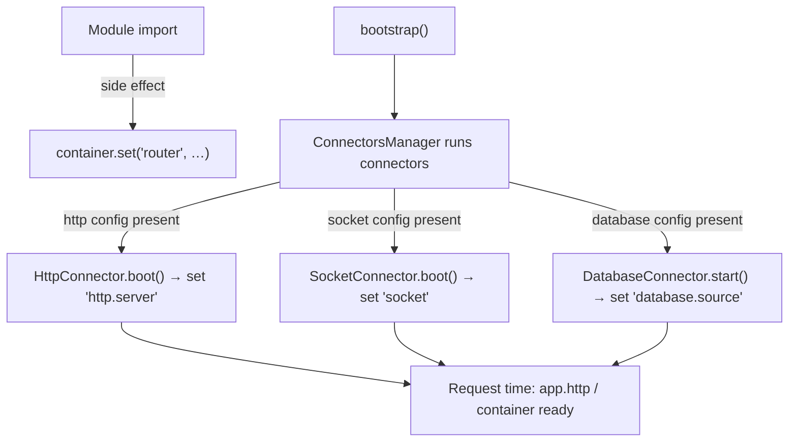

The **container** is a tiny global registry — a single `Map` behind a typed wrapper. Connectors drop runtime singletons into it during boot (the Fastify instance, the Socket.IO server, the database source, the router), and the rest of the framework reads them back out. The `app` object is an ergonomic façade over the handful of keys you'll actually want.

This is lower-level plumbing. Most application code never touches the container directly — you reach for `app.http` or `getSocketServer()` instead. This page exists so that when you *do* need the raw instance (a plugin, a one-off integration, a test harness), you know exactly what's in there, who put it there, and why it's sometimes `undefined`.

```ts
import { container, app } from "@warlock.js/core";
```

## The 30-second look

```ts
import { app } from "@warlock.js/core";

app.http;        // the Fastify instance (when http config exists)
app.socket;      // the Socket.IO server (when socket config exists)
app.router;      // the router (always present)
app.database;    // the cascade DataSource (when database config exists)
```

`app` is a plain object of getters. Each getter reads one key out of the container the moment you access it. There's no `new`, no class to instantiate — `app.http` is literally `container.get("http.server")` evaluated on demand.

If you need a key that `app` doesn't expose, drop down to the container:

```ts
import { container } from "@warlock.js/core";

const fastify = container.get("http.server");
const dataSource = container.get("database.source");
container.has("socket"); // boolean — is the socket server up?
```

## The container

`container` is a singleton instance with four methods:

| Method                 | What it does                                              |
| ---------------------- | -------------------------------------------------------- |
| `container.set(key, v)`| Store a value under `key`.                               |
| `container.get(key)`   | Read the value back. Returns `undefined` if unset.       |
| `container.has(key)`   | `true` if the key has been set.                          |
| `container.delete(key)`| Remove the key.                                          |

Under the hood it's a module-level `Map<string, any>` — global to the process, no scoping, no lifecycle of its own. Whatever you `set` stays set until you `delete` it or the process ends.

### Typed keys

The container ships a `ContainerTypes` map so the well-known keys get real types in your editor. `container.get("http.server")` is typed as a `FastifyInstance`; `container.get("database.source")` as a cascade `DataSource`:

```ts title="src/container/index.ts (shape)"
export type ContainerTypes = {
  router: Router;
  "http.server": FastifyInstance;
  "http.baseUrl": string;
  socket: Server;
  "database.source": DataSource;
};
```

| Key                | Type              | Set by                                  | When                          |
| ------------------ | ----------------- | --------------------------------------- | ----------------------------- |
| `router`           | `Router`          | the router module itself                | at import (eager — see below) |
| `"http.server"`    | `FastifyInstance` | `HttpConnector.boot()`                   | boot, only if http config exists |
| `socket`           | `Server`          | `SocketConnector.boot()`                 | boot, only if socket config exists |
| `"database.source"`| `DataSource`      | `DatabaseConnector.start()`              | boot, only if database config exists |
| `"http.baseUrl"`   | `string`          | *(declared in the type, not written)*   | — see Gotchas                 |

`get` and `set` are also overloaded for arbitrary string keys (`container.get<MyType>("my.custom.key")`), so you can stash your own singletons here too — they just won't get the typed-key treatment.

## The `app` accessor

`app` is the friendly front door. It's a fixed object with four getters, each a thin read of one container key:

| Accessor       | Reads container key  | Present when                          |
| -------------- | -------------------- | ------------------------------------- |
| `app.router`   | `router`             | always (router self-registers)        |
| `app.http`     | `"http.server"`      | `src/config/http.ts` exists           |
| `app.socket`   | `socket`             | `src/config/socket.ts` exists         |
| `app.database` | `"database.source"`  | `src/config/database.ts` exists       |

The presence rule is the important part. **`app.http`, `app.socket`, and `app.database` only return an instance when the matching config file exists.** A connector's `boot()`/`start()` checks `config.get("http")` (or `"socket"`, `"database"`) and returns early if it's absent — so the container key is never set, and the getter returns `undefined`.

```ts
import { app } from "@warlock.js/core";

// In an app with no src/config/socket.ts:
app.socket;   // undefined — the socket connector no-op'd at boot
app.router;   // always there

// Guard before you use the optional ones:
if (app.socket) {
  app.socket.emit("ping", Date.now());
}
```

`app.router` is the exception: the router registers itself into the container at module-load time, so it's there as soon as the router module is imported — independent of any config file.

## Who fills the container, and when

The container starts empty. It gets populated in two distinct moments:

1. **At import time** — `router` is set the instant the router module loads (a top-level `container.set("router", router)` runs as a side effect of importing it).
2. **During boot** — the HTTP, socket, and database connectors set their keys inside their lifecycle methods, which run when `bootstrap()` walks the connectors. Each only fires if its config file is present.



### Why top-level access returns `undefined`

This is the single most common surprise. A module's **top level runs at import time** — which is *before* `bootstrap()` has run the connectors. So this is a trap:

```ts title="src/app/orders/some-module.ts"
import { app } from "@warlock.js/core";

// ❌ Runs at import time — boot hasn't populated the container yet.
const server = app.http;   // undefined
server.get("/health", …);  // throws: cannot read property of undefined
```

Access the container (or `app`) **inside** code that runs after boot — your module's `main.ts`, a request handler, an event listener — not at the top level of a module:

```ts title="src/app/main.ts"
import { app } from "@warlock.js/core";

export default async function main() {
  // ✅ main() runs after bootstrap — the container is populated.
  app.http.addHook("onRequest", async (request) => {
    // …
  });
}
```

Inside a request handler the container is always fully populated, so `app.http` / `app.database` / `app.socket` are safe there without guards (beyond the config-presence rule above).

## Container vs `app` vs the helpers

Three layers reach the same instances. Pick the highest one that fits.

| You want…                                              | Use                          | Notes                                                        |
| ------------------------------------------------------ | ---------------------------- | ----------------------------------------------------------- |
| The common runtime singletons, ergonomically           | `app.http` / `app.socket` / `app.router` / `app.database` | Returns `undefined` when the config is absent. |
| A null-safe socket handle                              | `getSocketServer()`          | Returns the `Server` **or `null`** if sockets aren't configured. |
| The Fastify instance from anywhere                     | `getHttpServer()`            | Returns the module-held server (see caveat below).          |
| A custom/non-standard key, or `has`/`delete` semantics | `container.get/set/has/delete` | The raw registry. The only layer that can store your own keys. |

```ts
import { getSocketServer, getHttpServer } from "@warlock.js/core";

const io = getSocketServer();   // Server | null
if (io) io.emit("notice", "…");

const server = getHttpServer(); // FastifyInstance
```

Rule of thumb: in normal app code prefer `app.*`; if you need the explicit `null` check, `getSocketServer()` reads cleanest. Drop to `container` only when you're storing your own singleton or genuinely need `has`/`delete`.

## Gotchas

- **Top-level container reads are `undefined`.** The connectors populate the container during `bootstrap()`, after your modules have been imported. Read `app.http` / `container.get(...)` inside `main.ts` or at request time — never at the top level of a module.
- **`app.socket` / `app.http` / `app.database` are `undefined` without their config.** Presence of the config file (`src/config/socket.ts`, etc.) is what activates the subsystem and fills the container key. No config → no key → `undefined`. Guard the optional ones, or use `getSocketServer()` for the null-safe read.
- **`getHttpServer()` and `app.http` aren't backed by the same storage.** `app.http` reads the container's `"http.server"` key; `getHttpServer()` returns a module-level variable set by `startHttpServer()`. In a normally-booted app both point at the same Fastify instance, but they're separate references — don't assume mutating one rebinds the other.
- **`getSocketServer()` returns `null`, `app.socket` returns `undefined`** when sockets aren't configured. Same "not available" condition, two different empty values — check accordingly.
- **`"http.baseUrl"` is declared but not populated.** It appears in `ContainerTypes` for typing, but no runtime code calls `container.set("http.baseUrl", …)`. The HTTP connector tracks the base URL through a separate module variable (`setBaseUrl`/`url`), not this key. Treat `"http.baseUrl"` as reserved — `container.get("http.baseUrl")` is `undefined` today. To build URLs, use the `url()` helper instead.
- **The container is global and unscoped.** Everything you `set` lives for the life of the process and is visible everywhere. It's a registry of singletons, not a per-request DI scope — don't stash request-specific state in it.
- **Editing `src/config/socket.ts` in dev doesn't fully re-apply socket options.** The socket connector builds its server in `boot()`, but a watched-file change triggers `restart()` (= `shutdown()` + `start()`), which never re-runs `boot()`. The old server is torn down; a fresh one with the new options only stands up on a full dev-server restart.

## See also

- **[Bootstrap and connectors](./bootstrap-and-connectors.md)** — the boot sequence that runs the connectors which fill the container.
- **[Application](./application.md)** — the sibling static gateway for environment, paths, and version (a different surface from this runtime registry).
- **[Sockets](../digging-deeper/socket.md)** — the realtime layer behind `app.socket` / `getSocketServer()`.
