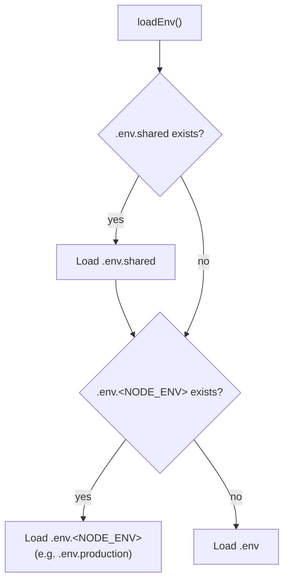
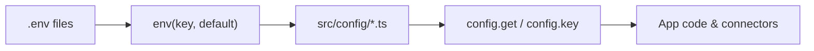

`.env` is the bottom of the config stack. It holds raw strings, it loads before anything else, and every `src/config/*` file reads from it through one helper: `env()`. This page is the concept-and-reference view — how loading actually works, how `env()` reads, how the framework decides whether it's in development / production / test, and how config branches on that.

If you just want to get a project running, read [Getting started → Configuration](../getting-started/03-configuration.md) first — it's the onboarding view. This page is the layer underneath it.

## The 30-second look

```ts
import { env, Application } from "@warlock.js/core";

// Read an env value, with an optional default
const port = env("HTTP_PORT", 3000);
const secret = env("JWT_SECRET");          // → undefined if unset

// Branch on the runtime environment
if (Application.isProduction) {
  // production-only wiring
}
```

Two moving parts:

1. **`env(key, default?)`** — reads a single value out of the loaded `.env` data. Re-exported from `@mongez/dotenv`.
2. **`Application`** — the static gateway that tells you (and your config files) which environment you're in.

Config files sit on top of both: they call `env()` to pull values and branch on `Application.isProduction` for environment-specific defaults. App code never reads `process.env` directly — it reads `config.key(...)`, which was populated from `env()` at boot.

## When .env loads

`bootstrap()` awaits `loadEnv()` as its very first step — before dayjs is initialized, before any config file is imported, before any connector starts:

```ts title="bootstrap() — loading .env first"
import { loadEnv } from "@mongez/dotenv";

export async function bootstrap() {
  await loadEnv();

  initializeDayjs();
  captureAnyUnhandledRejection();
}
```

This ordering is the whole reason `env()` works inside `src/config/*` files: by the time any config file is imported, the `.env` data is already in memory.

### Which file gets loaded

`loadEnv()` (from `@mongez/dotenv`) resolves files in this order:



In words:

1. **`.env.shared`** loads first, if it exists — values common to every environment.
2. Then **`.env.<NODE_ENV>`** loads if it exists (`.env.production`, `.env.development`, `.env.test`). The `<NODE_ENV>` part comes from `process.env.NODE_ENV`.
3. If no environment-specific file exists, **`.env`** loads as the fallback.

| File                  | Loaded when                                | Typical use                                  |
| --------------------- | ------------------------------------------ | -------------------------------------------- |
| `.env.shared`         | Always, if present (first)                 | Keys identical across every environment      |
| `.env.<NODE_ENV>`     | If a file matching the current `NODE_ENV` exists | Per-environment values (prod DB, prod keys) |
| `.env`                | Fallback when no `.env.<NODE_ENV>` exists  | The single-file setup most projects start with |

The default loader runs with `override: true`, so values it reads are written onto `process.env` (and tracked so they can be reset). Because `.env.shared` loads before the environment-specific file, a key set in both ends up with the environment-specific value winning.

> A subtlety worth knowing: the resolution picks **either** `.env.<NODE_ENV>` **or** `.env` — not both. If you create `.env.production`, the plain `.env` is no longer read in production. `.env.shared` is the place for values you want in every environment regardless of which main file wins.

## env() — reading a value

`env()` is re-exported from `@warlock.js/core` (it originates in `@mongez/dotenv`):

```ts
import { env } from "@warlock.js/core";

env("HTTP_PORT", 3000);     // → 3000 if HTTP_PORT is unset
env("DB_LOGGING", false);   // → false if unset
env("JWT_SECRET");          // → undefined if unset (no default)
```

The signature is `env(key, defaultValue?)`. The rule is simple: **if the key is present in the loaded `.env` data, you get the stored value; otherwise you get the default.** The default fires only when the key is genuinely absent — a key that was loaded as `null` (from `KEY=null`) is preserved and returned as `null`, not replaced by the default.

### Where the type coercion actually happens

This is the part that trips people up. The value's type is decided **when the `.env` line is parsed**, not by the default you pass. `@mongez/dotenv` coerces each line as it loads it:

| `.env` line       | Stored value      | Type      |
| ----------------- | ----------------- | --------- |
| `PORT=3000`       | `3000`            | number    |
| `DEBUG=true`      | `true`            | boolean   |
| `DEBUG=false`     | `false`           | boolean   |
| `OPTIONAL=null`   | `null`            | null      |
| `NAME=warlock`    | `"warlock"`       | string    |

So `env("PORT")` returns the number `3000` because the parser already turned the string `"3000"` into a number — the default you pass to `env()` does **not** re-coerce the stored value. The default is only a fallback for a missing key. In practice you still pass a typed default (`env("PORT", 3000)`) so that when the key is missing you get a number rather than `undefined`, and so the value is correctly typed for the consumer.

> Quoted values (`"..."`, `'...'`, or backticks) are treated as strings — `PORT="3000"` stays the string `"3000"`. Use unquoted values when you want numeric/boolean coercion.

`env.all()` returns the full loaded map if you ever need to inspect everything that was read.

## Environment detection

Warlock recognizes three environments: **development**, **production**, and **test**. The source of truth is `process.env.NODE_ENV`:

```ts title="How the environment is resolved"
export type Environment = "development" | "production" | "test";

export function environment(): Environment {
  return (process.env.NODE_ENV as Environment) || "development";
}
```

If `NODE_ENV` is unset, the environment is **development**. You read it through the `Application` class rather than touching `process.env` yourself:

```ts
import { Application } from "@warlock.js/core";

Application.environment;     // → "development" | "production" | "test"
Application.isDevelopment;   // → boolean
Application.isProduction;    // → boolean
Application.isTest;          // → boolean
```

| Accessor                    | Returns                                   |
| --------------------------- | ----------------------------------------- |
| `Application.environment`   | The current `Environment` string          |
| `Application.isDevelopment` | `environment === "development"`           |
| `Application.isProduction`  | `environment === "production"`            |
| `Application.isTest`        | `environment === "test"`                  |

### How each environment gets set

You rarely set `NODE_ENV` by hand — the framework's entry points do it for you:

- **Development** — the dev-server command runs with the development runtime strategy; with no `NODE_ENV` override, `Application.environment` falls through to `"development"`.
- **Production** — the production builder explicitly calls `Application.setEnvironment("production")` (and `setRuntimeStrategy("production")`) so the built bundle reports production.
- **Test** — the test HTTP server bootstrap calls `Application.setEnvironment("test")`, so code under the test runner sees `Application.isTest === true`.

There is also a separate `Application.runtimeStrategy` (`"production" | "development"`) that describes *how* the process was started (built bundle vs. dev server) — distinct from the *environment*. For most app code, `environment` / `isProduction` is the value you want; `runtimeStrategy` is an internal concern. See [Application](./application.md) for the full surface.

## How config branches on the environment

Config files are plain modules, so they can read `Application.isProduction` at the top level and bake environment-specific defaults into the exported object. The scaffolded HTTP config does exactly this for cookie security:

```ts title="src/config/http.ts"
import { Application, env } from "@warlock.js/core";
import type { HttpConfigurations } from "@warlock.js/core";

const httpConfigurations: HttpConfigurations = {
  port: env("HTTP_PORT", 3000),
  host: env("HTTP_HOST", "localhost"),
  cookies: {
    secret: env("COOKIE_SECRET", "super-secret-key-change-me"),
    options: {
      httpOnly: true,
      secure: Application.isProduction, // HTTPS-only cookies in prod
      path: "/",
    },
  },
};

export default httpConfigurations;
```

`Application.isProduction` is evaluated **when this file loads** — once, at boot. The boolean is baked into the config object; changing `NODE_ENV` mid-process won't update it. That's intentional: config is read-once.

The same pattern shows up wherever a default should differ between dev and prod — CORS allowlists, mail transports, cache TTLs. Connectors and subsystems then read the resulting config (e.g. the HTTP connector calls `config.get("http")` in its `boot()`), so the environment branch you wrote in the config file is what the running subsystem sees. The HTTP connector even logs the environment it's starting in.

## The relationship to config files

The flow is one direction: `.env` → config → app code.



- **`.env` holds raw values** (strings, coerced to number/boolean/null at parse time).
- **`src/config/*.ts` files call `env()`** to pull those values into typed config objects, branching on `Application` where needed.
- **App code reads `config.key(...)` / `config.get(...)`** — never `process.env` or `env()` directly in handlers.

This separation is why a missing `.env` value degrades gracefully: the config file's `env("KEY", default)` supplies the fallback, and a subsystem whose config is empty (e.g. mail with no SMTP set) is simply not activated by its connector. For the full config-reading API, special handlers, and merge order, see [Configuration — deep dive](./configuration-deep.md).

## Which keys are "framework" keys?

Honest answer: very few. The framework itself only reads **`NODE_ENV`** for environment detection. Every other env key you see — `HTTP_PORT`, `DB_*`, `MAIL_*`, `JWT_SECRET`, `COOKIE_SECRET`, and so on — is read **by your `src/config/*` files**, not hard-wired into core. They are scaffolding conventions, not framework-mandated names: rename `HTTP_PORT` in both `.env` and `src/config/http.ts` and nothing in the framework objects.

| Key             | Read by                          | Notes                                                       |
| --------------- | -------------------------------- | ---------------------------------------------------------- |
| `NODE_ENV`      | The framework (`environment()`)  | The only env key the framework itself consults. Selects dev/prod/test and which `.env.<NODE_ENV>` file loads. |
| `HTTP_PORT`, `HTTP_HOST` | `src/config/http.ts`    | Convention in the scaffolded HTTP config — not a framework constant. |
| `DB_*`          | `src/config/database.ts`         | Connection options; your config file decides the names.    |
| `MAIL_*`        | `src/config/mail.ts`             | SMTP credentials; passthrough into the mail config.        |
| `JWT_SECRET`, `COOKIE_SECRET` | `src/config/auth.ts`, `src/config/http.ts` | App secrets read by their config files. |

The takeaway: outside of `NODE_ENV`, treat env-key names as **your** contract. Define them once in a config file with `env(...)`, and read everything else through `config`.

## Gotchas

- **`NODE_ENV` defaults to `development`.** If it's unset, you're in development — including any unexpected child process that didn't inherit it. Production and test are set explicitly by the build and test entry points; production deploys should still set `NODE_ENV=production` so `.env.production` and the production branch in your config files take effect.
- **Coercion happens at parse time, not by the default's type.** `PORT=3000` is already the number `3000` when `env("PORT")` returns it. The default you pass is only a fallback for a *missing* key — it does not re-coerce a present value. Quote a value (`KEY="3000"`) if you specifically want it kept as a string.
- **`KEY=null` becomes JS `null`, not the string `"null"`, and is preserved.** `env("KEY", "fallback")` returns `null` (the loaded value), not the default — because the key *is* present. If you want "treat null as unset", handle it explicitly in the config file.
- **It's either `.env.<NODE_ENV>` or `.env`, never both.** Once you add `.env.production`, the plain `.env` stops being read in production. Put cross-environment values in `.env.shared`, which always loads.
- **`.env` changes need a restart, not an HMR reload.** `env()` runs when a config file is imported, not on every `config.key(...)`. The dev server doesn't re-read `.env` mid-run by default — restart it (or add `.env` to a connector's `watchedFiles`) to pick up changes.
- **Don't read `process.env` or `env()` in request handlers.** Read `config.key(...)` instead. Config is the typed, validated, environment-branched view; `env()` is the raw input that config is built from.
- **`Application.isProduction` in a config file is frozen at boot.** It's evaluated once when the file imports. Don't expect it to react to a mid-process `NODE_ENV` change.

## See also

- **[Getting started → Configuration](../getting-started/03-configuration.md)** — the onboarding view of the two config layers and `.env`.
- **[Configuration — deep dive](./configuration-deep.md)** — `config.get` / `config.key`, special handlers, merge order.
- **[Application](./application.md)** — the full `Application` surface: environment, runtime strategy, version, paths.
- **[warlock.config.ts](./warlock-config.md)** — the project-level config that also reads `env()`.
- **[Connectors](./connectors.md)** — how subsystems read their config and activate (or stay dormant) based on what `.env`-backed config is present.
