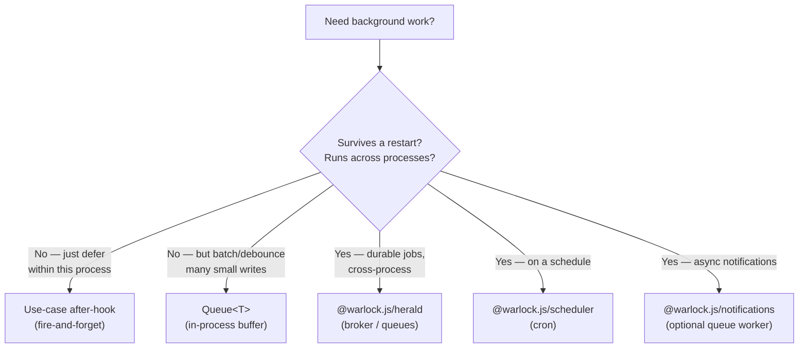

Let's be honest up front: **`@warlock.js/core` does not ship a distributed job queue.** There is no `dispatch(job)`, no worker process, no Redis-backed retry table, no "jobs" directory. If you came here looking for Laravel queues or BullMQ baked into core, it isn't here — and pretending otherwise would set you up for a bad time.

What core *does* give you are two small, honest primitives for moving work off the critical path **inside a single process**, plus a clear pointer to the packages that own real background infrastructure. This page draws those boundaries so nobody ships a "background job" that silently dies on the next deploy.

## The 30-second look

Two things live in core:

1. **Use-case after-hooks are fire-and-forget.** Anything in a use-case's `after` array runs after the handler succeeds, and a throw there is logged — it does **not** fail the use-case. Good for notifications and side effects.
2. **`Queue<T>` is an in-process batching buffer.** Enqueue items; they flush when the buffer hits `maxSize` or every `executeEvery` ms. It debounces and batches writes. It is **not** durable — items live in memory and vanish if the process exits.

Everything beyond those — durable queues, cron, retryable async work that survives a restart — lives in separate packages:



## Fire-and-forget after-hooks

A use-case runs its handler, and on success it runs each function in the `after` array. These are **side effects** — send the confirmation email, bump a metric, enqueue a notification. The key property: **a failing after-hook never fails the use-case.**

```ts title="src/app/orders/use-cases/place-order.ts"
import { useCase } from "@warlock.js/core";
import { placeOrderService } from "../services/place-order";
import { sendOrderConfirmation } from "../side-effects/send-order-confirmation";

export const placeOrder = useCase({
  name: "place_order",
  schema: placeOrderSchema,
  handler: async (data, ctx) => placeOrderService(data),
  after: [sendOrderConfirmation], // runs on success; a throw here is logged, not fatal
});
```

Inside the use-case, the after loop wraps each middleware in its own try/catch:

```ts
// from use-cases/use-case.ts — simplified
if (!error && after && output !== undefined) {
  for (const middleware of after) {
    try {
      await middleware(output, ctx);
    } catch (afterError) {
      log.error("use-cases", name, "after middleware failed", { error: afterError });
    }
  }
}
```

What this means in practice:

| Property | Behavior |
| --- | --- |
| When they run | After the handler succeeds (`output !== undefined`, no error). Skipped entirely on failure. |
| Failure isolation | Each hook's throw is caught and logged via `log.error("use-cases", name, "after middleware failed", { error })` — the next hook still runs, the use-case still returns its output. |
| Ordering | Sequential and **awaited** — each `after` middleware is `await`ed before the next. "Fire-and-forget" means failures are swallowed, **not** that the use-case returns before they finish. |
| Durability | None. They run in the same process, in the same call. If the process dies mid-loop, remaining hooks are lost. |

So "fire-and-forget" is about *fault isolation*, not detachment: the caller still waits for the hooks, but a broken side effect can't take down the business operation. If you genuinely need the work to outlive the request — survive a crash, run on another box — an after-hook is the wrong tool. Have the after-hook **hand the work to herald or the notifications queue** instead of doing it inline.

See [Use-cases (deep dive)](../the-basics/use-cases-deep.md) for the full execution order and the rest of the option surface.

## `Queue<T>` — the in-process batching utility

`Queue<T>` (exported from core) is a buffer. You push items into it; it accumulates them and calls your function in batches, either when the buffer fills up or on a timer. Reach for it to **debounce and batch many small writes** — analytics events, audit-log rows, cache warm-ups — so you do one bulk operation instead of a thousand tiny ones.

It is **not** a job queue. Nothing about it is durable: the items are a plain in-memory array. A restart drops whatever hasn't flushed.

### Constructor signature

```ts
import { Queue } from "@warlock.js/core";

const queue = new Queue<AnalyticsEvent>(
  async (items) => {
    await analytics.bulkInsert(items);
  },
  true,  // executeInParallel — default true
  5000,  // executeEvery (ms) — default 5000
  100,   // batchSize — how many items per execute call
  500,   // maxSize — flush immediately once the buffer reaches this (optional)
);

queue.enqueue({ type: "page_view", path: "/home" });
```

The positional argument order is exactly this — note that `executeInParallel` comes **before** the timing/size args:

| Position | Parameter | Type | Default | What it does |
| --- | --- | --- | --- | --- |
| 1 | `executeFn` | `(items: T[]) => Promise<void>` | — | Called with a batch of items to process. |
| 2 | `executeInParallel` | `boolean` | `true` | When `true`, the batch is processed with `Promise.all`, one `executeFn` call per item. When `false`, items are processed one at a time, sequentially. |
| 3 | `executeEvery` | `number` (ms) | `5000` | Interval timer — if items are waiting, the queue flushes this often. |
| 4 | `batchSize` | `number` | — | How many items are pulled off the front of the buffer per flush. **Required for items to actually drain** (see Gotchas). |
| 5 | `maxSize` | `number?` | `undefined` | When set, `enqueue` triggers an immediate flush once the buffer reaches this length, instead of waiting for the timer. |

### How a flush works

- `enqueue(item)` pushes onto the internal array. If `maxSize` is set and the buffer has reached it, a flush fires right away. Either way, if no timer is running, one starts.
- On flush, the queue splices `batchSize` items off the front and hands them to `executeFn`. With `executeInParallel: true` it calls `executeFn([item])` for each item under `Promise.all`; with `false` it loops them sequentially.
- The timer (`setInterval` at `executeEvery`) re-fires as long as items remain.

```ts title="batch audit rows instead of one insert per action"
import { Queue } from "@warlock.js/core";

const auditQueue = new Queue<AuditRow>(
  async (rows) => {
    await auditModel.insertMany(rows);
  },
  false, // sequential — keep insert order deterministic
  2000,  // flush every 2s
  50,    // up to 50 rows per flush
  200,   // or immediately once 200 pile up
);

// somewhere hot, called thousands of times:
auditQueue.enqueue({ userId, action: "login", at: new Date() });
```

That's the whole surface. There is no `flush()`, no `drain()`, no `stop()` method on `Queue<T>` today — document only what exists. If you need an explicit drain or graceful stop on shutdown, you don't get it from this class.

## Where real background work lives

When the work has to be **durable, cross-process, scheduled, or retried until it succeeds**, it does not belong in core. Three sibling packages own that ground:

| Package | Owns | Reach for it when |
| --- | --- | --- |
| **`@warlock.js/herald`** | Message broker / queues | You need durable queues, pub/sub, request–reply, dead-letter handling — work that survives restarts and crosses process boundaries. Wired into core through the herald connector (`src/config/herald.ts`). |
| **`@warlock.js/scheduler`** | Cron / recurring jobs | You need "run this every night at 2 AM" — timezone-aware schedules, overlap guards, retry/backoff. |
| **`@warlock.js/notifications`** | Notifications, optional queue worker | You're sending notifications and want the slow channels (SMTP, HTTP) off the request path via a herald-backed queue worker. |

The herald and notifications connectors are **always registered** in core, but they no-op unless you provide their config file (`src/config/herald.ts`, `src/config/notifications.ts`) — config presence is what activates the subsystem. See [Bootstrap & connectors](../architecture-concepts/bootstrap-and-connectors.md) for that declarative model.

The clean pattern is: a use-case after-hook (fire-and-forget, in-process) **hands off** to one of these (durable, out-of-process). The after-hook's only job is the enqueue; herald/notifications owns delivery, retries, and survival across restarts.

```ts title="after-hook hands durable work to herald"
import { useCase } from "@warlock.js/core";

export const placeOrder = useCase({
  name: "place_order",
  schema: placeOrderSchema,
  handler: async (data) => placeOrderService(data),
  after: [
    async (order) => {
      // in-process, fire-and-forget enqueue → durable delivery owned by herald
      await publishOrderPlaced(order);
    },
  ],
});
```

## Gotchas

- **`Queue<T>` is not durable — ever.** Items live in a plain in-memory array. A deploy, crash, or `process.exit` drops anything that hasn't flushed. Never put work you can't afford to lose in it. For durable work use herald.
- **No `batchSize` means nothing drains.** The internal `execute()` only splices and processes items when `batchSize` is truthy. If you leave it `0`/unset, the timer fires but no items are ever handed to `executeFn`. Always pass a `batchSize`.
- **Mind the positional order.** `executeInParallel` is the **second** argument, before `executeEvery` and `batchSize`. It's easy to pass a number where the boolean goes. There are no named options — it's all positional.
- **`executeInParallel: true` calls `executeFn` once per item.** In parallel mode each item is wrapped as `executeFn([item])` — your function receives a one-element array per call, not the whole batch. If your `executeFn` does a true bulk insert, you want `executeInParallel: false` (sequential) so it still receives one array, or rethink the shape. Read the source before assuming a single bulk call.
- **After-hooks are awaited, not detached.** "Fire-and-forget" means a throw is swallowed and logged — it does **not** mean the use-case returns before the hooks finish. A slow after-hook still adds to the caller's latency. Push genuinely slow work to herald/notifications, not into the after array.
- **After-hooks only run on success.** If the handler throws, the entire `after` loop is skipped. Don't rely on an after-hook for cleanup that must run on failure — use `onError` or handle it in the handler.
- **A throwing after-hook leaves no trace except a log line.** The failure surfaces only as `log.error("use-cases", name, "after middleware failed", …)`. If a side effect matters, give it its own observability — don't assume a green use-case means every side effect landed.

## See also

- [Use-cases (deep dive)](../the-basics/use-cases-deep.md) — the `after` array, execution order, and the rest of the option surface.
- [Bootstrap & connectors](../architecture-concepts/bootstrap-and-connectors.md) — how the herald and notifications connectors activate from config.
- [Retry](./retry.md) — `retry()` from `@mongez/reinforcements` for in-process retry of a single call.
- [Benchmark](./benchmark.md) — measuring the latency that slow after-hooks add.
- [Herald — Introduction](/v/latest/herald/getting-started/01-introduction/) — durable queues, pub/sub, and request–reply.
- [Scheduler — Introduction](/v/latest/scheduler/getting-started/introduction/) — cron and recurring jobs.
- [Notifications — Queue & async](/v/latest/notifications/guides/queue-and-async/) — the optional herald-backed notifications worker.
