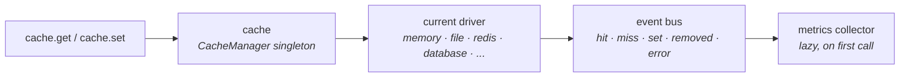

Some queries are expensive. Some lookups are constant for a request. Some homepage data changes once an hour but is hit ten thousand times in between. Cache is how you stop paying for the repeat work.

Warlock's cache layer lives in `@warlock.js/cache` (the standalone manager + drivers) and `@warlock.js/core` (which auto-registers the `database` driver). One singleton, several drivers, one API.

## Mental model



Three things to know:

1. **`cache` is one singleton.** It holds the current driver and a registry of loaded drivers. Most apps point at one driver and never reach for another.
2. **Drivers are interchangeable.** Memory for dev, Redis or memory-extended for production, database for serverless / horizontally-scaled apps without Redis. Same API — `set`, `get`, `remember`, `lock`, `swr`.
3. **Per-call driver override exists.** Want one specific write to land on Redis while everything else uses memory? Pass `{ driver: "redis" }` in the options. The default driver doesn't change.

## The shape

```ts
import { cache } from "@warlock.js/cache";

await cache.set("user.42", user, "1h");
const cached = await cache.get<User>("user.42");

// Or — the canonical pattern, cache-aside with stampede protection
const fresh = await cache.remember("user.42", "1h", () => db.users.find(42));
```

Those three calls cover 80% of usage. TTLs accept seconds (number) or duration strings: `"1h"`, `"30m"`, `"7d"`, `"2 weeks"`, anything the `ms` package parses.

## Configuration

`src/config/cache.ts` declares the drivers and the default. Driver classes come from `@warlock.js/cache` (memory, file, redis, memoryExtended, lru, pg, mock, null) and `@warlock.js/core` (the `database` driver — auto-registered on import).

```ts title="src/config/cache.ts"
import {
  FileCacheDriver,
  MemoryCacheDriver,
  MemoryExtendedCacheDriver,
  RedisCacheDriver,
  type CacheConfigurations,
} from "@warlock.js/cache";
import { DatabaseCacheDriver, env } from "@warlock.js/core";

const cacheConfigurations: CacheConfigurations<"database"> = {
  default: "memoryExtended",
  logging: false,
  drivers: {
    file: FileCacheDriver,
    memory: MemoryCacheDriver,
    redis: RedisCacheDriver,
    memoryExtended: MemoryExtendedCacheDriver,
    database: DatabaseCacheDriver,
  },
  options: {
    redis: {
      host: env("REDIS_HOST"),
      port: env("REDIS_PORT"),
      url: env("REDIS_URL"),
    },
    memory: { ttl: 3 * 60 * 60 },         // 3 hours default
    memoryExtended: { ttl: 30 * 60 },     // 30 minutes default
  },
};

export default cacheConfigurations;
```

| Field      | Purpose                                                                          |
| ---------- | -------------------------------------------------------------------------------- |
| `default`  | Driver name to activate on boot                                                  |
| `logging`  | Verbose logging from the cache manager — default `false`                         |
| `drivers`  | Name → class map. Drivers are lazy-instantiated on first reference               |
| `options`  | Per-driver constructor options. Indexed by driver name                           |

The `database` driver uses a `cache` table — it ships with the auth migrations bundle, or you can register your own `cache.migration.ts`. Without the table the first `set` throws on boot.

### Driver picks at a glance

| Driver           | When to use                                                                            |
| ---------------- | -------------------------------------------------------------------------------------- |
| `memory`         | Local dev, ephemeral state, tests. Single-process.                                     |
| `memoryExtended` | Like `memory` but with tags, SWR, locks, and similarity. Single-process.               |
| `file`           | Local dev when you want persistence across restarts.                                   |
| `redis`          | Production with multi-process / multi-instance apps. Strong stampede protection.        |
| `database`       | Production without Redis — runs on your existing DB. Slower than Redis, fine for many. |
| `pg`             | Production with Postgres-native locks / listen-notify integration.                     |
| `mock` / `null`  | Tests. `null` is a no-op driver; `mock` collects calls for inspection.                 |

## The core surface

### Write

```ts
await cache.set("key", value);                  // no TTL — driver default applies
await cache.set("key", value, 3600);            // 3600 seconds
await cache.set("key", value, "1h");            // duration string
await cache.set("key", value, {                 // rich options
  ttl: "1h",
  tags: ["users", "active"],
  onConflict: "create",                         // NX — set only if missing
});
```

Rich options:

| Option       | Purpose                                                          |
| ------------ | ---------------------------------------------------------------- |
| `ttl`        | Seconds or duration string                                       |
| `expiresAt`  | Absolute epoch ms or `Date` (mutually exclusive with `ttl`)      |
| `tags`       | `string[]` — invalidate together via `cache.tags([...])`         |
| `onConflict` | `"upsert"` (default), `"create"` (NX), `"update"` (XX)           |
| `namespace`  | Per-call namespace override                                      |
| `driver`     | Per-call driver override — route this one write somewhere else   |
| `staleAt`    | Freshness deadline (epoch ms) — primarily used by `swr()`         |

`onConflict: "create"` / `"update"` returns a `CacheSetResult` with `wasSet` and `existing` so callers can branch on the outcome.

### Read

```ts
const value = await cache.get<User>("key");      // T | null
const exists = await cache.has("key");           // boolean
const value = await cache.pull("key");           // get-then-delete (atomic on drivers that support it)
const many = await cache.many(["k1", "k2"]);     // any[] — null per missing key
```

`pull` is handy for one-shot tokens (verification codes, single-use idempotency keys) — fetch and remove in one call.

### Remove

```ts
await cache.remove("key");
await cache.removeNamespace("users");    // remove every key under namespace
await cache.flush();                     // wipe everything on the current driver
```

`flush` is the nuke option — useful in tests, dangerous in production. `removeNamespace` is the targeted invalidation you usually want.

### `remember` — stampede-safe cache-aside

```ts
const user = await cache.remember("user.42", "1h", async () => {
  return db.users.find(42);
});
```

The canonical caching pattern: read from cache, on miss run the callback, write the result, return it. Multiple concurrent callers for the same missing key see the per-driver protection mechanism — Redis offers strong protection (lock-on-miss), memory is single-process so it's naturally serialised, `database` driver's protection depends on row-level locking.

Rich form for tags or per-call driver override:

```ts
const user = await cache.remember(
  "user.42",
  { ttl: "1h", tags: ["users"], driver: "redis" },
  () => db.users.find(42),
);
```

### `forever`

```ts
await cache.forever("config.flags", flags);    // no expiration
```

Use sparingly — without a TTL you're committing to manual invalidation. Good for things that genuinely never change at runtime (compiled config, build hashes).

### Counters

```ts
await cache.increment("hits.daily");           // +1, returns new value
await cache.increment("hits.daily", 5);        // +5
await cache.decrement("inventory.42");         // -1
await cache.decrement("inventory.42", 3);      // -3
```

Atomic on Redis. On memory drivers they're a read-modify-write under a per-key lock — still serialised within the process.

## Stale-while-revalidate — `swr`

For hot reads where serving slightly-stale data beats blocking on a refresh:

```ts
const product = await cache.swr(
  "product.42",
  { freshTtl: "1m", staleTtl: "1h" },
  () => db.products.find(42),
);
```

Three windows split the entry's lifecycle:

- **Within `freshTtl`** — return cached, no upstream call.
- **Between `freshTtl` and `staleTtl`** — return the cached value immediately, kick off the callback in the background to refresh. Concurrent callers in this window all get the stale value; the refresh runs exactly once.
- **Past `staleTtl`** — block like a normal miss, await the callback.

If the background refresh fails, the stale entry is preserved and the error is logged + emitted on the `error` event. Callers that got the stale value never see the failure.

Honors the per-call `driver` override the same way `remember` does:

```ts
await cache.swr(
  "hot.value",
  { freshTtl: "1m", staleTtl: "10m", driver: "redis" },
  () => compute(),
);
```

## Distributed locks

For "exactly one process / worker / cron should do this thing right now":

```ts
const outcome = await cache.lock("lock.import", "5m", async () => {
  await runImport();
  return "done";
});

if (!outcome.acquired) {
  log.info("import", "skip", "another worker is running");
} else {
  log.info("import", "done", `result: ${outcome.value}`);
}
```

The TTL is mandatory — the lock auto-releases after that interval even if the holder crashes between acquire and release. Pick a TTL longer than the work; too short and a second worker can pick up the job before the first finishes.

The return value is a `LockOutcome` discriminated union. `outcome.acquired === true` → the body ran and `outcome.value` has the return. `outcome.acquired === false` → someone else holds the lock; nothing ran.

Rich options for owner labels and per-call driver:

```ts
await cache.lock(
  "lock.x",
  { ttl: "1m", owner: "worker.jobs-2", driver: "redis" },
  async () => doWork(),
);
```

The `owner` label is opaque to the cache — it ends up in driver-specific lock metadata, useful for debugging "who holds the lock" in introspection tooling.

## Namespaces — scoped views

Group related keys under a prefix:

```ts
const chat = cache.namespace("chats.10", { ttl: "30d" });

await chat.set("messages.1", msg);             // → "chats.10.messages.1", 30d default
await chat.set("draft", d, { ttl: "1h" });     // per-call ttl wins

const drafts = chat.namespace("typing", { ttl: "5s" });
await drafts.set("user.42", true);             // → "chats.10.typing.user.42"

await chat.clear();                            // wipe everything under "chats.10"
```

Scope defaults flow through writes; per-call options override. Tags merge additively. Nested scopes inherit and can override further.

The `ScopedCache` returned by `cache.namespace(...)` has the same surface as `cache` itself — `set`, `get`, `has`, `remember`, `swr`, `lock`, `increment`, `decrement`, `pull`, `clear`, plus nested `namespace`. Drop-in compatible.

## Tags

Tagged cache lets you invalidate a group without enumerating keys:

```ts
await cache.set("user.42", user, { ttl: "1h", tags: ["users", "user.42"] });
await cache.set("user.43", user2, { ttl: "1h", tags: ["users"] });
await cache.set("session.abc", session, { ttl: "1h", tags: ["sessions", "user.42"] });

await cache.tags(["users"]).invalidate();      // wipes user.42 and user.43
await cache.tags(["user.42"]).invalidate();    // wipes user.42 and session.abc
```

Tag support depends on the driver. Redis and `memoryExtended` have it; the base `database` driver does not (call `cache.tags(...)` on a non-tagging driver throws `CacheUnsupportedError`).

## Repository caching — `listCached` / `getCached`

`RepositoryManager` (from `@warlock.js/core`) wraps `list()` and `get()` with cache-through variants. The repository owns the cache key (deterministic hash of the call options), so callers don't manage keys:

```ts title="src/app/users/controllers/get-users.controller.ts"
import type { RequestHandler } from "@warlock.js/core";
import { usersRepository } from "../repositories/users.repository";

export const getUsersController: RequestHandler = async (request, response) => {
  const users = await usersRepository.listCached({
    perform: (q) => q.where("status", "active"),
    limit: 50,
  });

  return response.success({ users });
};
```

`listCached(filters)` returns the same `{ data, pagination, ... }` envelope as `list`, but the result is cached. Writes through the repository invalidate the relevant namespace automatically.

Disable per-repository with `static isCacheable = false`. The `Restful` base class respects this via its `cache` flag (default `true`), so a RESTful resource on a non-cacheable repo silently falls through to live queries.

This is the canonical pattern in the reference codebase — see `src/app/users/`, `src/app/projects/`, `src/app/ai-models/` for examples of `listCached` in list services.

## Per-call driver override

For when you want one write to land on a non-default driver without flipping the global default:

```ts
await cache.set("session.abc", session, { ttl: "1h", driver: "redis" });

await cache.remember("hot.value", { ttl: "1m", driver: "redis" }, () => compute());

await cache.lock("lock.x", { ttl: "1m", driver: "redis" }, async () => doWork());
```

Useful for ephemeral session storage on Redis while the rest of the app caches against memory. The override is per-call — it doesn't change `currentDriver`.

## Events and metrics

Every driver fans out lifecycle events through the manager:

```ts
cache.on("hit", (data) => {
  /* { key, driver } — cache hit */
});

cache.on("miss", (data) => {
  /* { key, driver } — cache miss */
});

cache.on("set", (data) => {
  /* { key, driver, ttl?, tags? } — write completed */
});

cache.on("removed", (data) => {
  /* { key, driver } — entry deleted */
});

cache.on("error", (data) => {
  /* { key?, driver, error } — driver-level failure */
});
```

Use these to push counters into your observability stack — "hit rate by namespace", "miss latency by driver", "errors by driver". Subscribe in a `main.ts` so the listeners stay alive for the process lifetime.

Metrics are lazy — `cache.metrics()` builds the collector on first call:

```ts
const m = cache.metrics();

console.log(`hit rate: ${(m.hitRate * 100).toFixed(1)}%`);
console.log(`p95: ${m.latencyMs.p95.toFixed(2)}ms`);
console.log(`per-driver:`, m.byDriver);

cache.resetMetrics();
```

Apps that never read metrics pay nothing — the collector doesn't exist until the first `metrics()` call.

## Common patterns

### Cache-aside read

The default pattern. One line, stampede-safe, easy to invalidate:

```ts
const user = await cache.remember(`user.${id}`, "1h", () => db.users.find(id));
```

### Invalidate on write

```ts
async function updateUser(id: string, patch: Partial<User>) {
  const user = await db.users.update(id, patch);
  await cache.remove(`user.${id}`);
  return user;
}
```

For namespaced caches, `cache.removeNamespace(`user.${id}`)` wipes everything prefixed with `user.<id>.` in one go.

### SWR for hot reads

Homepage data, dashboard counts, anything where staleness is tolerable but slow misses are visible:

```ts
const homepage = await cache.swr(
  "homepage.products",
  { freshTtl: "1m", staleTtl: "10m" },
  () => productsRepository.list({ featured: true }),
);
```

Within 1 minute it returns cached. Between 1 and 10 minutes it returns cached and refreshes in the background. After 10 minutes a request will block on the refresh — but you've covered the visibility window.

### Worker lock — exactly-one execution

```ts
const outcome = await cache.lock("job.daily-import", "30m", async () => {
  await runDailyImport();
  return { ok: true };
});

if (!outcome.acquired) {
  log.info("import", "skip", "another worker is running");
}
```

Pair with a scheduler that fires the same job across N workers — only one runs.

### Tenant-scoped cache

```ts
const tenantCache = cache.namespace(`tenant.${tenantId}`, { ttl: "1h", tags: [`tenant.${tenantId}`] });

await tenantCache.set("settings", settings);
await tenantCache.set("plan", plan);

// On tenant deletion / suspension:
await cache.tags([`tenant.${tenantId}`]).invalidate();
```

Every write under the tenant carries the tenant tag; one `invalidate` call clears the whole footprint.

### One-shot OTP token

```ts
const code = generateOtp();
await cache.set(`otp.${userId}`, code, { ttl: "10m", onConflict: "create" });

// On verification:
const stored = await cache.pull(`otp.${userId}`);   // get + delete atomically
if (stored !== submitted) {
  throw new BadRequestError("Invalid code");
}
```

`onConflict: "create"` prevents overwriting an existing in-flight OTP. `pull` ensures the code can only be used once.

## Gotchas

- **TTL durations parse via `ms`.** `"1h"`, `"30m"`, `"7d"`, `"2 weeks"` all work. Typos return `NaN` and get treated as "no expiration" — watch out for keys that quietly stop expiring.
- **`cache.set` returns `undefined` for upsert** (the default). It returns a `CacheSetResult` only when you pass `onConflict: "create"` / `"update"`.
- **`remember` is not stampede-proof across every driver.** Memory drivers serialise within process. Multi-process apps need Redis (or build your own coordination on `cache.lock`).
- **Per-call driver overrides don't stick.** Passing `{ driver: "redis" }` for one call doesn't change the default — that's by design. Use `cache.use("redis")` to switch defaults.
- **`globalPrefix` is per-driver.** Setting it on `memory` doesn't affect `redis`. If you use multiple drivers for the same app, pin the prefix uniformly to avoid cross-driver key collisions.
- **The `database` driver requires the `cache` table.** It's part of `authMigrations` in the canonical project setup. Without the table the first `set` throws on a missing table — cover this in your startup health check.
- **Tags require a tagging driver.** Calling `cache.tags(...)` on the base `database` driver throws `CacheUnsupportedError`. Use Redis or `memoryExtended` if you need tags.
- **`cache.lock` releases on its own TTL.** If your work exceeds the TTL, a second worker can pick up the job. Size the TTL generously, monitor for over-runs.

## See also

- **[Repositories deep dive](../the-basics/repositories-deep.md)** — `listCached`, `getCached`, and how the repository owns its cache keys.
- **``@warlock.js/cache` — cache-basics skill`** — entry point for the cache package; see sibling skills (`pick-cache-driver`, `use-swr`, `use-cache-tags`, `use-cache-lock`, …) for specific tasks.
- **[Recipe: Cached list](../recipes/cached-list.md)** — end-to-end cached repository list with invalidation.
