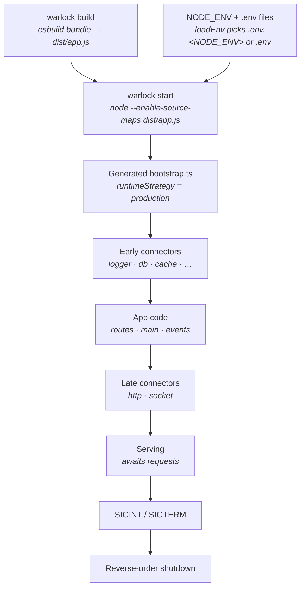

Shipping a Warlock app is two commands: `warlock build` to produce a bundle, `warlock start` to run it. Dev runs through a custom ESM loader optimized for fast reloads; production runs an esbuild bundle on a plain Node process — no `tsx`, no loader hook, no file watcher. This page covers what `build` emits, how `start` launches it, how the environment is selected, why the runtime flips into "production" mode, and what happens to your connectors when the process gets a kill signal.

It stays grounded in the actual `build`/`start` commands and the production builder. Where to *host* the resulting process — a VM, a container, a PaaS — is up to you; Warlock just needs a Node runtime and the right env vars. There's a short pointer at the end, but no Docker or PM2 recipe here, because the framework doesn't ship one.

## The 30-second look



Three takeaways:

1. **`build` is a bundler step, `start` is just `node`.** The whole framework dev-time machinery is absent in production.
2. **The bundle decides its own runtime mode.** The generated entry sets the runtime strategy to `production` before any connector starts — `start` itself stays dumb.
3. **Connectors shut down in reverse priority order** on `SIGINT`/`SIGTERM` (and `SIGHUP` on Windows), so the HTTP/socket servers close before the database does.

## `warlock build`

`warlock build` runs the `ProductionBuilder`. It generates a handful of combined files under `.warlock/production/`, hands them to [esbuild](https://esbuild.github.io/), writes the bundle to your output directory, then deletes the temporary `.warlock/production/` folder. The build is driven entirely by `warlock.config.ts > build` — there are no build flags to pass.

What the builder generates before bundling:

| Generated file       | What it contains                                                                                   |
| -------------------- | -------------------------------------------------------------------------------------------------- |
| `bootstrap.ts`       | Calls `bootstrap()` and sets the runtime strategy + environment to `production` (see below)         |
| `config-loader.ts`   | Imports every `src/config/*` file, registers each into `config`, and runs its special handlers      |
| `events.ts`          | Side-effect imports of every `**/events/*` file — only generated if your app has event files         |
| `locales.ts`         | Side-effect imports of every `**/utils/locales` file — only if present                               |
| `main.ts`            | Side-effect imports of every `**/main` file — only if present                                        |
| `routes.ts`          | Side-effect imports of every `**/routes` file — only if present                                      |
| `app.ts`             | The entry point that ties it all together (bootstrap → configs → early connectors → app code → late connectors) |

The `app.ts` entry imports app code with dynamic `await import("./routes")` (not static imports) so each module's side effects fire *after* the early-phase connectors have finished starting — that's why the builder turns on esbuild's `splitting: true`. The same phase split you read about in [Bootstrap and connectors](../architecture-concepts/bootstrap-and-connectors.md) is baked straight into the generated entry.

### esbuild settings

The builder bundles with esbuild using these settings (the ones you can influence come from `build` config):

| Setting              | Value                                                              | Source                       |
| -------------------- | ----------------------------------------------------------------- | ---------------------------- |
| `platform`           | `node`                                                            | fixed                        |
| `format`             | `esm`                                                             | fixed                        |
| `target`             | `node22`                                                          | fixed (transpiles stage-3 decorators, which Node doesn't run natively yet) |
| `bundle` / `splitting` | both `true`                                                     | fixed                        |
| `packages`           | `external` (your `node_modules` are not inlined)                  | fixed                        |
| `minify`             | from `build.minify`                                              | config — default `true`      |
| `sourcemap`          | from `build.sourcemap` (`true` becomes `"linked"`)               | config — default `true`      |
| `outdir`             | from `build.outDirectory`                                        | config — default `dist`      |
| `entryNames`         | from `build.outFile` (extension stripped; esbuild adds `.js`)    | config — default `app.js`    |

Because `packages: "external"`, your dependencies are **not** bundled in — `node_modules` must be present (installed) wherever you run the result.

### The `build` config keys

These live in `warlock.config.ts` under `build`. The defaults the runtime actually applies come from the framework's default configuration, merged over your values by `resolveBuildConfig()`:

| Key            | Type                                     | Default  | What it does                                                              |
| -------------- | ---------------------------------------- | -------- | ------------------------------------------------------------------------ |
| `outDirectory` | `string`                                 | `dist/` under the project root (resolved from `process.cwd()`) | Folder the bundle is written to                                          |
| `outFile`      | `string`                                 | `"app.js"` | Bundle filename (the extension is normalized to `.js` by esbuild)        |
| `minify`       | `boolean`                                | `true`   | Minify the output                                                        |
| `sourcemap`    | `boolean \| "inline" \| "linked"`        | `true`   | Emit source maps; `true` is treated as `"linked"`                        |

```ts title="warlock.config.ts"
import { defineConfig } from "@warlock.js/core";

export default defineConfig({
  build: {
    outDirectory: "dist",
    outFile: "app.js",
    minify: true,
    sourcemap: true,
  },
});
```

The entry the bundle produces is `{outDirectory}/{outFile}` — by default `dist/app.js`. `warlock start` resolves that exact path through the same `resolveBuildConfig()` helper, so `build` and `start` always agree on where the artifact lives.

## `warlock start`

`warlock start` does not re-bundle. It resolves the build config to find the entry path, then spawns a child Node process on the bundle:

```bash
node --enable-source-maps dist/app.js
```

Specifically:

- `--enable-source-maps` is added **unless** `build.sourcemap` is `false`, so production stack traces map back to your TypeScript.
- Anything you type after `start` is passed through to the Node process — e.g. `warlock start --inspect` forwards `--inspect`.
- The command runs the child with `stdio: "inherit"` and the parent's `env`, in the same working directory.

`start` exits with the child's exit code. It forwards `SIGTERM` to the child explicitly and lets `SIGINT` (Ctrl+C) reach the child naturally; the actual graceful shutdown is handled *inside* the bundle by the connectors manager (next section).

> The build must exist before you call `start`. `start` does not build for you — run `warlock build` first (typically as a deploy step), then `warlock start` on the server.

## Environment selection

There are two distinct notions of "environment", and it's worth keeping them straight:

1. **`NODE_ENV`** — a standard process env var (`"development" | "production" | "test"`). It decides which `.env` file gets loaded and what `Application.environment` reports.
2. **Runtime strategy** — an internal Warlock flag (`"development" | "production"`) that decides whether the dev-server code paths run. It is set by the CLI command / generated bundle, *not* read from `NODE_ENV`.

### `NODE_ENV` and the `.env` file it picks

`bootstrap()` calls `loadEnv()` from `@mongez/dotenv` as its very first step. `loadEnv` resolves which file to read based on `NODE_ENV`:

1. If `.env.shared` exists, it is loaded first (shared baseline values).
2. Then, if `.env.<NODE_ENV>` exists (e.g. `.env.production`), that file is loaded.
3. Otherwise it falls back to plain `.env`.

By default `loadEnv` overrides — values in the loaded file win over whatever is already in `process.env`. If `NODE_ENV` is unset, `Application.environment` defaults to `"development"`, so on a production host you typically set `NODE_ENV=production` *before* the process starts (so the right `.env.production` is picked up) and provide the secrets your config files read.

```bash title="Production launch"
NODE_ENV=production warlock start
```

```ini title=".env.production"
# Whatever your src/config/* files read via env(...)
DATABASE_URL=...
CACHE_DRIVER=redis
MAIL_HOST=...
```

`Application` exposes read-only getters for the resolved environment:

| Accessor                     | Returns                                  |
| ---------------------------- | ---------------------------------------- |
| `Application.environment`    | `NODE_ENV` (or `"development"` if unset) |
| `Application.isProduction`   | `true` when environment is `"production"`|
| `Application.isDevelopment`  | `true` when environment is `"development"`|
| `Application.isTest`         | `true` when environment is `"test"`      |

### Runtime strategy: dev vs production

The runtime strategy is set in exactly one place per run:

- **Dev** — the `warlock dev` command preloads `runtimeStrategy: "development"`.
- **Production** — the *generated* `bootstrap.ts` in the bundle calls `Application.setRuntimeStrategy("production")` and `Application.setEnvironment("production")` before anything else.

```ts title=".warlock/production/bootstrap.ts (generated)"
import { bootstrap, Application } from "@warlock.js/core";

Application.setRuntimeStrategy("production");
Application.setEnvironment("production");

bootstrap();
```

The strategy matters because some connectors branch on it. The clearest case is the HTTP connector: in `development` it registers routes via `router.scanDevServer(...)` (the HMR-aware path); otherwise it uses the plain `router.scan(...)`. You don't toggle this yourself — building for production wires the production path in.

> The generated bootstrap forces `Application.setEnvironment("production")`, which sets `process.env.NODE_ENV = "production"` from inside the process. But that happens *after* `loadEnv()` has already chosen the `.env` file based on the `NODE_ENV` the process started with. So the env var you set on the host still determines which `.env` file is read — set `NODE_ENV=production` before launching if you want `.env.production`.

## Graceful shutdown

The generated production entry ends by calling `connectorsManager.shutdownOnProcessKill()`. That installs signal handlers so the process tears subsystems down cleanly instead of dropping connections:

| Signal     | Where                | Behavior                                              |
| ---------- | -------------------- | ----------------------------------------------------- |
| `SIGINT`   | all platforms        | Triggers graceful shutdown (Ctrl+C)                   |
| `SIGTERM`  | all platforms        | Triggers graceful shutdown (orchestrators send this)  |
| `SIGHUP`   | Windows only (`win32`) | Triggers graceful shutdown                           |

When a signal arrives, `gracefulShutdown` runs once (an `isShuttingDown` re-entry guard ignores repeat signals), prints `Exiting...`, awaits `connectorsManager.shutdown()`, then `process.exit(0)`.

`shutdown()` walks the connectors in **reverse priority order** — the inverse of startup. Since the connectors start sorted ascending by priority (logger first, access last), shutdown runs from the highest priority back down. The practical effect is that **late-phase servers close before early-phase infrastructure**: HTTP and socket stop accepting work before the database connection is torn down, so you don't drop in-flight requests onto a closed database. Each connector's `shutdown()` is wrapped in a try/catch — a failure is logged, not thrown, so one misbehaving subsystem can't block the rest from shutting down.


The two layers cooperate: `warlock start`'s parent process forwards `SIGTERM` to (and lets `SIGINT` reach) the child, and the child's `shutdownOnProcessKill()` does the actual reverse-order teardown.

## Which subsystems come up

A connector only does anything if its config file exists. All ten built-ins are always registered, but each one's `start()` reads its config (`config.get("http")`, `config.get("database")`, …) and no-ops if it's absent. In production the generated `config-loader.ts` imports **every file in `src/config/`**, so a subsystem is active in production exactly when its `src/config/*.ts` file is present and its env-driven values are set. This is the same activation rule as dev — see [Connectors](../architecture-concepts/connectors.md) for the full catalog and priorities.

The upshot for deployment: if a subsystem isn't coming up in production, the first thing to check is whether its config file is in `src/config/` and whether the env vars it reads are actually present in the environment you launched with.

## Pre-deploy checklist

Before `warlock start` on a fresh host:

- **`NODE_ENV` is set** to `production` *before* the process starts, so `loadEnv` reads `.env.production` (if you keep one) and `Application.environment` reports `production`.
- **The right env file is on the box** — `.env.production` (and/or `.env.shared`, and/or `.env`). `loadEnv` throws if the file it resolves to does not exist, so at minimum the resolved file must be present.
- **Every secret your config files read is in the environment.** Connectors pull values via `config.get(...)`, which is fed by your `src/config/*` files reading `env(...)`. Missing values mean a subsystem silently no-ops (or, for access, fails fast — see gotchas).
- **The config files for the subsystems you need are present** in `src/config/` (`http.ts`, `database.ts`, `cache.ts`, …). A subsystem with no config file does not activate.
- **`node_modules` is installed** on the host. The bundle marks packages as external, so dependencies are resolved at runtime, not inlined.
- **The bundle exists** — run `warlock build` as part of your deploy. `warlock start` will not build for you.
- **A real shutdown signal reaches the process.** If you run under a supervisor, make sure it sends `SIGTERM` (or `SIGINT`) so the connectors get to shut down gracefully instead of being `SIGKILL`-ed.

## Gotchas

- **`start` does not build.** Running `warlock start` against a missing/stale `dist/` just runs whatever is there (or fails to find the entry). Always `warlock build` first in your pipeline.
- **`NODE_ENV` is read before the bundle forces it.** The generated bootstrap sets the environment to `production` *inside* the process, but `loadEnv` already chose the `.env` file from the `NODE_ENV` the process started with. Setting `NODE_ENV=production` in the bundle does **not** retroactively change which `.env` file was loaded.
- **`loadEnv` throws on a missing file.** If `.env.<NODE_ENV>` doesn't exist it falls back to `.env`, but if *that* is also missing it throws. Make sure at least one resolvable env file is on the host.
- **Dependencies aren't bundled.** `packages: "external"` keeps `node_modules` out of the bundle, so a host without the installed packages will fail at runtime, not at build time.
- **A subsystem that "won't start" is usually a missing config file or missing env value**, not a framework bug — the connector is registered, it just read an empty config and returned.
- **The `access` connector fails at startup if misconfigured.** Unlike the others, it validates that a resolver is present, so an authorization layer that's half-configured surfaces the error on boot rather than on the first protected request — a feature, but it means a bad `src/config/access.ts` will stop the process from coming up.
- **`SIGKILL` skips shutdown.** Graceful teardown only runs for `SIGINT`/`SIGTERM` (and `SIGHUP` on Windows). A hard kill gives connectors no chance to close — configure your supervisor to send a terminable signal and allow a short grace period.

## Where to host

Warlock produces a standard Node ESM bundle plus your `node_modules` — anywhere that runs Node 22+ will serve it. Build in CI (or on the box), ship `dist/` + `node_modules` + your `.env`/config, set `NODE_ENV`, and run `warlock start` under whatever process supervisor your platform provides. The framework deliberately doesn't prescribe a container or process-manager setup; the only hard requirements are a Node runtime, the installed dependencies, and the env vars your config files read.

## See also

- [Bootstrap and connectors](../architecture-concepts/bootstrap-and-connectors.md) — the boot sequence the production entry reproduces: bootstrap, early phase, app code, late phase.
- [Connectors](../architecture-concepts/connectors.md) — the catalog of all ten built-ins, their priorities and phases, and the rule that the config file activates each subsystem.
- [How it works](../architecture-concepts/how-it-works.md) — the production builder and the dev/prod loader split in more depth.
- [warlock.config.ts](../architecture-concepts/warlock-config.md) — the project-level config, including the `build` block.
- [Application](../architecture-concepts/application.md) — the static gateway to `environment`, runtime mode, and the well-known paths.
- [Configuration](../getting-started/03-configuration.md) — the two config layers and how `.env` values feed `src/config/*`.
