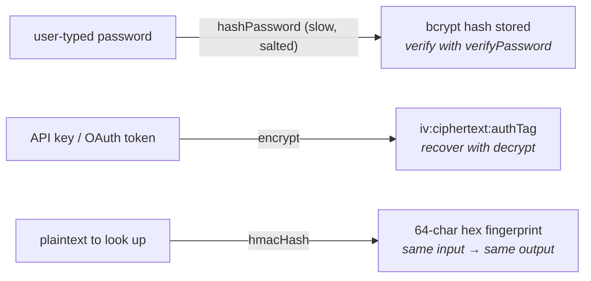

Three different jobs, three different tools. Picking the right one is the difference between a secure system and a credentials leak waiting to happen.

| Tool                                  | Direction  | Algorithm    | Use for                                                         |
| ------------------------------------- | ---------- | ------------ | --------------------------------------------------------------- |
| `hashPassword` / `verifyPassword`     | one-way    | bcrypt (slow) | User-typed passwords. **Only** passwords.                       |
| `encrypt` / `decrypt`                 | reversible | AES-256-GCM  | Secrets you need to read back — API keys, OAuth tokens.         |
| `hmacHash`                            | one-way    | HMAC-SHA256  | Deterministic fingerprints for lookup / dedup of encrypted data. |

All three live in `@warlock.js/core`. Configure them with `src/config/encryption.ts`.

## Mental model



The rules of thumb:

- If the user types it, hash it. Use bcrypt. **Never** encrypt user passwords — a database leak then becomes a credentials leak.
- If you need to read it back, encrypt it. Use AES-256-GCM. **Never** put bcrypt on the request hot path; it's ~250ms per call and that's deliberately the point.
- If you need to look it up by value without reading it back, hmac it. Use HMAC-SHA256. **Never** use HMAC for passwords; it's fast enough to brute-force.

Mixing these is the most common security mistake. Encrypting a password means a stolen database equals stolen credentials. Hashing an API key with bcrypt means a 250ms tax on every authenticated request. Hashing a password with HMAC means rainbow-table-able. Use the right tool.

## The shape

```ts
import {
  hashPassword,
  verifyPassword,
  encrypt,
  decrypt,
  hmacHash,
} from "@warlock.js/core";

// Password — one-way, slow, salted (bcrypt)
const hashed = await hashPassword("user-password-123");
const valid = await verifyPassword("user-password-123", hashed);

// Encryption — reversible, fast, integrity-checked (AES-256-GCM)
const cipherText = encrypt("sk-proj-12345");
const plainText = decrypt(cipherText);

// HMAC — one-way, fast, deterministic (HMAC-SHA256)
const fingerprint = hmacHash("sk-proj-12345");
```

## Configuration

`src/config/encryption.ts` holds the keys. Generate them once with `node -e "console.log(require('crypto').randomBytes(32).toString('hex'))"` and put them in `.env`.

```ts title="src/config/encryption.ts"
import type { EncryptionConfigurations } from "@warlock.js/core";
import { env } from "@warlock.js/core";

const encryptionConfig: EncryptionConfigurations = {
  key: env("APP_ENCRYPTION_KEY"),       // 64 hex chars = 32 bytes — required for encrypt/decrypt
  algorithm: "aes-256-gcm",              // optional, default
  hmacKey: env("APP_HMAC_KEY"),         // 64 hex chars — falls back to `key` if absent
  password: {
    salt: 12,                            // bcrypt rounds. 10–12 is the standard band.
  },
};

export default encryptionConfig;
```

| Field          | Purpose                                                                       |
| -------------- | ----------------------------------------------------------------------------- |
| `key`          | 32-byte hex key for `encrypt` / `decrypt`. **Never rotate without migration.** |
| `algorithm`    | Cipher algorithm. Default `aes-256-gcm`. Other GCM variants work.              |
| `hmacKey`      | Separate HMAC key for `hmacHash`. Falls back to `key` if not set.              |
| `password.salt` | bcrypt rounds. Higher = slower = more secure. 10–12 standard.                  |

The encryption key is a forever decision. Every value you encrypt under it depends on that key for recovery — if you change it, every existing ciphertext becomes garbage. Plan a migration if you ever genuinely need to rotate (decrypt-all + re-encrypt under new key + atomic cutover).

The HMAC key can rotate more freely if you accept that recomputed fingerprints under the new key won't match historical ones — you'd have to migrate the stored fingerprints too. Best practice is two separate keys; the framework defaults to using `key` for HMAC if `hmacKey` is missing, but you should split them in production.

## `hashPassword` / `verifyPassword` — only for passwords

bcrypt is **deliberately slow**. Each call takes ~250ms with `salt: 12`. That's the point — it makes offline brute-force attacks against a stolen database prohibitively expensive. The attacker pays the tax too.

```ts title="src/app/users/services/register-user.service.ts"
import { hashPassword } from "@warlock.js/core";
import { User } from "../models/user";

export async function registerUserService(input: { email: string; password: string }) {
  const user = await User.create({
    email: input.email,
    password: await hashPassword(input.password),
  });

  return user;
}
```

```ts title="src/app/auth/services/verify-credentials.service.ts"
import { verifyPassword } from "@warlock.js/core";
import { usersRepository } from "app/users/repositories/users.repository";

export async function verifyCredentialsService(email: string, password: string) {
  const user = await usersRepository.first({ email });

  if (!user) return null;

  const isValid = await verifyPassword(password, user.get("password"));

  return isValid ? user : null;
}
```

### Before and after

Without warlock conventions, you might see something like:

```ts
// ❌ stores a recoverable password — a database leak is a credentials leak
await User.create({ email, password: encrypt(password) });

// ❌ stores HMAC fingerprint — brute-forceable
await User.create({ email, password: hmacHash(password) });

// ❌ no hashing — plain text, just don't
await User.create({ email, password });
```

The correct pattern is one line different and exactly right:

```ts
// ✅ bcrypt — slow, salted, one-way, no recovery
await User.create({ email, password: await hashPassword(password) });
```

The `@warlock.js/auth` package wires both helpers into its `authService` — `authService.hashPassword(p)` and `authService.verifyPassword(plain, hash)` are thin proxies over these. Use the auth service if you're using `@warlock.js/auth`; use the core helpers directly if you're rolling your own.

### Why bcryptjs (not native bcrypt)

The framework uses **`bcryptjs`** — pure JS, lazy-loaded. You get a clear install hint if it's missing:

```
Password encryption requires the bcryptjs package.
Install it with:
  yarn add bcryptjs
```

Don't swap for native `bcrypt` without a reason — `bcryptjs` is portable across every platform (no native build), and the perf delta isn't meaningful at the verify-on-login frequency. If you're hashing 1000 passwords per second, you have a different problem.

Both functions are async because bcrypt is CPU-bound and Node's bcrypt bindings dispatch to a thread pool — never block the event loop with `hashSync`.

## `encrypt` / `decrypt` — reversible secrets

For values you need to read back: API keys you'll later send to a third party, OAuth refresh tokens, credentials in a vault row. **Never use this for passwords** — you'd be storing recoverable plaintext, which means a database breach equals a credentials leak.

The canonical pattern from the reference codebase:

```ts title="src/app/ai-api-keys/services/create-ai-api-key.service.ts"
import { ConflictError, encrypt, hmacHash } from "@warlock.js/core";
import { AiApiKey } from "../models/ai-api-key";
import { aiApiKeysRepository } from "../repositories/ai-api-keys.repository";

export async function createAiApiKeyService(data: {
  key: string;
  organization_id: string;
  created_by: string;
  provider: string;
}) {
  // Look up by fingerprint, not by plaintext — never decrypt to compare
  if (
    await aiApiKeysRepository.first({
      organization_id: data.organization_id,
      hash: hmacHash(data.key),
    })
  ) {
    throw new ConflictError("API key already exists");
  }

  return AiApiKey.create({
    ...data,
    key: encrypt(data.key),                  // the secret, recoverable
    hash: hmacHash(data.key),                // the fingerprint, lookup-able
    last_four_chars: data.key.slice(-4),     // for UI ("ending in 1234")
  });
}
```

This is the textbook pattern: **encrypt the secret, hmacHash the same value for lookup**. Now you can find the row by user-provided plaintext (`first({ hash: hmacHash(input) })`) without ever decrypting, and `decrypt(row.get("key"))` recovers the secret when you genuinely need to use it (proxying a request to OpenAI, signing an outbound webhook, etc).

Reading it back:

```ts
import { decrypt } from "@warlock.js/core";

const apiKey = await aiApiKeysRepository.first({ id });
const plainKey = decrypt(apiKey.get("key"));

// Use plainKey for the outbound call, then forget it
await fetch("https://api.openai.com/v1/chat/completions", {
  headers: { Authorization: `Bearer ${plainKey}` },
  /* ... */
});
```

### The format

`encrypt(plain)` returns `iv:ciphertext:authTag` — three hex chunks joined with `:`. Three properties that matter:

1. **The IV is a fresh 16-byte random per call.** Encrypting the same input twice yields two different cipher texts. This is what you want — it defeats pattern analysis ("two rows have the same value").
2. **The authTag is GCM's integrity check.** If the stored ciphertext is tampered with, `decrypt()` throws — you can't quietly substitute a forged value.
3. **The whole token is ASCII-safe.** Hex-encoded, no escaping, fits in any string column.

`decrypt()` throws on:

- Invalid format (not three colon-separated parts).
- Wrong key (the IV decrypts but the authTag mismatches).
- Tampered ciphertext (auth tag mismatch).
- Wrong algorithm vs. the one used to encrypt.

Handle those at the boundary — they almost always mean misconfiguration or a corrupted row, not a runtime bug.

### Empty-string passthrough

Both `encrypt("")` and `decrypt("")` return `""` unchanged — convenient for nullable columns where "" means "no value." `null` and `undefined` throw at the type level (the signatures require `string`).

## `hmacHash` — deterministic fingerprints

A keyed one-way hash. Same input + same key always produces the same 64-hex-char output. Two properties that matter:

1. **Deterministic.** Use it to dedup or look up encrypted values without decrypting them. The lookup costs nothing.
2. **Keyed.** An attacker with the database but not the HMAC key can't precompute a rainbow table — they don't know which hash function you're using.

Three solid use cases:

```ts
// 1. Unique constraint on an encrypted column
const existing = await aiApiKeysRepository.first({ hash: hmacHash(userInput) });

// 2. Idempotency key derived from a payload
const idempotencyKey = hmacHash(JSON.stringify(request.body));

// 3. Fingerprint of a secret for audit logs (without storing the secret)
log.info("api-key", "used", { fingerprint: hmacHash(apiKey).slice(0, 8) });
```

**Do not use `hmacHash` for passwords.** It's fast — a brute-force attack with a stolen database would clear common passwords in minutes. That's exactly what bcrypt protects against.

## Common patterns

### Encrypt + fingerprint together

The canonical pattern from `create-ai-api-key.service.ts`:

```ts
await Model.create({
  key: encrypt(plain),
  hash: hmacHash(plain),                     // for lookups
  last_four_chars: plain.slice(-4),          // for UI display ("ending in 1234")
});
```

`last_four_chars` is gold for dashboards — let users tell their keys apart ("OpenAI key ending in 1234") without ever revealing the secret in the UI.

### Rotate a user's password

```ts
import { hashPassword, verifyPassword, BadRequestError } from "@warlock.js/core";

export async function rotatePasswordService(
  userId: string,
  oldPassword: string,
  newPassword: string,
) {
  const user = await usersRepository.findById(userId);

  if (!user) {
    throw new BadRequestError("User not found");
  }

  if (!(await verifyPassword(oldPassword, user.get("password")))) {
    throw new BadRequestError("Current password incorrect");
  }

  await user.set("password", await hashPassword(newPassword)).save();

  // Force re-login on all devices
  await authService.revokeAllTokens(user);
}
```

### Encryption boundary inside a model accessor

Keep the crypto in one place — controllers and services deal in plaintext, the model handles encryption on save and decryption on read:

```ts title="src/app/secrets/models/secret/secret.model.ts"
import { encrypt, decrypt } from "@warlock.js/core";
import { Model, RegisterModel } from "@warlock.js/cascade";

@RegisterModel()
export class Secret extends Model {
  public static table = "secrets";

  public setValue(plain: string): this {
    return this.set("value", encrypt(plain));
  }

  public getValue(): string {
    return decrypt(this.get("value"));
  }
}
```

Usage:

```ts
const secret = await Secret.create({});
secret.setValue("sk-proj-12345");
await secret.save();

// Later:
const plain = secret.getValue();    // "sk-proj-12345"
```

Now controllers never touch `encrypt` directly. If the model changes (key rotation, algorithm change), there's one place to fix.

### Search by encrypted column

The standard recipe: store encrypted, look up by fingerprint.

```ts
// On write
await ApiKey.create({
  key: encrypt(plain),
  hash: hmacHash(plain),
});

// On lookup — the user provides plaintext, you fingerprint it and search
const row = await apiKeysRepository.first({ hash: hmacHash(input) });

if (!row) {
  throw new UnauthorizedError("Invalid API key");
}

// Once verified, decrypt only when you need to use the value
const plainKey = decrypt(row.get("key"));
```

This pattern preserves both lookup speed (indexed `hash` column) and confidentiality (the encrypted `key` column never needs to be decrypted just for authentication).

## Gotchas

- **Never log decrypted values.** A log line is a leak. If you must debug, log the HMAC fingerprint (`hmacHash(value).slice(0, 8)`), not the plaintext.
- **Don't `hashPassword` on every request.** Each call is ~250ms. `verifyPassword(plain, storedHash)` takes the plaintext and the stored hash — that's the API. Bcrypt should only run on login / signup / password change, never on every authenticated request.
- **`encrypt` / `decrypt` keys must be 32 bytes (64 hex chars).** Anything else throws with a clear message. Don't truncate or pad — generate a fresh key with `crypto.randomBytes(32)`.
- **Empty key value is fatal at runtime.** If `env("APP_ENCRYPTION_KEY")` returns `undefined`, the first `encrypt()` call throws "Missing encryption key" at runtime, not at boot. Cover this in your startup health check or pre-flight script.
- **HMAC falls back to the encryption key.** If `hmacKey` isn't set, `hmacHash` uses `key`. Convenient, but slightly weakens your isolation — best practice is two separate keys.
- **Don't reuse the same value across `encrypt` and `hashPassword`.** A bcrypt hash and an AES ciphertext are different domains. You can't `decrypt(hashedPassword)` to recover the password, and you can't `verifyPassword(plain, encryptedValue)` to compare. Pick one helper for each value.
- **`encrypt(value) === encrypt(value)` is `false`.** The IV is random per call. If you need determinism (for indexing, dedup), use `hmacHash` — that's its whole purpose.
- **Rotating the encryption key is a migration.** Every value encrypted under the old key needs to be decrypted with the old key and re-encrypted with the new key, atomically. Plan for it; don't just swap the env var.

## See also

- **[Recipe: Protected routes](../recipes/protected-routes.md)** — auth flow that uses `hashPassword` / `verifyPassword` end-to-end.
- **[Configuration](../getting-started/03-configuration.md)** — the `src/config/encryption.ts` shape and `env()` patterns.
