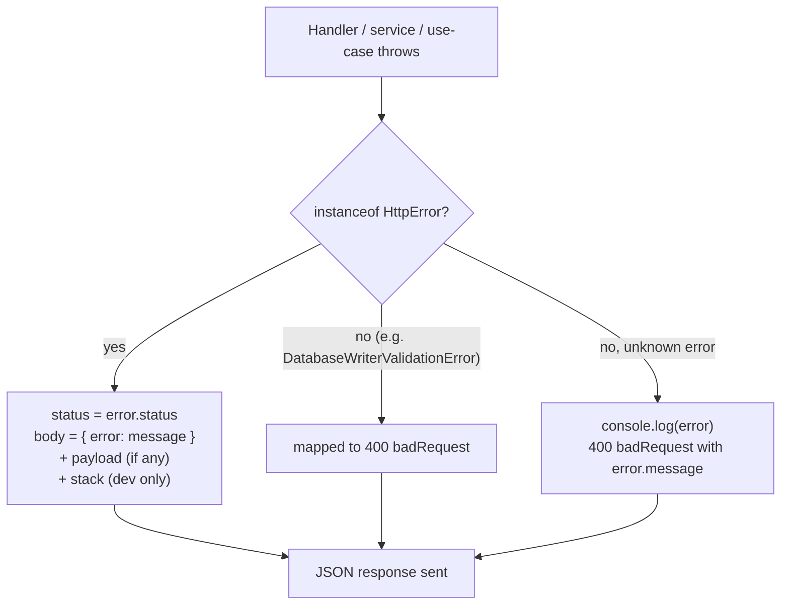

Warlock turns thrown errors into HTTP responses for you. Throw an `HttpError` (or one of its eight subclasses) from a controller, service, or use-case and the framework catches it, reads the status off the error, and sends a JSON body. You don't wire a `try/catch` into every handler — the request pipeline already wraps your code.

That's the honest scope. The framework handles the **mapping** (error → status → body) and a **stable code table** (`HttpErrorCodes`) that middleware uses so clients can branch on a code instead of parsing message text. What you decide is **which** error to throw and what to put in its payload. This page covers both — the error classes, how they reach the wire, the validation envelope, and the codes.

## The 30-second look

```ts title="src/app/orders/services/find-order.service.ts"
import { ResourceNotFoundError } from "@warlock.js/core";
import { Order } from "../models/order";

export async function findOrderOrFail(id: string) {
  const order = await Order.find(id);

  if (!order) {
    throw new ResourceNotFoundError("Order not found");
  }

  return order;
}
```

A controller calls this service and does nothing special. When the order is missing, the throw bubbles up, the request pipeline catches it, and the client gets:

```json
// HTTP 404
{
  "error": "Order not found"
}
```

No `try/catch` in the controller, no manual `response.notFound(...)`. The status code lives on the error class — `ResourceNotFoundError` is `404` — and the framework reads it.

## The error classes

All HTTP errors live in `@warlock.js/core`. The base is `HttpError`; the eight subclasses are thin wrappers that pre-fill the status code so you don't pass it yourself.

```ts
export class HttpError extends Error {
  public constructor(
    public status: number,
    public message: string,
    public payload?: any,
  ) {
    super(message);
    this.name = "HttpError";
  }
}
```

`HttpError` is the only class that takes a status as its first argument. Every subclass takes `(message, payload?)` and hard-codes the status:

| Class                   | Status | Throw it when…                                                        |
| ----------------------- | ------ | --------------------------------------------------------------------- |
| `HttpError`             | _you choose_ | You want a status the subclasses don't cover (e.g. `429`, `503`). |
| `ResourceNotFoundError` | `404`  | A looked-up record or route target doesn't exist.                     |
| `UnAuthorizedError`     | `401`  | The caller isn't authenticated (missing / invalid credentials).       |
| `ForbiddenError`        | `403`  | The caller is authenticated but not allowed to do this.               |
| `BadRequestError`       | `400`  | The request is malformed or semantically wrong.                       |
| `ConflictError`         | `409`  | The action conflicts with current state (duplicate, version clash).   |
| `NotAcceptableError`    | `406`  | The server can't produce a representation the client will accept.     |
| `NotAllowedError`       | `405`  | The HTTP method isn't allowed on this resource.                       |
| `ServerError`           | `500`  | Something broke server-side that the client can't fix.                |

Note the spelling: it's `UnAuthorizedError` (capital `A`), not `UnauthorizedError`.

```ts title="src/app/posts/services/publish-post.service.ts"
import {
  ConflictError,
  ForbiddenError,
  ResourceNotFoundError,
} from "@warlock.js/core";
import { Post } from "../models/post";

export async function publishPost(postId: string, userId: string) {
  const post = await Post.find(postId);

  if (!post) {
    throw new ResourceNotFoundError("Post not found");
  }

  if (post.get("authorId") !== userId) {
    throw new ForbiddenError("You can only publish your own posts");
  }

  if (post.get("status") === "published") {
    throw new ConflictError("Post is already published");
  }

  post.set("status", "published");
  await post.save();

  return post;
}
```

### The `payload` argument

Every error class accepts an optional second argument (third on `HttpError`) — a free-form `payload`. Use it to attach machine-readable detail the client can act on:

```ts
throw new ConflictError("Email already in use", {
  code: "EMAIL_TAKEN",
  field: "email",
});
```

How the payload reaches the response depends on which class you threw — see the next section.

## How a thrown error becomes a response

The request pipeline wraps your middleware, validation, and handler in a single `try/catch`. When something throws, it runs `handleRequestError`, which inspects the error type and sends a response.



The first check is `instanceof HttpError`. Because **all eight subclasses extend `HttpError`**, that branch catches every framework error — `ResourceNotFoundError`, `ForbiddenError`, and the rest all flow through it. The resulting body is:

```ts
// Conceptually, for any HttpError (or subclass):
{
  error: error.message,        // always
  payload: error.payload,      // only when payload was provided
  stack: error.stack,          // only in the development environment
}
```

So a `ResourceNotFoundError("Order not found", { orderId })` produces:

```json
// HTTP 404
{
  "error": "Order not found",
  "payload": { "orderId": "abc123" }
}
```

The payload lands under a `payload` key, not spread at the top level. In `development` the response also carries a `stack` field; in production it's omitted.

**Unknown errors are mapped, not leaked as 500.** If you throw something that isn't an `HttpError` — a plain `Error`, a `TypeError` — the pipeline logs it (`console.log(error)`) and responds `400` with `{ error: error.message }`. It does **not** become a generic `500`. If you want a true server error with a `500` status, throw `ServerError` explicitly. One framework exception is wired in: `DatabaseWriterValidationError` from `@warlock.js/cascade` is mapped to `400` with an `errors` array.

## The validation-failure envelope

Schema validation failures don't throw — they short-circuit into a dedicated envelope **before** your handler runs. When a route's schema validation fails, the framework calls `response.failedSchema(result)` and returns immediately.

The shape is driven by the `validation.response` config key (with built-in defaults):

```ts
// response.failedSchema reads this config, defaulting to:
const { errors, inputKey, inputError, status } = config.get("validation.response", {
  errors: "errors",
  inputKey: "input",
  inputError: "error",
  status: 400,
});
```

So an out-of-the-box validation failure looks like:

```json
// HTTP 400
{
  "errors": [
    { "input": "email", "error": "Email is required" },
    { "input": "password", "error": "Password must be at least 8 characters" }
  ]
}
```

| Config field (under `validation.response`) | Default    | Controls                                          |
| ------------------------------------------ | ---------- | ------------------------------------------------- |
| `errors`                                   | `"errors"` | The top-level key holding the array of failures.  |
| `inputKey`                                 | `"input"`  | The per-error key naming the failed input.        |
| `inputError`                               | `"error"`  | The per-error key holding the message.            |
| `status`                                   | `400`      | The HTTP status for a schema-validation failure.  |

Override any of these in your project config to reshape the envelope (for example, to match an existing API contract) without touching framework code.

### Use-cases: `BadSchemaUseCaseError`

[Use-cases](../the-basics/04-use-cases.md) run their own schema check inside the pipeline. When a use-case's `schema` rejects the input, the pipeline throws `BadSchemaUseCaseError` — which **extends `HttpError`** with status `400`, so it flows through the same `handleRequestError` path as everything else:

```ts
export class BadSchemaUseCaseError extends HttpError {
  public constructor(result: ValidationResult) {
    super(400, `Invalid input data`, {
      code: "BAD_SCHEMA_USE_CASE",
      errors: result.errors,
    });
  }
}
```

The validation detail rides in the `payload` (under `code` and `errors`), so the client sees:

```json
// HTTP 400
{
  "error": "Invalid input data",
  "payload": {
    "code": "BAD_SCHEMA_USE_CASE",
    "errors": [ /* per-field validation errors */ ]
  }
}
```

This is the difference between the two validation paths: **route schema validation** produces the flat `failedSchema` envelope (configurable keys), while **use-case schema validation** throws an `HttpError` whose payload carries the errors. Same `400`, different shape — branch on it accordingly.

## The `HttpErrorCodes` table

Some failures aren't tied to a single status — a client needs to distinguish "you reused an idempotency key with a different body" from "your idempotency key is malformed," and message text is a fragile thing to branch on. For those, core HTTP middleware attaches a **stable code** from the `HttpErrorCodes` enum.

```ts title="branching on the code, not the message"
import { HttpErrorCodes } from "@warlock.js/core";

if (response.body?.code === HttpErrorCodes.RateLimitExceeded) {
  // back off and retry — the code is stable, the message may be localized/reworded
}
```

| Code    | Enum member               | Meaning                                                                       |
| ------- | ------------------------- | ----------------------------------------------------------------------------- |
| `EC100` | `IdempotencyKeyConflict`  | Same idempotency key reused with a **different** request body — likely a client bug. |
| `EC101` | `IdempotencyKeyInvalid`   | Idempotency key header is malformed (wrong length / non-printable chars).      |
| `EC102` | `RateLimitExceeded`       | Per-route rate limit exceeded (distinct from the global `@fastify/rate-limit` 429). |
| `EC103` | `ConcurrencyLimitReached` | Per-route concurrency cap reached — too many in-flight requests on this endpoint. |
| `EC104` | `BodyTooLarge`            | Request `Content-Length` exceeds the per-route body cap.                       |
| `EC105` | `IpForbidden`             | Client IP failed the `ipFilter()` allow/deny check.                           |
| `EC106` | `Maintenance`             | App is in maintenance mode and the request didn't match the allowlist.        |

### The numbering convention

The ranges are deliberately partitioned so codes never collide across packages:

- **`EC100`–`EC199`** is reserved for `@warlock.js/core` HTTP middleware. `EC100`–`EC106` are in use today; the rest of the range is held for future core middleware.
- **`EC001`–`EC099`** belongs to `@warlock.js/auth` (its `AuthErrorCodes`).

**Clients should branch on the code, not the message.** The enum values are the stable contract. Message text may be reworded, localized, or expanded over time; the `EC###` value will not change meaning. Treat the code the way you'd treat an HTTP status — a machine-readable signal — and reserve the message for humans reading logs.

## Throw vs. `response.notFound()`

Two ways exist to produce an error response. They're not equivalent — pick by **where you are** in the call stack.

**Throw an error** from deep in a service or use-case where you don't have (or shouldn't reach for) the `response` object:

```ts title="service — no response in scope, throw"
import { ResourceNotFoundError } from "@warlock.js/core";

export async function getProfile(userId: string) {
  const user = await User.find(userId);

  if (!user) {
    throw new ResourceNotFoundError("User not found");
  }

  return user;
}
```

**Call a `response` helper** when you're in a controller and already hold the `response` — it's the direct, explicit path and lets you shape the body freely:

```ts title="controller — response in hand, return it"
export default async function showUser(request: Request, response: Response) {
  const user = await User.find(request.input("id"));

  if (!user) {
    return response.notFound({ error: "User not found" });
  }

  return response.success({ user });
}
```

The `response` object ships matching helpers for the common statuses — `response.notFound()`, `response.unauthorized()`, `response.forbidden()`, `response.badRequest()`, `response.conflict()`, `response.serverError()`, `response.tooManyRequests()`, `response.unprocessableEntity()`, and more. Each sets the status and sends the body in one call.

**Rule of thumb:** throw from services and use-cases (the error carries the status up the stack); return a `response.*` helper from controllers (you already have the object, no exception machinery needed). Throwing from a controller works too — it just takes the long way through the pipeline's `catch`.

## Gotchas

- **The base-class check wins.** `handleRequestError` checks `instanceof HttpError` first, and every subclass extends it — so all framework errors render through that single branch (`{ error, payload?, stack? }` at `error.status`). The per-subclass branches further down only matter for non-`HttpError` types like `DatabaseWriterValidationError`. Don't expect a `ForbiddenError`'s payload to be spread at the top level; it lands under `payload`.
- **Unknown throws become `400`, not `500`.** A plain `Error` or `TypeError` is logged and mapped to `400 badRequest` with its message. If you mean "server error," throw `ServerError` — only then do you get a `500`.
- **Stack traces are environment-gated.** The `stack` field is included only when the environment is `development`. Don't rely on it in production responses, and don't put secrets in error messages assuming they'll be hidden.
- **`UnAuthorizedError` has an odd capital `A`.** The class is `UnAuthorizedError`, not `UnauthorizedError`. The import will fail silently as a typo if you guess the conventional spelling.
- **Two validation paths, two shapes.** Route schema validation returns the flat `failedSchema` envelope (`{ errors: [{ input, error }] }`, configurable). Use-case schema validation throws `BadSchemaUseCaseError`, whose detail rides in `payload.errors`. Both are `400`; the body differs.
- **Error messages aren't a stable API.** If a client needs to branch on a specific condition, attach a code (via the error `payload`, or rely on `HttpErrorCodes` for middleware failures) — never parse the message string.

## See also

- [Use-cases](../the-basics/04-use-cases.md) — where `BadSchemaUseCaseError` is thrown, and the pipeline that catches your throws.
- [Validation](../the-basics/validation.md) — the schema layer that feeds the `failedSchema` envelope.
- [Logging](./logging.md) — the `log` API the pipeline uses when it records a failed request.
