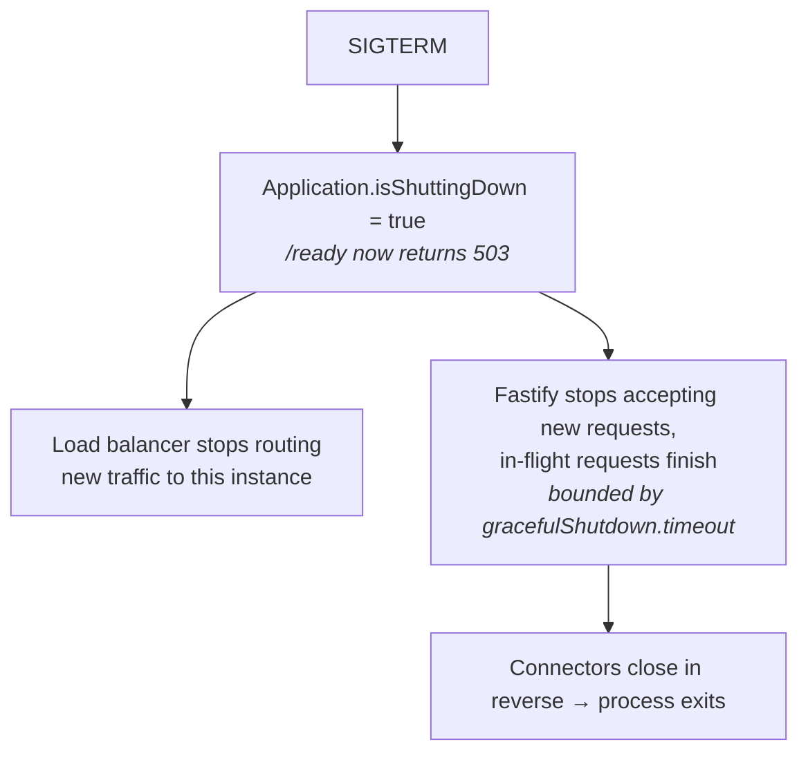

A deploy should never drop a request, and a load balancer should never route to an instance that isn't ready. Warlock ships both halves built in: two endpoints that report whether the instance should receive traffic, and a shutdown sequence that drains in-flight requests instead of cutting them off. No `/health` controller to hand-roll, no `terminus`-style glue.

## The two endpoints

The HTTP connector registers them directly on the Fastify server during boot — before route scanning — so they exist by the time the server listens, and they're immune to HMR.

| Path     | Probe     | `200` when                                                  | `503` when                                              |
| -------- | --------- | ---------------------------------------------------------- | ------------------------------------------------------ |
| `/health`| liveness  | the process is up                                          | shutdown has begun                                     |
| `/ready` | readiness | booted **and** not shutting down **and** every check passes | before boot, during shutdown, or any failing check    |

The distinction matters for orchestrators:

- **Liveness** answers _"should you RESTART me?"_ — so it ignores dependency checks. A flaky database doesn't mean the process is dead; restarting wouldn't help.
- **Readiness** answers _"should you ROUTE to me?"_ — so it gates on boot completion, shutdown state, and your registered checks.

```
GET /health → 200 {"status":"ok"}
GET /ready  → 200 {"status":"ok","checks":{"db":true}}
            → 503 {"status":"error","checks":{"db":false}}
```

### Configuration

Both endpoints are on by default. Tune them in `src/config/http.ts`:

```ts title="src/config/http.ts"
import type { HttpConfigurations } from "@warlock.js/core";

const httpConfigurations: HttpConfigurations = {
  health: {
    enabled: true, // default; set false to remove both endpoints
    path: "/health", // liveness path
    readinessPath: "/ready", // readiness path
  },
};

export default httpConfigurations;
```

## Readiness checks

Out of the box, readiness is `isBooted && !isShuttingDown`. Layer on dependency checks — a database ping, a cache round-trip, a downstream health call — and `/ready` only reports ready when they all pass:

```ts
import { health } from "@warlock.js/core";

health.addCheck("db", async () => database.isConnected());
health.addCheck("cache", async () => cache.ping());

// later, if you need to drop one:
health.removeCheck("db");
```

A check returns `boolean | Promise<boolean>`. A **thrown error counts as a failed check** — it's reported in the `checks` map and the `503`, not logged (probes poll constantly; a failure is a normal signal, not an error event). Keep checks cheap: they run on every `/ready` poll.

A natural place to register a check is inside `Application.onceBooted(...)`, or from a custom connector's `start()`.

## Graceful shutdown

When the process receives `SIGINT`/`SIGTERM`, Warlock tears down in two stages — **app `onShutdown` hooks first** (while connectors are still up), then **connectors in reverse priority order**. The HTTP connector's teardown drains rather than drops:



1. `Application.isShuttingDown` flips `true` immediately, so `/ready` returns `503` and the load balancer drains this instance.
2. Fastify stops accepting new connections (answering `503` while closing) and lets in-flight requests finish.
3. Draining is bounded by a timeout so one stuck request can't hang the deploy; after it, the server force-closes and logs a warning.

```ts title="src/config/http.ts"
const httpConfigurations: HttpConfigurations = {
  gracefulShutdown: {
    timeout: 10_000, // ms to wait for in-flight drain (default 10s)
    forceCloseConnections: "idle", // close idle keep-alives, let active finish (default)
  },
};
```

`forceCloseConnections`: `"idle"` (default) closes idle keep-alive connections and lets active requests finish; `true` force-closes everything immediately; `false` waits for every connection.

:::tip
For an even smoother handoff, give the load balancer time to _observe_ the `503` before the server closes — add an `Application.onShutdown(...)` hook with a short delay matched to your LB's health-check interval.
:::

## Gotchas

- **`/health` is registered on Fastify, not the app router.** That keeps it immune to HMR and route scanning — but if your app also defines a `/health` route, they collide. Rename via `http.health.path`.
- **Readiness needs a finished boot.** Before `Application.isBooted` — e.g. while late-phase connectors are still starting — `/ready` is `503` by design. That's the point: don't route traffic to a half-booted instance.
- **A hanging `onShutdown` hook delays the drain.** App hooks run before connector teardown and are only bounded by your process manager's kill timeout. Keep them fast; the HTTP drain itself is bounded by `gracefulShutdown.timeout`.
- **Maintenance mode is a different `503`.** The `maintenance` middleware allowlists `/health` so probes pass during maintenance, but it's operator-toggled downtime, not readiness.

## See also

- [Application](../architecture-concepts/application.md#boot-lifecycle) — `onceBooted`, `onShutdown`, `isShuttingDown`, the lifecycle hooks these endpoints build on.
- [Bootstrap and connectors](../architecture-concepts/bootstrap-and-connectors.md) — the boot/shutdown sequence the drain slots into.
- [Deployment & production](./deployment.md) — `warlock build` / `warlock start` and the production runtime.
