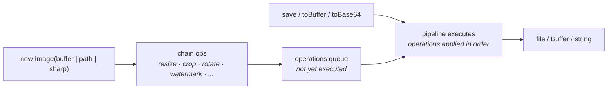

You accepted an upload. Now you need a thumbnail, a square avatar, a watermarked version for previews, a WebP variant that's 80% smaller. The `Image` class does all of that with a chainable API on top of [sharp](https://sharp.pixelplumbing.com/).

This guide covers the surface you'll actually use — resize, crop, format conversion, watermarks, the deferred-pipeline model that makes chaining cheap, and how to pair `Image` with `storage` to persist the result.

## Mental model



The key idea: **operations are deferred until output**. `.resize(800)` and `.quality(85)` don't transform anything yet — they queue a descriptor. The pipeline runs when you call `.save(path)`, `.toBuffer()`, `.toBase64()`, or `.toDataUrl()`. Single `await` at the end.

This matters because:

1. **You can chain freely.** All chainable methods are synchronous. No `await` between calls.
2. **The order is preserved.** Operations execute in the order you queued them — `.resize().watermark()` is different from `.watermark().resize()`.
3. **Clone is cheap.** `image.clone()` copies the queue without re-running it.

## The shape

```ts
import { Image } from "@warlock.js/core";

// Single await at the end — everything in between is sync
await new Image("photo.jpg")
  .resize({ width: 800 })
  .quality(85)
  .format("webp")
  .save("photo.webp");

// Or to a Buffer:
const thumb = await new Image(buffer)
  .resize({ width: 200, height: 200, fit: "cover" })
  .toBuffer();
```

Constructor accepts a string path, a `Buffer`, a `Uint8Array`, an `ArrayBuffer`, or an existing `sharp.Sharp` instance. Cloud-friendly: read from `storage`, transform, write back.

```ts
import { storage, Image } from "@warlock.js/core";

const buffer = await storage.get("uploads/photo.jpg");
const thumb = await new Image(buffer).resize({ width: 200 }).toBuffer();
await storage.put(thumb, "thumbnails/photo.jpg");
```

## Constructors

Three ways to start an `Image`:

```ts
new Image("path/to/file.jpg");        // from filesystem path
new Image(buffer);                     // from Buffer

Image.fromFile("path/to/file.jpg");    // static, same as the path constructor
Image.fromBuffer(buffer);              // static, same as the buffer constructor
await Image.fromUrl("https://example.com/photo.jpg");   // download via @mongez/http
```

`fromUrl` downloads the bytes with `@mongez/http` (`responseType: "arrayBuffer"`) and returns a fresh `Image`; it throws if the request errors or comes back empty. The `Buffer` and path constructors are synchronous — `fromUrl` is async because of the download.

## Transforms — chainable, all synchronous

Every transform method returns `this`. None of them touch the image until the pipeline executes.

### Resize

```ts
image.resize({ width: 800 });                    // by width, height auto
image.resize({ height: 600 });                   // by height, width auto
image.resize({ width: 800, height: 600 });       // both — uses sharp's default fit ("cover")
image.resize({ width: 800, height: 600, fit: "cover" });    // crop to fill
image.resize({ width: 800, height: 600, fit: "contain" });  // letterbox to fit
image.resize({ width: 800, height: 600, fit: "inside" });   // never enlarge, fit within
image.resize({ width: 800, height: 600, fit: "outside" });  // cover from outside
```

`fit` values come from sharp — `cover` (default), `contain`, `fill`, `inside`, `outside`. Use `cover` for thumbnails (crop to square), `contain` to preserve the whole image with letterboxing.

### Crop

```ts
image.crop({ left: 100, top: 50, width: 400, height: 300 });
```

`crop` (sharp's `extract`) takes an explicit region. Coordinates are top-left in pixels.

### Rotate, flip, flop

```ts
image.rotate(90);     // degrees clockwise
image.flip();          // vertical flip (top to bottom)
image.flop();          // horizontal flip (left to right)
```

`rotate(0)` is a no-op; sharp also auto-rotates based on EXIF orientation if you call `rotate()` with no angle (warlock's API requires an angle, though — call sharp directly via `image.image.rotate()` if you need EXIF auto-rotation).

### Effects

```ts
image.blur(2);                   // sigma — minimum 0.3, higher = blurrier
image.sharpen();                 // default sharp parameters
image.sharpen({ sigma: 1.5 });
image.blackAndWhite();           // grayscale via "b-w" colourspace
image.grayscale();               // alias for blackAndWhite
image.negate();                  // invert colors
image.tint({ r: 255, g: 100, b: 50 });   // overlay tint
image.trim();                    // trim solid-color borders
image.opacity(50);               // 0–100 percent
```

`opacity` is implemented via a composite with an alpha pixel — useful for layering watermarks at half-strength.

### Format and quality

```ts
image.format("webp");      // jpeg, png, webp, avif, tiff, gif, heif
image.quality(85);          // 1–100, applies based on final format
```

Quality semantics depend on the format:

- **JPEG / WebP / AVIF / TIFF / HEIF** — `quality` is the actual quality setting (lower = smaller).
- **PNG** — `quality` maps to compression level (warlock translates `quality: 85` to `compressionLevel: 1`, sharp's "near-best" tier).
- **GIF** — `quality` is ignored; GIF doesn't have a quality setting.

If you don't call `.format(...)`, the output preserves the original format and applies quality to it intelligently. If you don't call `.quality(...)` either, the pipeline is a pure resize/crop with no recompression.

### Watermark

Composite another image (a logo, a brand mark, a "PREVIEW" stamp) on top:

```ts
image.watermark("logo.png", { gravity: "southeast" });    // bottom-right
image.watermark(logoBuffer, {
  gravity: "northwest",
  top: 20,
  left: 20,
});
image.watermark(anotherImage, { blend: "over" });   // Image instance also valid
```

The second argument is sharp's `OverlayOptions` — `gravity`, `top`, `left`, `blend`, `tile`, `premultiplied`, etc.

For multiple watermarks at once (e.g. logo top-left, copyright bottom-right):

```ts
image.watermarks([
  { image: logoBuffer, options: { gravity: "northwest" } },
  { image: "stamp.png", options: { gravity: "southeast" } },
]);
```

Watermark inputs can be a path, a `Buffer`, a `Uint8Array`, or another `Image` instance.

## Batch transforms — `apply(options)`

For the common case where you want a predictable set of operations applied in a sensible order, `apply` takes an options object and queues each operation:

```ts
await new Image(buffer)
  .apply({
    resize: { width: 800, height: 600, fit: "cover" },
    quality: 85,
    format: "webp",
    watermark: { image: "logo.png", options: { gravity: "southeast" } },
  })
  .toBuffer();
```

The internal ordering is: resize → crop → rotate → flip/flop → grayscale → blur → sharpen → tint → negate → trim → watermark → opacity → format/quality. That covers 95% of pipelines; for custom orderings use the chainable methods directly.

## Outputs — single await

The pipeline runs once, on the first output call. Multiple output calls on the same instance reuse the executed pipeline.

```ts
const image = new Image(buffer).resize({ width: 800 }).quality(85);

await image.save("photo.jpg");        // → sharp.OutputInfo { format, width, height, size, ... }
const buf = await image.toBuffer();    // → Buffer
const b64 = await image.toBase64();    // → string (base64-encoded)
const url = await image.toDataUrl();   // → "data:image/jpeg;base64,..."

// Convenience: save as WebP regardless of input format
await image.saveAsWebp("photo.webp");
```

## Metadata

```ts
const meta = await image.metadata();
// → sharp.Metadata — { format, width, height, channels, depth, hasAlpha, exif, ... }

const { width, height } = await image.dimensions();
```

Metadata is cached on the instance after the first call. If you modify the image and need fresh metadata, call `refreshMetadata()` (re-reads from sharp) or `clearMetadataCache()` (forces the next `.metadata()` call to re-read).

## Cloning

`clone()` returns a fresh `Image` with the same operations queued but a separate pipeline state — handy when you want to derive multiple variants from one source:

```ts
const source = new Image(buffer).resize({ width: 1200 });

const thumb = source.clone().resize({ width: 200 }).quality(70);
const preview = source.clone().resize({ width: 600 }).quality(85);
const watermarked = source.clone().watermark("brand.png", { gravity: "southeast" });

await Promise.all([
  thumb.save("thumb.jpg"),
  preview.save("preview.jpg"),
  watermarked.save("watermarked.jpg"),
]);
```

Each clone executes its own pipeline; they don't share the queue past `clone()`.

## Common patterns

### Resize an uploaded avatar

```ts title="src/app/users/services/save-avatar.service.ts"
import { Image, storage } from "@warlock.js/core";
import type { UploadedFile } from "@warlock.js/core";

export async function saveAvatarService(userId: string, file: UploadedFile) {
  const buffer = await file.buffer();

  const avatar = await new Image(buffer)
    .resize({ width: 400, height: 400, fit: "cover" })
    .quality(85)
    .format("webp")
    .toBuffer();

  return storage.put(avatar, `avatars/${userId}.webp`, {
    mimeType: "image/webp",
    cacheControl: "max-age=31536000",
  });
}
```

### Generate three sizes after upload

```ts title="src/app/uploads/services/generate-thumbnails.service.ts"
import { Image, storage, type StorageFile } from "@warlock.js/core";

const SIZES = [
  { name: "thumb", width: 200 },
  { name: "medium", width: 600 },
  { name: "large", width: 1200 },
] as const;

export async function generateThumbnailsService(file: StorageFile) {
  const buffer = await file.contents();

  await Promise.all(
    SIZES.map(async ({ name, width }) => {
      const resized = await new Image(buffer)
        .resize({ width })
        .quality(85)
        .format("webp")
        .toBuffer();

      await storage.put(resized, `thumbnails/${name}/${file.path}.webp`);
    }),
  );
}
```

### On-the-fly resize from query string

A real example from the reference codebase — the upload-serving controller resizes based on `?h=`, `?w=`, `?q=` query params and caches the result:

```ts title="src/app/uploads/controllers/get-public-upload.controller.ts"
import {
  Image,
  storagePath,
  type Request,
  type RequestHandler,
  type Response,
} from "@warlock.js/core";
import { fileExistsAsync } from "@mongez/fs";
import { getUploadServiceByPath } from "../services/get-upload.service";

export const getPublicUploadController: RequestHandler = async (
  request: Request,
  response: Response,
) => {
  const upload = await getUploadServiceByPath(request.input("*"));

  if (request.input("h") || request.input("w") || request.input("q")) {
    const cacheKey = [
      "uploads",
      upload.uuid,
      request.input("h"),
      request.input("w"),
      request.input("q"),
    ]
      .filter(Boolean)
      .join("-");

    const cachePath = storagePath(`cache/${cacheKey}`);

    const quality = request.int("q");
    const width = request.int("w");
    const height = request.int("h");

    if (!(await fileExistsAsync(cachePath))) {
      const image = new Image(upload.storageFile().absolutePath!);

      if (width || height) {
        image.resize({ width, height });
      }

      if (quality) {
        image.quality(quality);
      }

      await image.save(cachePath);
    }

    return response.sendCachedFile(cachePath);
  }

  return response.sendCachedFile(upload.storageFile());
};
```

The pattern: cache on disk by transform parameters, serve via `sendCachedFile` which sets the right ETag / Cache-Control headers.

### Watermark a preview

```ts
const preview = await new Image(buffer)
  .resize({ width: 1200 })
  .watermark("brand-stamp.png", {
    gravity: "southeast",
    top: 20,
    left: 20,
  })
  .quality(80)
  .toBuffer();

await storage.put(preview, `previews/${id}.jpg`);
```

### Format conversion only — strip EXIF, resize, save as WebP

```ts
await new Image(originalPath)
  .resize({ width: 2000, withoutEnlargement: true })
  .saveAsWebp(webpPath);
```

`saveAsWebp` is shorthand for `.format("webp").save(...)`. The `withoutEnlargement` sharp option keeps small images at their original size (no upscaling).

## Gotchas

- **Sharp is lazy-loaded.** If you see `sharp is not installed` at first `new Image(...)`, run `yarn add sharp` (or `warlock add image`). The constructor throws; chained methods are unreachable.
- **Operations execute in queue order, not declaration order optimally.** `.resize(800).watermark(logo)` resizes first, then stamps the logo on the resized canvas — the watermark scales with the result. `.watermark(logo).resize(800)` stamps first then shrinks the whole thing, including the watermark.
- **`apply(options)` ordering is fixed.** It's a sensible default order (resize → crop → rotate → effects → format), but if you need watermark-before-resize, use the chainable methods directly.
- **PNG quality is mapped, not native.** `quality(85)` translates to `compressionLevel: 1` for PNG. For finer control, drop to sharp directly via the `image.image` escape hatch (`new Image(buffer).image.png({ compressionLevel: 4 }).toBuffer()`).
- **`.format(...)` rewrites the implied extension.** If you `.save("out.jpg")` after `.format("webp")`, you get a WebP file at `out.jpg` — sharp doesn't rewrite the filename. Set the right extension in `save()` or use `saveAsWebp()`.
- **`.toBuffer()` runs the pipeline.** Calling it twice on the same instance returns the same buffer cheaply (the pipeline has `pipelineExecuted` state). For independent variants, `.clone()`.
- **Watermarks read inputs at save time.** If you pass a file path to `.watermark("logo.png")`, sharp reads that file when the pipeline executes — not at the chained call. Make sure the path is still valid.
- **`blur(sigma)` requires `sigma >= 0.3`.** Smaller values throw with a clear message — that's a sharp constraint, not a warlock one.
- **`opacity(value)` is 0–100, not 0–1.** Out of range throws. `opacity(50)` means "half transparent."

## See also

- **[File uploads](./file-uploads.md)** — `UploadedFile.resize().format().save()` shortcut that wraps `Image` for the common upload path.
- **[Storage](./storage.md)** — persisting transformed images via `storage.put`.
- **[Sharp documentation](https://sharp.pixelplumbing.com/)** — full reference for the underlying engine; warlock's `Image` is a thin wrapper.
