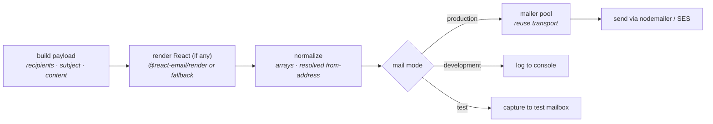

You need to send a welcome email, a password reset, an invoice. Warlock has one mail engine wrapped in two ergonomic APIs and a three-way mode switch that keeps emails out of the way in development and out of your tests in CI.

This guide covers the full picture: the fluent `Mail` builder, the functional `sendMail()` call, React Email templates, SMTP and AWS SES configuration, named mailers for multi-provider apps, per-mail hooks, global events, and the test mailbox for assertion-based testing.

## Mental model

Every `Mail.to(...).send()` (or `sendMail({...})`) call flows through the same pipeline:



The mode switch is process-global — `setMailMode("production" | "development" | "test")`. Default is `production`. Test mode is for assertions; development logs subject and recipient without sending; production goes through the real transport.

The two APIs (`Mail` builder and `sendMail` function) take the exact same `MailOptions` shape and hit the exact same pipeline. Use whichever reads better at the call site.

## Configuration

`src/config/mail.ts` declares the SMTP (or SES) settings. The simple form is one config object — that becomes the default mailer:

```ts title="src/config/mail.ts"
import type { MailConfigurations } from "@warlock.js/core";
import { env } from "@warlock.js/core";

const mailConfigurations: MailConfigurations = {
  host: env("MAIL_HOST"),
  username: env("MAIL_USERNAME"),
  password: env("MAIL_PASSWORD"),
  port: env("MAIL_PORT"),
  secure: env("MAIL_SECURE"),
  from: {
    name: env("MAIL_FROM_NAME"),
    address: env("MAIL_FROM_ADDRESS"),
  },
};

export default mailConfigurations;
```

The fields map to a standard nodemailer SMTP transport, with two convenience aliases:

| Field        | Purpose                                                                |
| ------------ | ---------------------------------------------------------------------- |
| `host`       | SMTP hostname (`smtp.gmail.com`, `smtp.sendgrid.net`, …)               |
| `port`       | SMTP port — usually `587` (STARTTLS) or `465` (SSL)                    |
| `secure`     | `true` for port 465, `false` for 587                                   |
| `tls`        | Enable STARTTLS upgrade — set `true` on port 587                       |
| `username`   | Auth username (alias for `auth.user`)                                  |
| `password`   | Auth password (alias for `auth.pass`)                                  |
| `auth`       | Full auth object — use instead of username/password when needed        |
| `from`       | Default `From` for every send. String or `{ name, address }`           |
| `requireTLS` | Fail the connection if STARTTLS upgrade fails. Useful in compliance    |

Anything nodemailer's `SMTPTransport.Options` accepts works here — `pool`, `connectionTimeout`, `socketTimeout`, etc.

### Common SMTP providers

```ts title="Gmail (app-password required)"
{ host: "smtp.gmail.com", port: 587, tls: true,
  username: "you@gmail.com", password: env("GMAIL_APP_PASSWORD") }
```

```ts title="SendGrid"
{ host: "smtp.sendgrid.net", port: 587,
  username: "apikey", password: env("SENDGRID_API_KEY") }
```

```ts title="Mailgun"
{ host: "smtp.mailgun.org", port: 587,
  username: env("MAILGUN_SMTP_USER"), password: env("MAILGUN_SMTP_PASS") }
```

```ts title="Postmark"
{ host: "smtp.postmarkapp.com", port: 587,
  username: env("POSTMARK_TOKEN"), password: env("POSTMARK_TOKEN") }
```

### AWS SES driver

For SES, drop the SMTP fields and set `driver: "ses"` — the framework uses `@aws-sdk/client-sesv2` directly instead of going through SMTP:

```ts title="src/config/mail.ts (SES)"
import type { MailConfigurations } from "@warlock.js/core";
import { env } from "@warlock.js/core";

const mailConfigurations: MailConfigurations = {
  driver: "ses",
  accessKeyId: env("AWS_ACCESS_KEY_ID"),
  secretAccessKey: env("AWS_SECRET_ACCESS_KEY"),
  region: env("AWS_REGION"),
  from: { name: "My App", address: "noreply@app.com" },
};

export default mailConfigurations;
```

Install the SDK once: `yarn add @aws-sdk/client-sesv2`. The first send that uses the SES config triggers lazy module loading; if the SDK isn't installed you get a clear install hint.

## Sending — the fluent builder

`Mail` is built per call. `Mail.to(...)`, `Mail.config(...)`, `Mail.mailer(...)` start a new builder; each setter returns `this`; `.send()` validates the payload and resolves to a `MailResult`.

The shape every call ends with:

```ts
import { Mail } from "@warlock.js/core";

const result = await Mail.to("user@example.com")
  .subject("Welcome!")
  .text("Thanks for joining.")
  .send();

console.log(result.success);    // true
console.log(result.messageId);  // "<random-id@smtp.host>"
```

### Recipients and addressing

```ts
await Mail.to("a@example.com")
  .to(["a@example.com", "b@example.com"])   // override — last `to()` wins
  .cc("manager@example.com")
  .bcc(["audit@example.com", "ops@example.com"])
  .replyTo("support@example.com")
  .from({ name: "Support", address: "support@example.com" })
  .subject("Subject line")
  .text("...")
  .send();
```

`from(...)` overrides the configured default. Pass a string (`"noreply@app.com"`) or `{ name, address }` — both work everywhere a `MailAddress` is accepted.

### Picking the content type

Three content slots — pick at least one:

```ts
// Plain text
await Mail.to("u@e.com").subject("Plain").text("Hi.").send();

// HTML (raw string)
await Mail.to("u@e.com").subject("Html").html("<p>Hi.</p>").send();

// React component — runs through @react-email/render if installed,
// falls back to react-dom/server's renderToStaticMarkup
await Mail.to("u@e.com").subject("React").component(<WelcomeEmail name="Hasan" />).send();
```

You can set both `text` and `html` — most clients prefer HTML but fall back to text. `component(...)` is the React Email integration; see the [React templates](#react-templates) section below.

`.send()` throws synchronously if `to`, `subject`, or content is missing — those are caught by the builder's `validate()` step before the pipeline runs.

### Attachments

```ts
await Mail.to("u@e.com")
  .subject("Invoice")
  .html("<p>See attached.</p>")
  .attach(pdfBuffer, "invoice.pdf", "application/pdf")
  .attachFile("/abs/path/to/terms.pdf", "terms.pdf")
  .send();
```

- `attach(content, filename, contentType?)` — inline buffer or string content. Use for generated PDFs, in-memory CSVs, dynamic images.
- `attachFile(path, filename?, contentType?)` — read from disk at send time. Skips loading into memory until the send actually happens. The filename defaults to the basename of `path`.
- `attachments([...])` — pass a pre-built array. Mostly useful when iterating a list.

Cid-referenced inline images (the kind email clients display inline rather than as attachments) work via the `cid` field:

```ts
.attach(logoBuffer, "logo.png", "image/png")
// then in the HTML: 
```

### Other knobs on the builder

| Method                                          | Purpose                                                       |
| ----------------------------------------------- | ------------------------------------------------------------- |
| `.priority("high" \| "normal" \| "low")`         | sets the X-Priority header                                    |
| `.headers({ "X-Foo": "bar" })`                  | merge a header bag                                            |
| `.header("X-Foo", "bar")`                       | add one header                                                |
| `.tags(["welcome"])` / `.tag("transactional")`  | categorization tags for downstream filtering / analytics      |
| `.correlationId("req-123")`                     | tracking id (logged alongside the send)                       |
| `.config(MailConfigurations)`                   | one-off override of the global config (multi-tenant — see below) |
| `.mailer("marketing")`                          | route via a named mailer from config                          |

### Per-mail event handlers

The builder accepts four lifecycle hooks. Useful for one-off side effects you don't want to register globally:

```ts
await Mail.to("u@e.com")
  .subject("...")
  .text("...")
  .beforeSending(async (mail) => {
    // Mutate `mail` (e.g. inject a header) or return false to cancel
    if (await userHasUnsubscribed(mail.to)) {
      return false;
    }
  })
  .onSent((mail, result, error) => {
    // Fires after every attempt, success or failure
  })
  .onSuccess((mail, result) => {
    // Fires only when result.success is true
  })
  .onError((mail, error) => {
    // Fires only when the send failed
  })
  .send();
```

Returning `false` from `beforeSending` cancels the send. `.send()` still resolves — but `result.success` is `false` and `result.response` is `"Cancelled by beforeSending event"`.

## Sending — the functional API

When the payload is already an object — say, you're iterating a list in a queue worker — `sendMail({...})` reads more cleanly than chaining builder calls:

```ts
import { sendMail } from "@warlock.js/core";

await sendMail({
  to: "user@example.com",
  cc: ["manager@example.com"],
  subject: "Welcome",
  component: <WelcomeEmail name="Hasan" />,
  config: tenant.mailSettings,    // per-tenant override
  tags: ["welcome"],
  onSuccess: (mail, result) => {
    /* ... */
  },
});
```

Both APIs share the same `MailOptions` shape. Pick whichever reads better at the call site — both end up at the same place.

## React templates

`.component(<Template />)` (or `component:` in `sendMail`) pipes a React element through the renderer:

1. If `@react-email/render` is installed, it runs the full React Email pipeline — style inlining, MSO conditionals, the works. Install with `yarn add @react-email/components @react-email/render`.
2. If not, it falls back to `react-dom/server`'s `renderToStaticMarkup`, wrapped in a minimal `<html>` shell — readable in dev, but missing the polish you'd want for production HTML.

A typical template:

```tsx title="src/app/auth/emails/welcome.email.tsx"
import { Html, Heading, Text, Button } from "@react-email/components";

type WelcomeEmailProps = {
  name: string;
  activationUrl: string;
};

export function WelcomeEmail({ name, activationUrl }: WelcomeEmailProps) {
  return (
    <Html>
      <Heading>Welcome, {name}</Heading>
      <Text>Thanks for joining. Activate your account to get started.</Text>
      <Button href={activationUrl}>Activate account</Button>
    </Html>
  );
}
```

Use it from a service:

```ts title="src/app/auth/services/send-welcome.service.ts"
import { Mail } from "@warlock.js/core";
import { WelcomeEmail } from "../emails/welcome.email";

export async function sendWelcomeEmail(user: { email: string; name: string; uuid: string }) {
  return Mail.to(user.email)
    .subject(`Welcome, ${user.name}`)
    .component(<WelcomeEmail name={user.name} activationUrl={buildActivationUrl(user.uuid)} />)
    .tags(["welcome", "transactional"])
    .send();
}
```

You don't need to wrap the template in a `<head>` or `<body>` — the renderer takes care of that.

## Mail modes — production / development / test

The mail pipeline switches on a process-global mode. Set it with `setMailMode(...)`:

```ts
import { setMailMode } from "@warlock.js/core";

setMailMode("production");    // actually send (default)
setMailMode("development");   // log subject + recipient, no send, return fake-success
setMailMode("test");          // capture to test mailbox, no send, return fake-success
```

| Mode          | Behaviour                                                                  |
| ------------- | -------------------------------------------------------------------------- |
| `production`  | Hits the transport. Real send. Real `MailResult` from nodemailer / SES.    |
| `development` | Logs `subject` and `to` to the logger. Returns `{ success: true, ... }`.   |
| `test`        | Pushes a `CapturedMail` onto an in-memory mailbox. Returns success.        |

Test mode is the workhorse — it lets you write `expect(wasMailSentTo("u@e.com")).toBe(true)` against a service that calls `Mail.to(...).send()` without spinning up an SMTP fake.

## The test mailbox

In `test` mode every send is captured. The helpers are named exports — there is no `testMailbox` object, no `.reset()` method:

```ts
import {
  setMailMode,
  clearTestMailbox,
  getTestMailbox,
  getLastMail,
  findMailsTo,
  findMailsBySubject,
  wasMailSentTo,
  wasMailSentWithSubject,
  getMailboxSize,
  assertMailSent,
  assertMailCount,
} from "@warlock.js/core";

beforeEach(() => {
  setMailMode("test");
  clearTestMailbox();
});

it("sends a welcome email on signup", async () => {
  await signupUserService({ email: "u@e.com", name: "Hasan" });

  expect(wasMailSentTo("u@e.com")).toBe(true);
  expect(wasMailSentWithSubject("Welcome, Hasan")).toBe(true);

  const mail = assertMailSent((m) => m.options.to === "u@e.com");

  expect(mail.options.subject).toBe("Welcome, Hasan");
  expect(mail.options.tags).toContain("welcome");
});
```

The helper surface:

| Helper                                  | What it returns                                              |
| --------------------------------------- | ------------------------------------------------------------ |
| `getTestMailbox()`                      | a shallow copy of all captured mails                         |
| `getLastMail()`                         | the most recent capture, or `undefined`                      |
| `findMailsTo(email)`                    | every captured mail whose `to` includes `email`              |
| `findMailsBySubject(needle)`            | every captured mail whose subject `.includes(needle)`        |
| `wasMailSentTo(email)`                  | boolean                                                      |
| `wasMailSentWithSubject(exactSubject)`  | boolean (exact match)                                        |
| `getMailboxSize()`                      | number of captured mails                                     |
| `clearTestMailbox()`                    | empty the mailbox                                            |
| `assertMailSent(predicate)`             | the matching `CapturedMail`, or throws                       |
| `assertMailCount(n)`                    | throws if count isn't exactly `n`                            |

Each captured mail looks like:

```ts
type CapturedMail = {
  options: MailOptions;        // original payload — `to`, `subject`, `component`, etc.
  normalized: NormalizedMail;  // post-normalization (arrays, resolved `from`)
  timestamp: Date;
  result?: MailResult;         // always success in test mode
  error?: MailError;           // populated only if render/normalize threw
};
```

## Named mailers — multi-provider apps

Some apps run two transports — e.g. a fast transactional provider for password resets, a marketing provider for newsletters. Configure both as named mailers:

```ts title="src/config/mail.ts (named mailers)"
import type { MailersConfig } from "@warlock.js/core";
import { env } from "@warlock.js/core";

const mailConfigurations: MailersConfig = {
  default: {
    host: env("SENDGRID_HOST"),
    port: 587,
    username: "apikey",
    password: env("SENDGRID_API_KEY"),
    from: { name: "Acme", address: "no-reply@acme.com" },
  },
  mailers: {
    marketing: {
      host: env("MAILCHIMP_HOST"),
      port: 587,
      username: env("MC_USER"),
      password: env("MC_PASS"),
    },
    transactional: {
      host: env("POSTMARK_HOST"),
      port: 587,
      username: env("POSTMARK_TOKEN"),
      password: env("POSTMARK_TOKEN"),
    },
  },
};

export default mailConfigurations;
```

Route a single send through a specific mailer with `.mailer(name)`:

```ts
await Mail.mailer("marketing")
  .to(audience.emails)
  .subject("Spring Sale")
  .component(<SpringSaleEmail />)
  .send();

await Mail.mailer("transactional")
  .to(user.email)
  .subject("Password reset")
  .component(<PasswordResetEmail token={token} />)
  .send();
```

Mailer name lookups are exact strings — `"marketing"`, not `"Marketing"`. An unknown mailer name throws `Mailer "X" not found in configuration`.

## Per-tenant configuration

For multi-tenant apps where each tenant has its own SMTP credentials, pass `config` per-call. This bypasses the global config entirely:

```ts
await Mail.config(tenant.mailSettings)
  .to(invitation.email)
  .subject(`You've been invited to ${tenant.name}`)
  .component(<InvitationEmail invitation={invitation} />)
  .send();
```

The `sendMail` form takes the same option:

```ts
await sendMail({
  to: invitation.email,
  subject: `You've been invited to ${tenant.name}`,
  component: <InvitationEmail invitation={invitation} />,
  config: tenant.mailSettings,
});
```

Per-tenant transports are pooled the same as global — the connection pool keys on a hash of the config, so two tenants with the same host/port/credentials share a transport.

## Global event hooks

For app-wide observability — metrics, structured logging, audit trails — subscribe to global mail events:

```ts
import { mailEvents } from "@warlock.js/core";

mailEvents.onSuccess((mail, result) => {
  log.info("mail", "sent", `to=${mail.to} id=${result.messageId}`);
});

mailEvents.onError((mail, error) => {
  log.error("mail", "failed", `code=${error.code} msg=${error.message}`);
});

mailEvents.onBeforeSending((mail) => {
  // Returning `false` here cancels every send. Use carefully.
});

mailEvents.onSent((mail, result, error) => {
  // Always fires — same envelope as `onSent` in the per-mail builder
});
```

Global hooks fire for **every** mail. Per-mail handlers from `Mail` / `sendMail` fire only for that single send. Both run; they don't replace each other — be careful not to double-count metrics.

### Tracking a specific mail by id

If you need to correlate a global hook back to one specific send (e.g. emit an analytics event for a particular invitation), generate an id and subscribe by id:

```ts
import { generateMailId, mailEvents, sendMail } from "@warlock.js/core";

const mailId = generateMailId();

mailEvents.onMailSuccess(mailId, (mail, result) => {
  // Fires only for the mail with this id
  analytics.track("invitation.delivered", { invitationId, messageId: result.messageId });
});

await sendMail({
  id: mailId,
  to: invitation.email,
  subject: "You're invited",
  component: <InvitationEmail invitation={invitation} />,
});
```

Match calls: `onMailSent`, `onMailBeforeSending`, `onMailSuccess`, `onMailError`.

## Connection pooling

Transports are pooled per unique config — the first send to a given host/port/credential combo creates a connection; subsequent sends reuse it. The framework shuts the pool down on graceful exit; you rarely need to call this manually, but the door is there:

```ts
import { closeAllMailers } from "@warlock.js/core";

await closeAllMailers();
```

Pool statistics for debugging:

```ts
import { getPoolStats } from "@warlock.js/core";

const stats = getPoolStats();    // { size: number, hashes: string[] }
```

You can also verify a config end-to-end without sending:

```ts
import { verifyMailer } from "@warlock.js/core";

const ok = await verifyMailer({ host: "smtp.gmail.com", port: 587, username: "...", password: "..." });
```

`verifyMailer` connects, runs nodemailer's `verify()`, and returns a boolean — useful for `/health` endpoints in production.

## Common patterns

### Welcome email after signup

```ts title="src/app/auth/services/send-welcome.service.ts"
import { Mail } from "@warlock.js/core";
import { WelcomeEmail } from "../emails/welcome.email";
import type { User } from "app/users/models/user";

export async function sendWelcomeEmail(user: User) {
  return Mail.to(user.get("email"))
    .subject(`Welcome, ${user.get("name")}`)
    .component(<WelcomeEmail name={user.get("name")} />)
    .tags(["welcome", "transactional"])
    .send();
}
```

### Password reset with OTP

```ts title="src/app/auth/services/send-password-reset.service.ts"
import { Mail } from "@warlock.js/core";
import { PasswordResetEmail } from "../emails/password-reset.email";

export async function sendPasswordResetEmail(email: string, otpCode: string) {
  return Mail.to(email)
    .subject("Reset your password")
    .component(<PasswordResetEmail code={otpCode} />)
    .tag("password-reset")
    .priority("high")
    .send();
}
```

### Cancel a send when the user opted out

```ts
await Mail.to(user.email)
  .subject("Weekly digest")
  .component(<DigestEmail digest={digest} />)
  .beforeSending(async () => {
    if (await hasOptedOut(user.id, "digest")) {
      return false;
    }
  })
  .send();
```

### Per-tenant SMTP with the functional API

```ts title="src/app/notifications/services/send-tenant-mail.service.ts"
import { sendMail } from "@warlock.js/core";

export async function sendTenantMailService(
  tenant: { mailSettings: MailConfigurations; name: string },
  recipient: string,
  subject: string,
  body: React.ReactElement,
) {
  return sendMail({
    config: tenant.mailSettings,
    to: recipient,
    subject: `[${tenant.name}] ${subject}`,
    component: body,
    headers: { "X-Tenant": tenant.name },
  });
}
```

### AI tool dispatching mail with org-level config

A real example — an AI agent tool that picks up the calling org's SMTP credentials from a registry:

```ts title="excerpt from src/app/ai/tools/send-email.tool.ts"
const result = await sendMail({
  to,
  subject,
  ...(is_html ? { html: body } : { text: body }),
  cc,
  bcc,
  replyTo: reply_to,
  priority,
  config,   // injected per-org from the tool registry — falls back to global config if undefined
});
```

When `config` is `undefined` the call uses the global default. When it's set, it overrides — the typical pattern for letting tenants ship through their own outbound mail server.

## Gotchas

- **`.send()` validates synchronously.** Missing `to`, `subject`, or any of `text` / `html` / `component` throws before the pipeline runs.
- **Test mode is process-global.** Set it in `beforeAll` or `beforeEach`; reset to `"production"` between suites (or rely on test runner isolation). Forgetting to set test mode means real sends in CI.
- **`@react-email/render` is optional.** Without it the renderer falls back to `react-dom/server` — readable but missing style inlining, MSO conditionals, and the full React Email pipeline. Install it for production-quality HTML.
- **`nodemailer` is lazy-loaded.** If you see `nodemailer is not installed` at first send, run `yarn add nodemailer` (or `warlock add mail`).
- **`secure: true` requires port 465.** For port 587 use `secure: false` and `tls: true` (STARTTLS). Mismatching these is the most common config bug.
- **Per-mail handlers don't replace global handlers — both fire.** If you're counting sends, count once or use a single source of truth.
- **`assertMailSent(predicate)` throws when no mail matches.** That's by design — it's an assertion. Catch the thrown error in your test runner; don't silently swallow it.
- **`.send()` returns `success: false` on cancellation.** `beforeSending` returning `false` is not an error — `result.success` is just `false` and `result.response` says why.

## See also

- **[File uploads](./file-uploads.md)** — attaching uploaded files to outgoing mail.
- **[Logging](./logging.md)** — the `log` API the mail pipeline uses for `[DEV MODE]` and `[TEST MODE]` traces.
- **[Recipe: Transactional email](../recipes/transactional-email.md)** — end-to-end welcome → reset → confirmation flow.
