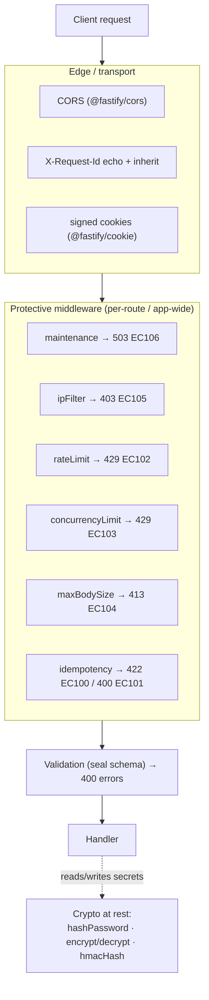

This page is a map, not a manual. Warlock doesn't ship a monolithic "security module" — instead, security shows up as a handful of focused pieces: crypto helpers for secrets, a suite of protective HTTP middleware, a few transport knobs in `src/config/http.ts`, and validation as a hard request boundary. This page links them together so you can see the whole surface at once, then sends you to the page that goes deep on each.

Nothing here is novel — it's the honest inventory of what exists today, with each knob verified against the code that reads it. If a security feature isn't listed here, assume it isn't built.

## The 30-second look



The layers, outside-in:

1. **Transport** — CORS, request-id correlation, cookie signing. Configured in `src/config/http.ts`.
2. **Protective middleware** — opt-in per route (or app-wide) gates that reject before your handler runs. Each emits a stable `HttpErrorCodes` value.
3. **Validation** — the seal schema attached to a controller runs before the handler. A failed schema is a rejected request, full stop.
4. **Crypto at rest** — when the handler stores a password or a secret, it reaches for the encryption helpers.

## Secrets and crypto

Two rules carry most of the weight: **never commit a secret, and pick the right crypto helper for the job.**

### Secrets live in `.env`, read through `env()`

Every key, password, and credential comes from the environment, surfaced through `env()` and wired into a config file — never inlined in source.

```ts title="src/config/encryption.ts"
import type { EncryptionConfigurations } from "@warlock.js/core";
import { env } from "@warlock.js/core";

const encryptionConfig: EncryptionConfigurations = {
  key: env("APP_ENCRYPTION_KEY"), // 64 hex chars = 32 bytes
  hmacKey: env("APP_HMAC_KEY"), // falls back to `key` if absent
  password: {
    salt: 12, // bcrypt rounds
  },
};

export default encryptionConfig;
```

### The three crypto helpers

All three live in `@warlock.js/core`. Mixing them up is the single most common security mistake — encrypting a password turns a database leak into a credentials leak; HMAC-ing one makes it brute-forceable.

| Helper                            | Direction  | Algorithm    | Use for                                                  |
| --------------------------------- | ---------- | ------------ | -------------------------------------------------------- |
| `hashPassword` / `verifyPassword` | one-way    | bcrypt (slow) | User-typed passwords. **Only** passwords.               |
| `encrypt` / `decrypt`             | reversible | AES-256-GCM  | Secrets you must read back — API keys, OAuth tokens.     |
| `hmacHash`                        | one-way    | HMAC-SHA256  | Deterministic fingerprints for lookup of encrypted data. |

```ts
import { hashPassword, verifyPassword, encrypt, decrypt, hmacHash } from "@warlock.js/core";

const hashed = await hashPassword("user-password-123"); // store this
const valid = await verifyPassword("user-password-123", hashed);

const cipher = encrypt("sk-proj-12345"); // iv:ciphertext:authTag
const plain = decrypt(cipher);

const fingerprint = hmacHash("sk-proj-12345"); // 64-char hex, deterministic
```

Full treatment — config shape, the encrypt-plus-fingerprint pattern, key rotation as a migration, why `bcryptjs` over native bcrypt — lives on the [Encryption](./encryption.md) page.

## Protective middleware

Warlock ships six built-in middleware factories under the `middleware` namespace. They are **opt-in** — registered per-route (in a route's `middleware` array) or app-wide (via `http.middleware.all`). None of them run unless you wire them in.

```ts
import { middleware, router } from "@warlock.js/core";

router.post("/auth/login", loginController, {
  middleware: [middleware.rateLimit({ max: 5, duration: 60_000 })],
});
```

Each rejection carries a stable `HttpErrorCodes` value so clients can branch on a code instead of parsing message text. The core range is `EC100..EC199` (`EC001..EC099` belongs to `@warlock.js/auth`).

| Factory                       | Rejects with        | Error code  | Caps / guards                                                            |
| ----------------------------- | ------------------- | ----------- | ----------------------------------------------------------------------- |
| `middleware.maintenance(…)`   | 503 + `Retry-After` | `EC106`     | App in maintenance mode; allowlist bypass (default `["/health"]`).      |
| `middleware.ipFilter(…)`      | 403                 | `EC105`     | Allow / deny by IP or IPv4 CIDR. Fail-closed; `deny` wins over `allow`. |
| `middleware.rateLimit(…)`     | 429 + `Retry-After` | `EC102`     | Requests-per-window per group key (default: client IP).                 |
| `middleware.concurrencyLimit(…)` | 429 + `Retry-After: 1` | `EC103`  | In-flight request cap per group key (default: route path).              |
| `middleware.maxBodySize(…)`   | 413                 | `EC104`     | Rejects when `Content-Length` exceeds the per-route cap.                |
| `middleware.idempotency(…)`   | 422 / 400           | `EC100` / `EC101` | Dedupes writes by `Idempotency-Key`; conflict vs. malformed key.  |

A few facts worth internalizing before you lean on these:

- **`rateLimit` and `concurrencyLimit` counters are process-local.** With `N` replicas the effective cap is `N × max`. For a genuinely shared rate limit, configure `@fastify/rate-limit`'s Redis store via `http.rateLimit` instead; for shared concurrency, reach for a `@warlock.js/cache` lock.
- **`ipFilter` reads the IP via `request.detectIp()`,** which honors `X-Real-IP` / `X-Forwarded-For` because Fastify runs with `trustProxy: true`. Those headers are client-settable — only trust them behind a proxy you control.
- **`maxBodySize` is a per-route layer, not pre-read protection.** It short-circuits the application stack on `Content-Length`, but the server still reads the body off the wire. For true pre-read protection, lower `http.bodyLimit` at the Fastify level too.
- **`idempotency` must run after `authMiddleware`** — its cache key is scoped per-user so user A can't replay user B's key. Anonymous requests fall back to IP scope.
- **`maintenance` is toggled by config and needs a restart** to flip — there's no runtime hot-flip. Its allowlist defaults to `["/health"]` so health checks survive planned downtime.

The full error-code catalog and how rejections are shaped lives on the [Error handling](./error-handling.md) page.

### The global rate limit is separate

`@fastify/rate-limit` is always registered with a global cap read from `http.rateLimit` (`max` default `60`, `duration` default `60_000`ms). That global 429 is distinct from the per-route `middleware.rateLimit()` (`EC102`) — both can run, and either can reject. Use the global as a coarse backstop and the middleware for endpoints that need a tighter cap (login, OTP, password reset, AI completions).

## Transport concerns

Three transport-layer knobs live in `src/config/http.ts`. All are optional, with defaults you should review before production.

```ts title="src/config/http.ts"
import { env } from "@warlock.js/core";

export default {
  cors: {
    origin: env("APP_URL"),
    credentials: true,
  },
  cookies: {
    secret: env("COOKIE_SECRET"), // enables signed cookies
  },
  requestId: {
    header: "X-Request-Id", // default
    enabled: true, // default
  },
};
```

### CORS

CORS comes from `@fastify/cors`, configured via `http.cors` (a `FastifyCorsOptions`).

> **Gotcha — the framework's permissive default wins.** The plugin is registered as `{ ...config.get("http.cors", {}), ...defaultCorsOptions }`, and `defaultCorsOptions` is `{ origin: "*", methods: "*" }`. Because the default is spread **last**, it overrides your `origin` / `methods` — today `http.cors` cannot tighten those two fields through config. If you need a locked-down origin, that's a known limitation to confirm against the current `src/http/plugins.ts` before relying on it.

### Cookies

`@fastify/cookie` is always registered. Set `http.cookies.secret` to enable **signed** cookies; `http.cookies.options` becomes the cookie `parseOptions`. Without a secret, cookies are parsed but unsigned — fine for non-sensitive values, not for anything a client shouldn't be able to forge.

### Request-id correlation

Every request gets a `request.id`. The framework echoes it back as a response header (`X-Request-Id` by default) and **inherits** an incoming value of the same header when present, so a single id correlates client logs, server logs, and traces.

Inherited values are validated before use — non-empty printable ASCII, max 128 characters — to block log-injection from a malicious client (a forged newline in a header could otherwise corrupt your log stream). Knobs under `http.requestId`:

| Key         | Default        | Effect                                                                     |
| ----------- | -------------- | -------------------------------------------------------------------------- |
| `header`    | `"X-Request-Id"` | Inbound + outbound header name.                                           |
| `generator` | random 32-char | Override the id generator.                                                 |
| `enabled`   | `true`         | Set `false` to stop echoing and inheriting. `request.id` is still generated for internal logging. |

## Validation as a boundary

Validation is a security control, not just UX polish. A seal schema attached to a controller runs **before** the handler is ever called; a failed schema short-circuits with a `400` carrying an `errors` payload, and the handler never sees the malformed input. That makes the schema your type-and-shape boundary against the outside world — reject early, and the rest of your code operates on values you've already proven.

```ts title="src/app/users/controllers/create-user.controller.ts"
import { v } from "@warlock.js/seal";

export const createUser = async (request, response) => {
  // only runs if the schema below passed
};

createUser.validation = {
  schema: v.object({
    email: v.string().email().required(),
    password: v.string().min(8).required(),
    role: v.string().in(["client", "admin"]).required(),
  }),
};
```

Treat every externally-provided field as hostile until a validator has vouched for it. Constrain enums with `v.string().in([...])` or `v.enum([...])`, cap lengths, and require what you depend on. The full schema surface — database-aware rules like `unique` / `exists`, file rules, the request-type alias, and ad-hoc validation — is on the [Validation](../the-basics/validation.md) page.

## Hardening checklist

Concrete, verified-against-the-code steps. Only knobs that actually exist are listed.

- **Secrets in `.env`, never in source.** Read them through `env()` into a config file. Keep `.env` out of version control.
- **Set `APP_ENCRYPTION_KEY` (and ideally a separate `APP_HMAC_KEY`).** A missing key throws on the first `encrypt()` call at runtime, not at boot — catch it in a startup pre-flight. Use a fresh 32-byte key (`crypto.randomBytes(32).toString("hex")`).
- **Hash passwords with `hashPassword`, never `encrypt` or `hmacHash`.** bcrypt only, on signup / login / password-change — never on the per-request hot path.
- **Encrypt recoverable secrets, fingerprint them with `hmacHash` for lookup.** Look up by fingerprint; decrypt only at the moment of use. Never log a decrypted value.
- **Lock down CORS** via `http.cors` — but verify the permissive-default gotcha above against `src/http/plugins.ts` first; `origin` / `methods` may not be overridable through config yet.
- **Sign cookies** by setting `http.cookies.secret` whenever a cookie value must not be client-forgeable.
- **Lower `http.bodyLimit`** from the historical default for production, and add `middleware.maxBodySize()` on routes that accept user payloads.
- **Add `middleware.rateLimit()`** to login, OTP, password-reset, and other abuse-prone endpoints — tighter than the global `http.rateLimit` backstop. Use a Redis store via `http.rateLimit` if you run multiple replicas and need a shared cap.
- **Add `middleware.concurrencyLimit()`** to unbounded-cost endpoints (report generation, AI completions, image processing).
- **Gate admin / webhook routes with `middleware.ipFilter()`** — and only trust `X-Forwarded-For` behind a proxy you control.
- **Require `middleware.idempotency()` after auth** on non-idempotent writes (`POST` / `PUT` / `PATCH` / `DELETE`) that clients may retry.
- **Attach a validation schema to every controller that takes input.** Constrain enums, lengths, and required fields. Reject malformed input before the handler runs.
- **Keep `http.requestId` enabled** so every request is traceable; inherited ids are already validated against log-injection.

## See also

- **[Encryption](./encryption.md)** — the three crypto helpers in full: config, the encrypt-plus-fingerprint pattern, key rotation, model-level boundaries.
- **[Error handling](./error-handling.md)** — the full `HttpErrorCodes` catalog and how rejections are shaped.
- **[Validation](../the-basics/validation.md)** — authoring seal schemas, database-aware rules, and ad-hoc validation.
- **[Configuration](../getting-started/03-configuration.md)** — `env()`, the config-file layout, and where `src/config/http.ts` / `src/config/encryption.ts` plug in.
