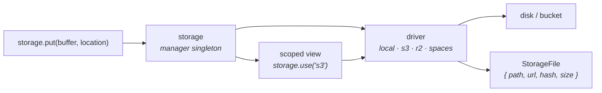

You need files. Avatars, invoices, exports, generated thumbnails. In dev they live on disk; in production they live in S3 or R2 or DigitalOcean Spaces. The code should not care which.

Warlock's storage layer is a manager singleton that wraps one or more drivers. Calls go to the active driver by default; `storage.use("name")` returns a scoped view of any other configured driver. Every write returns a `StorageFile` — a thin OOP handle with rich properties (`url`, `name`, `hash`) and chainable methods (`copy`, `move`, `delete`). Same API, every driver.

## Mental model



Three roles in this picture:

1. **The driver** is the boring part — it knows how to put bytes into a local folder, an S3 bucket, an R2 bucket. You configure drivers in `src/config/storage.ts` and rarely think about them again.
2. **The manager** (`storage`) is what your code calls. It routes to the active driver and emits events. If you want a different driver for one call, you `storage.use("name")` and call the same method on the scoped view.
3. **`StorageFile`** is the return value of every write. Think of it as the file's identity card: relative path, full URL, hash, driver. Pass it to your model, persist `file.path`, and you have everything you need to fetch the file back later.

## Configuration

`src/config/storage.ts` declares your drivers — one entry per disk. The framework ships factories that stamp the right `driver` field on the options:

```ts title="src/config/storage.ts"
import {
  env,
  type StorageConfigurations,
  storageConfigurations,
  storagePath,
} from "@warlock.js/core";

const storageOptions: StorageConfigurations = {
  default: "local",
  drivers: {
    local: storageConfigurations.local({
      root: storagePath(),
      urlPrefix: "/uploads",
    }),
    aws: storageConfigurations.aws({
      accessKeyId: env("AWS_ACCESS_KEY_ID"),
      secretAccessKey: env("AWS_SECRET_ACCESS_KEY"),
      region: env("AWS_REGION"),
      bucket: env("AWS_S3_BUCKET"),
      urlPrefix: "/uploads",
    }),
    r2: storageConfigurations.r2({
      bucket: env("R2_BUCKET"),
      endpoint: env("R2_ENDPOINT"),
      accessKeyId: env("R2_ACCESS_KEY_ID"),
      secretAccessKey: env("R2_SECRET_ACCESS_KEY"),
      accountId: env("R2_ACCOUNT_ID"),
      region: env("R2_REGION", "auto"),
      publicDomain: env("R2_BASE_URL"),
    }),
    spaces: storageConfigurations.spaces({
      accessKeyId: env("DO_KEY"),
      secretAccessKey: env("DO_SECRET"),
      region: env("DO_REGION"),
      bucket: env("DO_BUCKET"),
      endpoint: env("DO_ENDPOINT"),
    }),
  },
};

export default storageOptions;
```

`default` names the disk that calls go to when no driver is specified. The factories (`storageConfigurations.local|aws|r2|spaces`) just stamp the matching `driver` field on the options — beyond that, every field is forwarded straight to the underlying driver.

| Factory                          | Driver    | Required fields                                                    |
| -------------------------------- | --------- | ------------------------------------------------------------------ |
| `storageConfigurations.local()`  | `local`   | `root` (filesystem path), optional `urlPrefix` for public URLs     |
| `storageConfigurations.aws()`    | `s3`      | `accessKeyId`, `secretAccessKey`, `region`, `bucket`               |
| `storageConfigurations.r2()`     | `r2`      | `accessKeyId`, `secretAccessKey`, `bucket`, `accountId`            |
| `storageConfigurations.spaces()` | `spaces`  | `accessKeyId`, `secretAccessKey`, `region`, `bucket`, `endpoint`   |

Cloud factories accept any S3-compatible option in addition to the required fields — `endpoint` for custom S3-API hosts, `prefix` for an auto-prepended key prefix, `retry` for backoff config.

### Per-environment switching

The common pattern: local in dev, cloud in production, same code path.

```ts title="src/config/storage.ts"
const storageOptions: StorageConfigurations = {
  default: env("STORAGE_DRIVER", "local"),
  drivers: {
    local: storageConfigurations.local({ root: storagePath(), urlPrefix: "/uploads" }),
    r2: storageConfigurations.r2({ /* ... */ }),
  },
};
```

Set `STORAGE_DRIVER=r2` in production, leave unset in dev — the same `storage.put(...)` writes to local files in dev and to R2 in prod.

## The shape

```ts
import { storage } from "@warlock.js/core";

const file = await storage.put(buffer, "uploads/photo.jpg");

console.log(file.url);     // "/uploads/uploads/photo.jpg" or full https URL on cloud
console.log(file.name);    // "photo.jpg"
console.log(file.path);    // "uploads/photo.jpg"
console.log(file.hash);    // sha256:abc123...
```

That's the entire surface for the common case. `storage.put(...)` writes to the default driver and returns a `StorageFile`. Persist `file.path` to your DB and you can rebuild a `StorageFile` later with `storage.file(path)`.

`storage` is the lowercase singleton — there is no `Storage.disk()` static API. Don't construct it yourself; the framework wires it on boot.

## Writing files

Every `put*` returns a `StorageFile`:

```ts
import { createReadStream } from "node:fs";

// From a Buffer
const file = await storage.put(buffer, "uploads/photo.jpg");

// From a Buffer with explicit metadata
await storage.put(buffer, "uploads/photo.jpg", {
  mimeType: "image/jpeg",
  cacheControl: "max-age=31536000",
  visibility: "public",
});

// From a stream — best for large files (no whole-buffer copy in memory)
await storage.putStream(createReadStream("./video.mp4"), "uploads/video.mp4");

// From a remote URL — Warlock downloads then stores
await storage.putFromUrl("https://example.com/image.jpg", "uploads/image.jpg");

// From a base64 data URL — MIME extracted from the prefix automatically
await storage.putFromBase64(
  "data:image/png;base64,iVBORw0KGgo...",
  "uploads/photo.png",
);

// From a multipart UploadedFile — pull from `request.file()` / `request.validated()`
await storage.put(request.file("avatar"), `avatars/${userId}.jpg`);
```

For uploads, the usual pattern is `UploadedFile.save(directory, options?)` — that lives on the file object itself. See [File uploads](./file-uploads.md) for the full flow.

### Put options

```ts
type PutOptions = {
  mimeType?: string;              // Override the guessed MIME
  metadata?: Record<string, string>;  // Custom metadata — cloud drivers only
  cacheControl?: string;          // Cache-Control header — cloud drivers only
  contentDisposition?: string;    // Content-Disposition header — cloud drivers only
  visibility?: "public" | "private";  // Cloud drivers only
};
```

Pass any combination as the third arg to `put` / `putStream` / `putFromUrl` / `putFromBase64`. `mimeType` is the only one that affects the local driver — the rest are cloud-only knobs that the local driver silently ignores.

## Reading files

```ts
// Buffer — loads the whole file into memory
const buffer = await storage.get("uploads/photo.jpg");

// Stream — best for large files
const stream = await storage.getStream("uploads/video.mp4");

// JSON — convenience wrapper that buffers and parses
const config = await storage.getJson("config/settings.json");

// Existence check (no body read)
const exists = await storage.exists("uploads/photo.jpg");

// Metadata only — no body read
const info = await storage.metadata("uploads/photo.jpg");
// → { path, name, size, isDirectory, lastModified?, mimeType?, etag?, ... }

// Just the byte count
const bytes = await storage.size("uploads/photo.jpg");
```

`get()` is fine for small files (images, JSON, PDFs). For anything multi-MB, prefer `getStream()` and pipe — you don't want a 200 MB video sitting in the heap.

## Delete, copy, move

```ts
await storage.delete("uploads/photo.jpg");
// → true if deleted, false if not found

await storage.deleteMany(["a.txt", "b.txt", "c.txt"]);
// → DeleteManyResult[] — { location, deleted, error? } per file

await storage.copy("uploads/photo.jpg", "backups/photo.jpg");
// → StorageFile at backups/photo.jpg

await storage.move("uploads/temp.jpg", "uploads/photo.jpg");
// → StorageFile at uploads/photo.jpg (the original is gone)
```

`deleteMany` is one batch operation on cloud drivers (one S3 `DeleteObjects` call) — much faster than N round-trips. The result has per-file status so you can tell which ones failed.

### Directory operations

```ts
await storage.copyDirectory("uploads/temp", "uploads/final");
// → number of files copied (uses concurrency 5 by default)

await storage.moveDirectory("uploads/temp", "uploads/final");
// → number of files moved

await storage.emptyDirectory("uploads/temp");
// → number of files deleted (directory itself stays)

await storage.deleteDirectory("uploads/temp");
// → true if directory deleted

// Upload an entire local directory tree into storage
const result = await storage.putDirectory("./public/assets", "cdn/assets", {
  concurrency: 10,
  filter: (_, relative) => !relative.startsWith("."),     // skip dotfiles
  onProgress: (done, total) => console.log(`${done}/${total}`),
});
// → { uploaded: StorageFile[], failed: { localPath, error }[], total }
```

`putDirectory` walks the local tree, streams each file into storage, and collects failures rather than aborting on the first error — same shape as `deleteMany`.

## Listing files

```ts
const files = await storage.list("uploads", {
  recursive: true,
  limit: 100,
  cursor: previousResponse.cursor,    // for pagination
});

// → StorageFileInfo[] — [{ path, name, size, isDirectory, lastModified?, mimeType?, etag? }]
```

`list()` returns one page at a time. The `cursor` field is driver-specific on cloud (S3 continuation token); local lists everything in one shot. For very large directories on cloud, page through with the cursor.

## URLs

```ts
// Public URL — sync, fast, no roundtrip
const url = storage.url("uploads/photo.jpg");
// Local: "/uploads/uploads/photo.jpg"
// S3:    "https://bucket.s3.amazonaws.com/uploads/photo.jpg"
// R2 + publicDomain: "https://cdn.acme.com/uploads/photo.jpg"

// Temporary signed URL — expires in N seconds
const tempUrl = await storage.temporaryUrl("private/doc.pdf", 3600);
// Local: HMAC-signed token URL
// Cloud: presigned URL via the SDK
```

For private files, prefer `temporaryUrl` over building your own URL — the signing/token machinery is already there.

## Scoped storage — `storage.use(name)`

For a single call against a non-default driver, scope to it:

```ts
const r2File = await storage.use("r2").put(buffer, "exports/data.csv");
const localFile = await storage.use("local").put(buffer, "tmp/preview.jpg");

console.log(r2File.url);     // https://...
console.log(localFile.url);  // /uploads/...
```

`storage.use(name)` returns a `ScopedStorage` view with the same surface — `put`, `get`, `delete`, `copy`, `move`, `list`, everything. Use it when you want one call to route somewhere other than the default without flipping the global default.

To change the global default, `storage.setDefault("name")` — but you almost always want per-call scoping for clarity. A wandering `setDefault` in a service is a great way to confuse the next reader.

## `StorageFile` — the OOP handle

Every `put*` / `copy` / `move` returns a `StorageFile`. You can also build one for an existing path:

```ts
const file = storage.file("uploads/photo.jpg");
```

### Sync properties (no I/O)

| Property         | Description                                            |
| ---------------- | ------------------------------------------------------ |
| `file.path`      | full storage path (`"uploads/photo.jpg"`)              |
| `file.name`      | basename (`"photo.jpg"`)                               |
| `file.extension` | lowercased extension, no dot (`"jpg"`)                 |
| `file.directory` | parent directory                                       |
| `file.driver`    | driver name (`"local"` / `"s3"` / `"r2"` / `"spaces"`) |
| `file.url`       | public URL (uses cached value when available)          |
| `file.hash`      | sha256, set by `put*` operations                       |
| `file.absolutePath` | filesystem path — local driver only, else `undefined` |
| `file.isDeleted` | `true` after `file.delete()`                           |

### Async data

```ts
await file.data();         // full StorageFileData — size, mimeType, url, hash, driver
await file.size();
await file.mimeType();
await file.lastModified();
await file.etag();         // cloud only — undefined for local
await file.metadata();     // StorageFileInfo — info object the driver returns from HEAD
```

### Content reads

```ts
const buffer = await file.contents();
const stream = await file.stream();
const text = await file.text();           // utf-8
const base64 = await file.base64();
const dataUrl = await file.dataUrl();     // "data:image/jpeg;base64,..."
```

### Operations

```ts
await file.copy("backups/photo.jpg");      // → new StorageFile pointing at the copy
await file.move("archive/photo.jpg");      // → this instance, with updated path
await file.rename("photo-v2.jpg");         // → this instance, moved within same directory
await file.delete();                        // marks `isDeleted = true`
await file.exists();                        // boolean
await file.temporaryUrl(3600);             // signed URL for this specific file
```

### Type guards

```ts
await file.isImage();    // mimeType.startsWith("image/")
await file.isPdf();      // application/pdf
await file.isDocument(); // application/*
await file.isExcel();    // openxml spreadsheet OR vnd.ms-excel
await file.isDoc();      // msword OR openxml wordprocessingml
await file.isAudio();    // audio/*
await file.isVideo();    // video/*
```

Useful for routing logic — `if (await file.isImage()) { thumbnail = await new Image(buffer).resize(...).toBuffer(); }`.

## Cloud-only operations

Some methods only work on cloud drivers (`s3`, `r2`, `spaces`). Calling them on `local` throws with a clear message — check the driver if you're in cross-driver code.

### Presigned URLs

For direct browser-to-cloud uploads and downloads — the server hands the client a signed URL, the client uploads/downloads directly to/from the bucket, your server never sees the bytes.

```ts
// Download URL — client GETs the file directly
const downloadUrl = await storage.use("r2").getPresignedUrl("private/doc.pdf", {
  expiresIn: 3600,   // seconds
});

// Upload URL — client PUTs bytes directly
const uploadUrl = await storage.use("r2").getPresignedUploadUrl(
  `uploads/${userId}/${filename}`,
  {
    expiresIn: 3600,
    contentType: "application/pdf",
    maxSize: 50 * 1024 * 1024,
    metadata: { uploadedBy: userId },
  },
);

return response.success({ uploadUrl });
```

The client uploads with:

```js
await fetch(uploadUrl, {
  method: "PUT",
  headers: { "Content-Type": "application/pdf" },
  body: file,
});
```

The `contentType` you pass into `getPresignedUploadUrl` must match what the client sends — S3 enforces it server-side and rejects mismatches with 403.

### Visibility and storage class

```ts
await storage.use("aws").setVisibility("uploads/photo.jpg", "public");
await storage.use("aws").setVisibility("private/doc.pdf", "private");

const v = await storage.use("aws").getVisibility("uploads/photo.jpg");

await storage.use("aws").setStorageClass("archive/old.zip", "GLACIER");
```

Visibility maps to S3 ACLs (or the cloud-equivalent). Storage class lets you flip files to cheaper, slower tiers — `GLACIER`, `STANDARD_IA`, etc. Both are no-ops on the local driver and throw if called against it.

### Cloud bucket / region

```ts
const cloud = storage.useCloud("aws");

const bucket = await cloud.getBucket();
const region = await cloud.getRegion();

await cloud.getPresignedUrl("private/doc.pdf");
```

`useCloud(name)` is the same as `use(name)` but with the cloud-specific contract — useful when TypeScript needs to know the driver definitely has presigned URLs.

## Temporary URLs on the local driver

Local storage can't issue presigned URLs (there's no S3 to sign against), so it signs with an HMAC token instead. The flow: generate a token with `temporaryUrl`, expose a route that validates the token, and serve the file:

```ts
import { storage } from "@warlock.js/core";

const signedUrl = await storage.temporaryUrl("private/doc.pdf", 3600);
// → "/temp-files/<encoded-token>"

// In a route that handles the token:
const result = await storage.validateTemporaryToken(token);

if (!result.valid) {
  return response.forbidden({ error: result.error });
  // result.error is one of: "expired" | "invalid_signature" | "invalid_token" | "missing_key" | "file_not_found"
}

// For local driver — use response.sendFile for efficiency
if (result.absolutePath) {
  return response.sendFile(result.absolutePath);
}

// For other drivers — stream
const stream = await result.getStream!();
stream.pipe(response.raw);
```

Cloud drivers return `{ valid: false, error: "invalid_token" }` from `validateTemporaryToken` — they validate via the presigned URL on the cloud side, not here. If you're in cross-driver code, check `result.valid` and `result.absolutePath` and fall back to streaming.

The local driver reads its HMAC key from the `signatureKey` option on the driver config — set it in `src/config/storage.ts` if you use temporary URLs in dev.

## Runtime driver registration

For multi-tenancy or runtime config — e.g. each tenant has its own R2 bucket — register a driver at runtime:

```ts
storage.register("tenant-r2", {
  driver: "r2",
  bucket: tenant.bucket,
  accountId: tenant.accountId,
  accessKeyId: tenant.key,
  secretAccessKey: tenant.secret,
});

await storage.use("tenant-r2").put(buffer, "data.csv");
```

`storage.register(name, config)` clears any cached driver instance for that name, so the next access rebuilds with the new config. The cached instance is process-local — if you have multiple processes you need to register per process (or use `storageDriverContext` to scope per request, which is the request-scoped multi-tenant pattern).

## Storage events

The manager emits lifecycle events for cross-cutting concerns (logging, analytics, audit):

```ts
storage.on("afterPut", ({ location, file, driver }) => {
  log.info("storage", "uploaded", `${file?.size} bytes to ${driver}:${location}`);
});

storage.on("afterDelete", ({ location, driver }) => {
  analytics.track("file_deleted", { driver, path: location });
});
```

The full event list:

| Event          | Fires                                            |
| -------------- | ------------------------------------------------ |
| `beforePut`    | Before write                                     |
| `afterPut`     | After successful write                           |
| `beforeDelete` | Before delete                                    |
| `afterDelete`  | After delete                                     |
| `beforeCopy`   | Before copy                                      |
| `afterCopy`    | After copy                                       |
| `beforeMove`   | Before move                                      |
| `afterMove`    | After move                                       |

Event handlers receive a typed payload — `{ driver, location, timestamp }` plus event-specific extras (`file` on the after-events, `from`/`to` on copy/move). Subscribe in `src/app/<module>/main.ts` if the listener is module-specific, or in a top-level `main.ts` for global handlers.

`storage.off(event)` removes all handlers for a given event type — useful in tests, rare in production.

## Common patterns

### Switching disk per environment

Set `STORAGE_DRIVER=r2` in production `.env`, leave unset in dev. Same code path everywhere:

```ts
const file = await storage.put(buffer, `avatars/${userId}.jpg`);
// dev → ./storage/uploads/avatars/123.jpg
// prod → s3://bucket/avatars/123.jpg
```

### Uploading a request file

```ts title="src/app/uploads/controllers/upload-avatar.controller.ts"
import type { RequestHandler, Response } from "@warlock.js/core";
import { storage } from "@warlock.js/core";

export const uploadAvatarController: RequestHandler = async (request, response: Response) => {
  const upload = request.file("avatar")!;
  const file = await storage.put(upload, `avatars/${request.user!.uuid}/${upload.fileName}`);

  return response.successCreate({
    url: file.url,
    hash: file.hash,
    path: file.path,
  });
};
```

The real codebase wraps this in an `UploadedFile.save(...)` shortcut — see [File uploads](./file-uploads.md) — but the underlying mechanic is `storage.put(upload, location)`.

### Direct browser upload via presigned URL

The classic large-file pattern. Server returns a signed URL; client uploads directly to R2 / S3.

```ts title="src/app/uploads/services/issue-upload-url.service.ts"
import { storage } from "@warlock.js/core";

export async function issueUploadUrlService(userId: string, filename: string, mimeType: string) {
  const uploadUrl = await storage.use("r2").getPresignedUploadUrl(
    `uploads/${userId}/${filename}`,
    { expiresIn: 600, contentType: mimeType },
  );

  return { uploadUrl, key: `uploads/${userId}/${filename}` };
}
```

Client uploads with `fetch(uploadUrl, { method: "PUT", body: file })`. Server never sees the bytes — they go straight to the bucket.

### Persisting a StorageFile to a model

Real example from the reference codebase — the `Upload` model wraps a `storage.file(path)`:

```ts title="src/app/uploads/models/upload/upload.model.ts"
import { storage, type StorageFile } from "@warlock.js/core";
import { Model, RegisterModel } from "@warlock.js/cascade";

@RegisterModel()
export class Upload extends Model<UploadSchema> {
  public static table = "uploads";

  public storageFile(): StorageFile {
    return storage.file(this.get("path"));
  }
}
```

Then anywhere you have an `Upload`, you can `upload.storageFile().contents()`, `.url`, `.delete()`, etc. — same OOP handle, lazy resolution.

## Gotchas

- **`storage` is the lowercase singleton.** Don't `new Storage()` — your config won't reach the instance, and the framework's references won't see your instance.
- **`storage.path(location)` only works on the local driver.** Cloud drivers throw. If you're in cross-driver code, check the driver before calling it.
- **`StorageFile.move()` updates the instance in place.** After `await file.move("...")`, the same `file` reference now points at the new location. The old path is gone. (`copy()` returns a new instance; the original stays valid.)
- **Local URLs are relative (`/uploads/...`).** Prefix with `baseUrl` from `config.get("app").baseUrl` if you need absolute URLs for emails or external callers. Cloud drivers return absolute URLs already.
- **Presigned uploads enforce content-type at the cloud side.** The `contentType` you pass to `getPresignedUploadUrl` must match what the client sends. Mismatch returns 403 from the cloud, not from your server.
- **Driver name keys are case-sensitive.** `"r2"`, not `"R2"`. Match the keys in `src/config/storage.ts` exactly.
- **`putFromUrl` downloads to the server first.** It's not a server-side copy — the bytes flow through your process. For huge files in cloud-to-cloud copies, use `storage.copy(from, to)` (same driver only) or build a copy command via the cloud SDK directly.
- **The `prefix` driver option auto-prepends to every key.** If you set `prefix: "tenant-42"` and call `storage.put(buffer, "avatar.jpg")`, the file lands at `tenant-42/avatar.jpg`. This is by design for multi-tenant isolation — but it means `storage.list("tenant-42")` would double-prefix. Use bare paths in the call, let the driver add the prefix.
- **Treat storage keys and locations as untrusted input.** Never feed a raw request value (a filename, an `:id`, a `?path=` query) straight into `storage.get(...)`, `storage.put(...)`, or `storage.path(...)`. A key like `../../etc/passwd` is a path-traversal attempt. The local driver rejects paths that escape the storage root, but you should still sanitize and validate keys yourself — restrict them to a known prefix per tenant/user and strip `..` segments — so an attacker can't read or overwrite another tenant's files. Cloud drivers don't have a filesystem root to contain you, so key sanitization is on you there.

## See also

- **[File uploads](./file-uploads.md)** — the `UploadedFile.save(...)` pattern and validation.
- **[Image processing](./image-processing.md)** — the `Image` class for transforms before saving.
- **[Recipe: Upload to S3](../recipes/upload-to-s3.md)** — end-to-end cloud upload flow.
