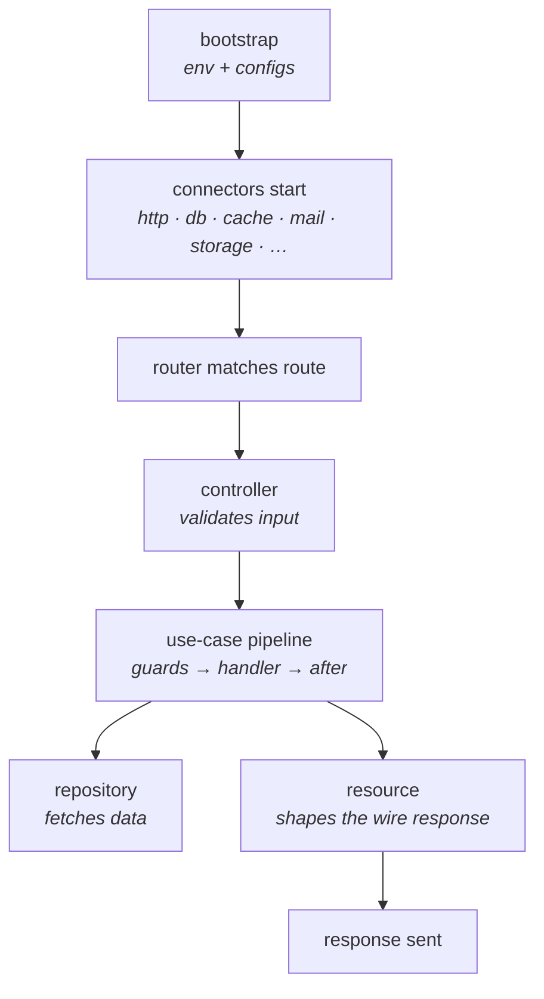

Most backend frameworks were designed before LLM agents were a thing. AI shows up bolted on: a route handler that imports a provider SDK directly, talks to one vendor, and ages badly the moment you need a second model, a retry policy, or a cost dashboard. Warlock was designed AI-first — agents, tools, workflows, and multi-agent supervisors are framework primitives with the same conventions, observability, and testing story as a route or a model. The rest of the stack (HTTP, routing, validation, ORM, mail, storage, queues, sockets) is the boring, reliable parts you'd build anyway, already built and already wired together.

This page shows what makes Warlock different in 30 seconds, the mental model that explains everything else, and what's *not* in scope so you know what you're signing up for.

## The 30-second look

A working HTTP endpoint in two small files, the way Warlock wants you to write them:

```ts title="src/app/products/routes.ts"
import { router } from "@warlock.js/core";
import { listProducts } from "./controllers/list-products.controller";

router.get("/products", listProducts);
```

```ts title="src/app/products/controllers/list-products.controller.ts"
import type { RequestHandler } from "@warlock.js/core";

export const listProducts: RequestHandler = async (request, response) => {
  return response.success({
    products: [
      { id: 1, name: "Hat" },
      { id: 2, name: "Hoodie" },
    ],
  });
};
```

Three things to notice before we move on:

1. `routes.ts` declares what URL hits what handler. The whole module's route surface lives in one file — open `src/app/<module>/routes.ts` for any module and you know its public shape.
2. The controller is a thin function — it pulls inputs from `request`, calls the work, and shapes the reply via `response.success(...)`. No class to extend, no decorators, no DI container to register against.
3. The CLI scaffolded both files: `warlock generate.module products && warlock generate.controller products/list-products`. The convention is the structure.

When you want AI on the same shape, you reach for `@warlock.js/ai`:

```ts
import { ai } from "@warlock.js/ai";
import { OpenAISDK } from "@warlock.js/ai-openai";

const openai = new OpenAISDK({ apiKey: process.env.OPENAI_API_KEY! });

const supportAgent = ai.agent({
  model: openai.model({ name: "gpt-4o-mini" }),
  systemPrompt: "Answer questions about our product catalog.",
});

router.post("/support", async (request, response) => {
  const { data, error } = await supportAgent.execute(request.input("message"));

  if (error) {
    return response.badRequest({ error: error.message });
  }

  return response.success({ reply: data });
});
```

The agent is a Warlock primitive. It lives next to your controllers, hits the same logger, surfaces in the same dashboards, and shares its result envelope with every other primitive in the framework. It is not a plugin.

## What you'll get

- **AI primitives as framework citizens.** `ai.agent`, `ai.tool`, `ai.workflow`, `ai.supervisor` — provider-agnostic, with snapshot resume, cost accounting, and lineage tracking baked in. Swap OpenAI for Anthropic or Bedrock by changing one import.
- **Strict module conventions.** Every feature lives in `src/app/<module>/` with the same layout: `routes.ts`, `controllers/`, `services/`, `models/`, `repositories/`, `resources/`. New teammates learn one shape and read every module the same way.
- **Batteries included.** HTTP server, router, request validation, ORM, mail, file storage, cache, queues, sockets, CLI scaffolding — already wired together. No glue project required.
- **Hot reload that doesn't lie.** The dev server tracks dependencies, restarts only what changed, and surfaces errors at the original source line. Cold reboots are rare.
- **TypeScript-strict by default.** Schemas declared with `@warlock.js/seal` drive request validation, database types, and resource shapes from the same definition. One source of truth.

## The mental model

Every request flows through the same pipeline. Knowing the pipeline is knowing Warlock.



Three sentences for the diagram:

Bootstrap loads env and config files, then every subsystem connector (HTTP server, database, cache, mail, storage) starts in priority order before the first request lands. The router matches each incoming request to a controller; the controller validates input against a schema and hands off to a use-case, which runs the structured pipeline of guards → handler → after-effects. Repositories own data access; resources shape the result for the wire; `response.success(...)` sends it.

AI agents slot in next to controllers as another primitive — they consume the same `request`, can call use-cases as tools, share the same logger, and emit reports with the same envelope shape (`{ data, error, usage, report }`) as every other Warlock primitive.

## What Warlock is *not*

Three things worth being explicit about, so you know what you're signing up for:

- **Not unopinionated.** Warlock has strong opinions about where things live. If you want your routes in twelve different files structured however your team likes, Warlock will fight you. The opinion is the value — your fifth module reads like your first.
- **Not a glue project.** Express + a router library + a validator + an ORM + a mailer is not Warlock. The cohesion is the point — primitives share a result shape, an error story, an observability surface, and a config story by design.
- **Not AI-required.** You can ship a Warlock app that never imports `@warlock.js/ai`. The AI primitives are opt-in; they cost nothing at runtime when you don't reach for them. But when you do, they fit the same conventions you already know.

## Where to next

You've got the shape. Next stop is **[Installation](./02-installation.md)** — the five-minute path from zero to a project that boots.

If you'd rather see the request lifecycle up close first, jump ahead to **[The request lifecycle](../architecture-concepts/01-the-request-lifecycle.md)** in essentials.
