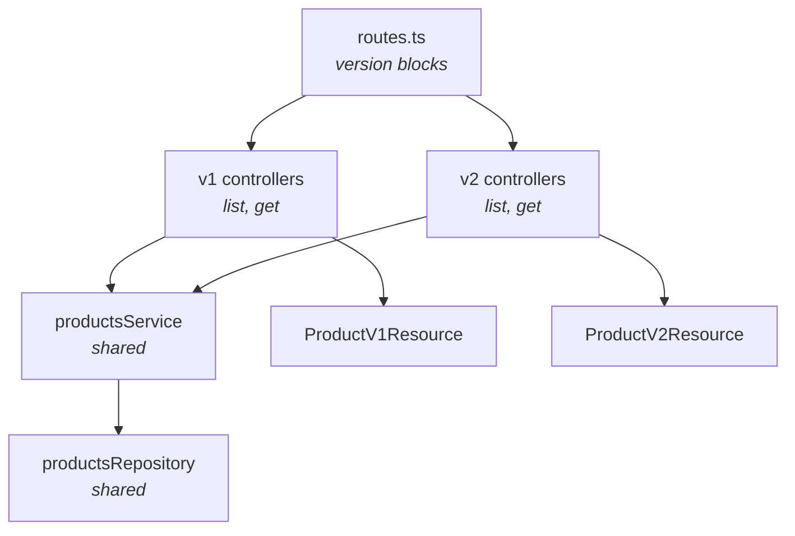

You shipped v1. Now you need v2 of the products API — new fields, a renamed key, breaking enum changes — but every mobile client running v1 still has to work for the next six months. This recipe shows the URL-prefix versioning pattern Warlock's router was designed for: shared services + repositories, version-specific resources, a deprecation header on v1 routes, and a clean 410 once you sunset.

By the end you'll have `/api/v1/products` and `/api/v2/products` living in one routes file, sharing 90% of their code, with a deprecation header on v1 that triggers your monitoring before the cutover.

## Why URL-prefix versioning

There are three common ways to version an HTTP API. They all work; only one of them works *well* with how the router is shaped:

| Strategy            | Example                       | Reality check                                           |
| ------------------- | ----------------------------- | ------------------------------------------------------- |
| URL prefix          | `/api/v1/products`            | Trivial to route. Cacheable. Every CDN handles it.      |
| Header              | `Accept: application/vnd.acme.v1+json` | Cleaner on paper. CDN cache keys are now a chore.   |
| Query param         | `/api/products?v=1`           | Awkward to log, awkward to monitor, hard to deprecate.  |

Warlock's `router.version(...)` and `router.prefix(...)` are first-class. The path stays in the URL, monitoring tools deal with it natively, and you can deprecate `/v1` with a CDN rule. This recipe uses URL-prefix versioning end to end.

## The two-version shape



The split is on the *edges* (controllers + resources). The middle (services + repositories + models) stays shared. That's the principle: version what the wire sees, not what the database sees.

## Step 1 — One routes file, two version blocks

```ts title="src/app/products/routes.ts"
import { router } from "@warlock.js/core";
import { listProductsV1Controller } from "./controllers/v1/list-products.controller";
import { showProductV1Controller } from "./controllers/v1/show-product.controller";
import { listProductsV2Controller } from "./controllers/v2/list-products.controller";
import { showProductV2Controller } from "./controllers/v2/show-product.controller";
import { createProductV2Controller } from "./controllers/v2/create-product.controller";

router.prefix("/api", () => {
  router.version("1", () => {
    router.get("/products", listProductsV1Controller);
    router.get("/products/:id", showProductV1Controller);
  });

  router.version("2", () => {
    router.get("/products", listProductsV2Controller);
    router.get("/products/:id", showProductV2Controller);
    router.post("/products", createProductV2Controller);
  });
});
```

What gets registered:

| Method | Path                       |
| ------ | -------------------------- |
| GET    | `/api/v1/products`         |
| GET    | `/api/v1/products/:id`     |
| GET    | `/api/v2/products`         |
| GET    | `/api/v2/products/:id`     |
| POST   | `/api/v2/products`         |

`router.version("1", ...)` is sugar for `router.prefix("/v1", ...)`. The `/api` prefix on the outside stacks with it — that's the whole grouping mechanism. `router.prefix` nests freely; you can have `/api → /v1 → /products` if you want a third level.

`router.group({ prefix, middleware, name }, callback)` is the verbose form when you need more than a prefix. The two below are equivalent:

```ts
// shorthand
router.prefix("/v1", () => {
  router.get("/products", handler);
});

// verbose — you'd use this form when adding shared middleware
router.group({ prefix: "/v1", middleware: [authMiddleware()] }, () => {
  router.get("/products", handler);
});
```

## Step 2 — Folder layout for versioned controllers

The standard Warlock module layout has one `controllers/` folder. For versioning, nest one folder per version:

```
src/app/products/
  controllers/
    v1/
      list-products.controller.ts
      show-product.controller.ts
    v2/
      list-products.controller.ts
      show-product.controller.ts
      create-product.controller.ts
  services/
    list-products.service.ts          ← shared
    get-product.service.ts            ← shared
    create-product.service.ts         ← shared (only v2 currently uses it)
  resources/
    v1/
      product.resource.ts
    v2/
      product.resource.ts
  repositories/
    products.repository.ts            ← shared
  models/
    product/
      product.model.ts                ← shared
  routes.ts
```

The principle: every layer below the controller stays shared. A change to product creation logic happens once in the service; v2 picks it up automatically. v1 doesn't see it because v1 never wired a create controller — that's intentional.

## Step 3 — Shared service, version-specific controllers

The shared service stays plain. It doesn't know what version called it:

```ts title="src/app/products/services/list-products.service.ts"
import { productsRepository } from "../repositories/products.repository";

export type ListProductsFilter = {
  search?: string;
  category_id?: string;
  page?: number;
  limit?: number;
};

export async function listProductsService(filter: ListProductsFilter) {
  return productsRepository.list(filter);
}
```

The v1 controller calls the service, then shapes the response through the v1 resource:

```ts title="src/app/products/controllers/v1/list-products.controller.ts"
import type { RequestHandler, Response } from "@warlock.js/core";
import { listProductsService } from "../../services/list-products.service";
import { ProductV1Resource } from "../../resources/v1/product.resource";

export const listProductsV1Controller: RequestHandler = async (request, response: Response) => {
  const { data, pagination } = await listProductsService({
    search: request.input("search"),
    category_id: request.input("category_id"),
    page: request.input("page", 1),
    limit: request.input("limit", 20),
  });

  return response
    .header("Deprecation", "true")
    .header("Sunset", "Wed, 01 Oct 2026 00:00:00 GMT")
    .header("Link", '</api/v2/products>; rel="successor-version"')
    .success({
      products: data.map((product) => new ProductV1Resource(product).toJSON()),
      pagination,
    });
};
```

The v2 controller is the same shape, different resource:

```ts title="src/app/products/controllers/v2/list-products.controller.ts"
import type { RequestHandler, Response } from "@warlock.js/core";
import { listProductsService } from "../../services/list-products.service";
import { ProductV2Resource } from "../../resources/v2/product.resource";

export const listProductsV2Controller: RequestHandler = async (request, response: Response) => {
  const { data, pagination } = await listProductsService({
    search: request.input("search"),
    category_id: request.input("category_id"),
    page: request.input("page", 1),
    limit: request.input("limit", 20),
  });

  return response.success({
    products: data.map((product) => new ProductV2Resource(product).toJSON()),
    pagination,
  });
};
```

90% of the code is identical. The two diffs that matter:

- The resource class — v1 ships `name` + `price`, v2 ships `name` + `pricing: { amount, currency }` + a new `availability` field.
- The deprecation headers — v1 announces its sunset; v2 doesn't.

## Step 4 — Versioned resources

```ts title="src/app/products/resources/v1/product.resource.ts"
import { defineResource } from "@warlock.js/core";

export const ProductV1Resource = defineResource({
  schema: {
    id: "string",
    name: "string",
    price: "number",
    category_id: "string",
    created_at: "date",
  },
});
```

```ts title="src/app/products/resources/v2/product.resource.ts"
import { defineResource } from "@warlock.js/core";

export const ProductV2Resource = defineResource({
  schema: {
    id: "string",
    name: "string",
    pricing: {
      amount: "number",
      currency: "string",
    },
    category_id: "string",
    availability: "string",
    created_at: "date",
    updated_at: "date",
  },
});
```

The model has all the data — `price`, `currency`, `availability`. v1 picks the subset it knows about and renames `price` → `price`; v2 picks a different subset and groups `price`+`currency` under `pricing`. The resource layer is where the wire shape lives.

If your v2 needs to compute a field, do it in the model (a getter) or in a service — never in the resource. Resources are output-only.

## Step 5 — Deprecation, the right way

You announce a deprecation **before** you delete a route, not after. Three headers do the heavy lifting:

| Header        | Value example                                                       | What it means                              |
| ------------- | ------------------------------------------------------------------- | ------------------------------------------ |
| `Deprecation` | `true` or RFC-3339 timestamp                                        | "This endpoint is deprecated."             |
| `Sunset`      | HTTP-date, e.g. `Wed, 01 Oct 2026 00:00:00 GMT`                     | "It goes away on this date."               |
| `Link`        | `</api/v2/products>; rel="successor-version"`                       | "Here's the replacement."                  |

These are draft-IETF standards (`draft-ietf-httpapi-deprecation-header` + RFC 8594). They're respected by enough tooling — API monitoring dashboards, log aggregators, OpenAPI generators — that adding them is essentially free.

Put them on every v1 route:

```ts
return response
  .header("Deprecation", "true")
  .header("Sunset", "Wed, 01 Oct 2026 00:00:00 GMT")
  .header("Link", '</api/v2/products>; rel="successor-version"')
  .success({ /* ... */ });
```

Doing this in every controller gets repetitive. Extract a middleware:

```ts title="src/app/shared/middleware/deprecated-v1.middleware.ts"
import type { Middleware } from "@warlock.js/core";

export const deprecatedV1Middleware: Middleware = async (_request, response) => {
  response.header("Deprecation", "true");
  response.header("Sunset", "Wed, 01 Oct 2026 00:00:00 GMT");
  response.header("Link", '</api/v2/>; rel="successor-version"');
};
```

Apply it to the v1 group with `router.group`:

```ts title="src/app/products/routes.ts"
import { router } from "@warlock.js/core";
import { deprecatedV1Middleware } from "app/shared/middleware/deprecated-v1.middleware";
import { listProductsV1Controller } from "./controllers/v1/list-products.controller";
import { showProductV1Controller } from "./controllers/v1/show-product.controller";
import { listProductsV2Controller } from "./controllers/v2/list-products.controller";
import { showProductV2Controller } from "./controllers/v2/show-product.controller";
import { createProductV2Controller } from "./controllers/v2/create-product.controller";

router.prefix("/api", () => {
  router.group({ prefix: "/v1", middleware: [deprecatedV1Middleware] }, () => {
    router.get("/products", listProductsV1Controller);
    router.get("/products/:id", showProductV1Controller);
  });

  router.version("2", () => {
    router.get("/products", listProductsV2Controller);
    router.get("/products/:id", showProductV2Controller);
    router.post("/products", createProductV2Controller);
  });
});
```

Now every v1 response carries the deprecation headers — no duplication in controllers.

## Step 6 — The cutover

On sunset day, replace v1 controllers with a single 410 Gone responder. Don't delete the routes — clients pinging v1 should hit a clear error, not a 404 that confuses their stack traces:

```ts title="src/app/shared/controllers/gone.controller.ts"
import type { RequestHandler, Response } from "@warlock.js/core";

export const goneController: RequestHandler = async (_request, response: Response) => {
  return response.setStatusCode(410).send({
    error: "This endpoint has been removed. Upgrade to /api/v2/.",
    successorVersion: "/api/v2/",
  });
};
```

Wire it as the v1 handler:

```ts
router.group({ prefix: "/v1" }, () => {
  router.any("/products", goneController);
  router.any("/products/:id", goneController);
});
```

`router.any(...)` matches every HTTP method — POST/PUT/DELETE all hit the same 410. Six months later you delete the v1 block entirely.

## Per-module-version vs flat routing

The pattern above puts both versions in one `routes.ts`. For a small module (the product example, fewer than a dozen routes) that's the right call. For a large module — auth, with twenty endpoints — split per version:

```
src/app/auth/
  routes.ts                  ← top-level, imports both
  v1/
    routes.ts                ← all v1 routes
    controllers/
    ...
  v2/
    routes.ts                ← all v2 routes
    controllers/
    ...
```

```ts title="src/app/auth/routes.ts"
import { router } from "@warlock.js/core";
import { registerV1Routes } from "./v1/routes";
import { registerV2Routes } from "./v2/routes";

router.prefix("/api", () => {
  router.version("1", registerV1Routes);
  router.version("2", registerV2Routes);
});
```

```ts title="src/app/auth/v2/routes.ts"
import { router } from "@warlock.js/core";
import { loginV2Controller } from "./controllers/login.controller";
import { registerV2Controller } from "./controllers/register.controller";

export function registerV2Routes() {
  router.post("/login", loginV2Controller);
  router.post("/register", registerV2Controller);
}
```

The version blocks become callbacks. Same outcome on the wire; the module reads cleaner when you're staring at twenty routes per version.

## Picking what to break per version

Some real-world rules of thumb worth internalizing:

- **Breaking changes only on a major bump.** Adding a field is non-breaking — old clients ignore it. Removing or renaming is breaking. Don't ship a "v1.1" with renames; bump to v2.
- **Behaviour changes count as breaking.** If `POST /products` was idempotent and v2 makes it non-idempotent (or vice versa), that's a major bump even if the schema didn't move.
- **Enum changes are subtle.** Adding a new enum value is non-breaking for the producer (v1 clients see a value they don't recognize) — but it can crash strict client deserializers. Document the addition; consider it breaking if your clients are TypeScript-strict.
- **Validation tightening is breaking.** v1 accepted any positive number for `quantity`; v2 caps it at 1000. Old clients sending 5000 will start getting 400s. Bump.

The point of versioning is to keep the contract stable. If a change wouldn't break a careful client, it doesn't need a new version. If it might break a careless client, it does.

## Gotchas

- **Routes are registered in declaration order, but matched longest-prefix-wins.** `/api/v2/products/:id` and `/api/v2/products/featured` both match `/api/v2/products/something`. Put the specific one first if there's ambiguity.
- **`router.version(n, ...)` uses the `n` you pass verbatim.** `router.version("1.0", ...)` produces `/v1.0`. Stick to integer majors unless you really mean to ship `/v1.1`.
- **Middleware on the prefix group applies to every nested route.** If you put `authMiddleware()` on `/api`, v1 *and* v2 require auth. That's usually what you want — but it's not always.
- **The `Deprecation` header doesn't change behaviour.** Clients ignoring it will happily keep hitting your endpoint until the day you 410 it. Pair the header with monitoring: log requests to v1, alert when traffic isn't dropping.
- **Don't version the database.** Resources change between versions; the underlying columns don't. If you need a column rename, do it in a migration with a compatibility shim, not by forking the model.

## Going further

- **Full router surface** — prefixes, groups, named routes, scan hooks: [Routing (deep) guide](../the-basics/routing-deep.md)
- **The routing basics** — verbs, controllers, validation: [Essentials → Routing](../the-basics/02-routing.md)
