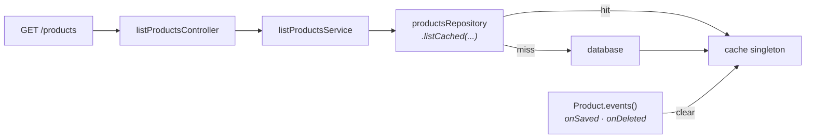

Your `GET /products` endpoint is fine at 200ms, until it isn't. The catalogue grows, the filter set grows, and now every page load eats a 50ms join you don't need to do every time. This recipe walks the three stages of caching a list endpoint properly — switch to `listCached`, lean on automatic invalidation via model events, and reach for `cache.remember(...)` when the standard repository cache doesn't fit.

By the end you'll have a list endpoint that serves from cache in under 5ms, invalidates itself when a product changes, and tells you the latency win in numbers you can take to a standup.

## What you're building



The repository owns the cache layer. Its `listCached(...)` method checks the cache; on a hit, deserializes models from the cached blob and returns. On a miss, runs the query and writes the result back to cache before returning. Model events clear the cache automatically — every `save` and `destroy` calls `repository.clearCache()` behind the scenes.

For one-off cases that don't fit the repository shape, the `cache` singleton from `@warlock.js/cache` has `remember(key, ttl, fn)` for ad-hoc caching of arbitrary shapes.

## Stage 0 — Configure the cache

Cache drivers and defaults live in `src/config/cache.ts`. The reference project's setup:

```ts title="src/config/cache.ts"
import {
  FileCacheDriver,
  MemoryCacheDriver,
  MemoryExtendedCacheDriver,
  RedisCacheDriver,
  type CacheConfigurations,
} from "@warlock.js/cache";
import { env } from "@warlock.js/core";

const cacheConfigurations: CacheConfigurations = {
  default: "memoryExtended",
  logging: false,
  drivers: {
    file: FileCacheDriver,
    memory: MemoryCacheDriver,
    redis: RedisCacheDriver,
    memoryExtended: MemoryExtendedCacheDriver,
  },
  options: {
    redis: {
      host: env("REDIS_HOST"),
      port: env("REDIS_PORT"),
      url: env("REDIS_URL"),
    },
    memoryExtended: {
      ttl: 30 * 60, // 30 minutes
    },
  },
};

export default cacheConfigurations;
```

Pick the driver that matches your deployment:

| Driver             | When                                                                   |
| ------------------ | ---------------------------------------------------------------------- |
| `memory`           | Single-process dev. Cache dies on restart. Default for getting started |
| `memoryExtended`   | Single-process with eviction + tagging. Sane local default              |
| `redis`            | Production. Shared across processes, survives restarts                 |
| `file`             | Edge cases — read-mostly data on a single host, no Redis available     |
| `database`         | When you already have the DB and don't want a new dependency           |

The `default` field picks which driver every cache call uses unless you override per-call. For local dev, `memoryExtended` is fine. For production with multiple worker processes (or even one — sticky to losing cache on every deploy), use `redis`.

### How the repository reads from cache

The framework wires this automatically:

```ts title="@warlock.js/core/src/repositories/repository.manager.ts (excerpt)"
protected isCacheable = config.get("repository.isCacheable") ?? true;
protected cacheDriver: CacheDriver<any, any> = config.get("repository.cacheDriver") || cache;
```

Every `RepositoryManager` subclass picks up the global `cache` singleton by default. To opt one repository out, override on the class:

```ts
class ProductsRepository extends RepositoryManager<Product, ProductListOptions> {
  protected isCacheable = false;
  // ...
}
```

To use a non-default driver for one repository:

```ts
import { cache } from "@warlock.js/cache";

class ProductsRepository extends RepositoryManager<Product, ProductListOptions> {
  public constructor() {
    super();
    cache.driver("redis").then((driver) => this.setCacheDriver(driver));
  }
  // ...
}
```

Most apps never touch this. The defaults are right.

## Stage 1 — Switch `list` to `listCached`

You start with a vanilla list service:

```ts title="src/app/products/services/list-products.service.ts"
import { productsRepository } from "../repositories/products.repository";

export type ListProductsFilter = {
  search?: string;
  category_id?: string;
  status?: string;
  page?: number;
  limit?: number;
};

export async function listProductsService(filter: ListProductsFilter) {
  return productsRepository.list(filter);
}
```

To cache, change one method name:

```ts title="src/app/products/services/list-products.service.ts"
import { productsRepository } from "../repositories/products.repository";

export type ListProductsFilter = {
  search?: string;
  category_id?: string;
  status?: string;
  page?: number;
  limit?: number;
};

export async function listProductsService(filter: ListProductsFilter) {
  return productsRepository.listCached(filter);
}
```

That's it. The first call runs the query and writes the result; every subsequent call within the TTL window reads from cache.

A real example from the reference codebase:

```ts title="src/app/catalog-items/services/list-catalog-items.service.ts"
import { catalogItemsRepository } from "../repositories/catalog-items.repository";

export async function listCatalogItemsService(filters: any) {
  return catalogItemsRepository.listCached(filters);
}
```

The repository's `listCached(...)` returns the exact same `PaginationResult<T>` shape `list(...)` does. Switching back is one method-name change. No call-site changes downstream.

### How the cache key is built

The framework hashes the filter object into a deterministic key:

```ts title="@warlock.js/core/src/repositories/repository.manager.ts (excerpt)"
protected cacheKey(key: string | Record<string, any>, moreOptions?: Record<string, any>): string {
  let cacheKey = `repositories.${this.getName()}`;
  if (key) {
    cacheKey += "." + (typeof key === "string" ? key : JSON.stringify(key));
  }
  if (moreOptions) {
    cacheKey += "." + JSON.stringify(moreOptions);
  }
  return cacheKey;
}
```

For a `list` call, the key looks like `repositories.productsRepository.list.{"search":"hoodie","status":"active"}`. Different filters → different keys → independent cache entries. Same filter twice in the TTL window → same key → cache hit.

The implication that catches people out: **the order of keys in the filter object matters**. `{ search: "hat", status: "active" }` and `{ status: "active", search: "hat" }` produce different cache keys. If you're building filters from user input, normalize the key order (or just always pass keys in a fixed order from your controllers).

## Stage 2 — Automatic invalidation

The repository registers model events at construction time:

```ts title="@warlock.js/core/src/repositories/repository.manager.ts (excerpt)"
public registerEvents() {
  this.eventsCallbacks.push(
    ...this.adapter.registerEvents((source: any) => {
      this.clearCache();
    }),
  );
}
```

That callback fires on every save and every destroy. `clearCache()` removes every cache entry under the `repositories.{name}.*` namespace — list caches, get caches, count caches, all of them.

The flow:

1. Cache `repositories.productsRepository.list.{"status":"active"}` is populated by a request.
2. Someone updates a product (`POST /products` followed by `PUT /products/5`).
3. The model's `saved` event fires.
4. The repository hears it, calls `clearCache()`.
5. The next list request finds nothing in cache, runs the query, repopulates.

**This is coarse on purpose.** A finer-grained "only invalidate entries whose filter would have matched the changed row" is hard to reason about and easy to get wrong. Wiping the whole repository namespace on every write is the conservative default that gives correct behaviour. If your write rate is so high that cache misses dominate, you have a different problem — see [Stage 3](#stage-3--escape-hatch-cacheremember) below.

### When automatic invalidation isn't enough

Two cases break the default:

- **Bulk writes via the query builder.** `Product.where("status", "draft").update({ status: "active" })` bypasses model events entirely (that's the whole reason to use the query builder for bulk ops). The cache won't clear. Call `productsRepository.clearCache()` explicitly after the bulk write.
- **Writes from a different process.** Worker A writes a product. Worker B's in-memory cache doesn't know — only Redis-backed caches share invalidation across processes. If you're running multiple workers, use Redis.

To clear manually after a bulk write:

```ts
import { productsRepository } from "app/products/repositories/products.repository";

await Product.where("status", "draft").update({ status: "active" });
await productsRepository.clearCache();
```

`clearCache(key?)` takes an optional key to narrow the wipe. `clearCache()` (no arg) wipes the whole repository namespace. For a list endpoint, the broad wipe is usually correct — the alternative is reasoning about which cache keys might have matched, which costs more cognitive effort than the cache buys.

## Stage 3 — Escape hatch: `cache.remember`

Sometimes you need to cache a shape that doesn't fit the repository. A derived statistic, an external API result, a computed report. Reach for `cache.remember(...)`:

```ts title="src/app/products/services/product-stats.service.ts"
import { cache } from "@warlock.js/cache";
import { Product } from "../models/product";

export async function getProductStatsService() {
  return cache.remember(
    "stats.products.overview",
    5 * 60, // TTL: 5 minutes
    async () => {
      const [total, inStock, lowStock] = await Promise.all([
        Product.count(),
        Product.where("inventory", ">", 0).count(),
        Product.whereBetween("inventory", [1, 5]).count(),
      ]);

      return { total, inStock, lowStock };
    },
  );
}
```

The shape:

```ts
cache.remember(key, ttl, callback);
```

- **`key`** — anything stringifiable. Conventionally namespaced (`stats.products.overview`).
- **`ttl`** — TTL in seconds, or a duration string (`"5m"`, `"1h"`).
- **`callback`** — runs only on cache miss. Its return value goes into the cache.

`remember(...)` is also the right answer for **cache-stampede protection**: when a hot cache entry expires and twenty requests hit at once, you don't want twenty database queries. `remember` deduplicates concurrent callers — only the first one runs the callback; the others wait and read the result it cached.

### When `remember` beats `listCached`

| Situation                                                    | Reach for         |
| ------------------------------------------------------------ | ----------------- |
| Standard repository list with filters                        | `listCached`      |
| Derived statistic (counts, aggregates)                       | `cache.remember`  |
| Result of an external API call                               | `cache.remember`  |
| Tagged invalidation (clear by category, not by repo)         | `cache.remember` + `cache.remove` |
| Per-user data that shouldn't share across users              | `cache.remember` with user id in the key |

For the per-user case:

```ts
return cache.remember(
  `user.${userId}.preferences`,
  "1h",
  () => loadUserPreferences(userId),
);
```

The user id in the key makes each user's cache independent. Don't try to do this with `listCached` — the repository cache key is per-filter, not per-user; you'd need filter-keyed slicing the framework doesn't give you.

### Manual invalidation

`cache.remove(key)` removes one entry. `cache.removeNamespace(prefix)` removes everything starting with that prefix:

```ts
await cache.remove("stats.products.overview");
await cache.removeNamespace("user.42.");
```

For repository-backed caches, prefer `repository.clearCache()` — it knows the namespace shape and handles the deserialization story.

## Measuring the win

Before you call it done, prove the win. The framework's `measure` helper times any callback and classifies the result against thresholds:

```ts
import { measure } from "@warlock.js/core";

const result = await measure(
  "products.list",
  () => listProductsService({ status: "active" }),
  { latencyRange: { excellent: 50, poor: 300 } },
);

console.log(`latency: ${result.latency}ms — ${result.state}`);
// First call (cache miss):  latency: 180ms — good
// Second call (cache hit):  latency:   3ms — excellent
```

The shape:

```ts
measure(name, callback, { latencyRange: { excellent, poor } })
```

`name` is a label that shows up in your observability — `"products.list"` is a sensible default. `latencyRange.excellent` and `latencyRange.poor` are thresholds in milliseconds. The `state` field comes back as `"excellent"` (≤ excellent), `"good"` (between), or `"poor"` (> poor). The numbers are yours to set — what counts as "excellent" for a list endpoint is your call. 50ms is a reasonable bar for a cache hit; 300ms is a reasonable warning line.

### Wrapping a use-case with benchmarking

If your list endpoint goes through a use-case, the benchmark integration is built in:

```ts title="src/app/products/use-cases/list-products.usecase.ts"
import { useCase } from "@warlock.js/core";
import { listProductsService } from "../services/list-products.service";

export const listProductsUseCase = useCase({
  name: "products.list",
  handler: async (input: { filter: ListProductsFilter }) => {
    return listProductsService(input.filter);
  },
  benchmarkOptions: {
    latencyRange: { excellent: 50, poor: 300 },
  },
});
```

Every invocation publishes a benchmark event. Wire your observability layer to listen and you get production timing data without instrumenting controllers.

## A complete cached list endpoint

The whole stack, end to end:

```ts title="src/app/products/repositories/products.repository.ts"
import { RepositoryManager, type FilterRules, type RepositoryOptions } from "@warlock.js/core";
import { Product } from "../models/product";

type ProductListFilter = {
  search?: string;
  category_id?: string;
  status?: string;
};

export type ProductListOptions = RepositoryOptions & ProductListFilter;

class ProductsRepository extends RepositoryManager<Product, ProductListOptions> {
  public source = Product;

  public filterBy: FilterRules = {
    id: "=",
    category_id: "=",
    status: "=",
    search: ["like", ["name", "description"]],
  };

  public defaultOptions: RepositoryOptions = {
    orderBy: { id: "desc" },
  };
}

export const productsRepository = new ProductsRepository();
```

```ts title="src/app/products/services/list-products.service.ts"
import { productsRepository, type ProductListOptions } from "../repositories/products.repository";

export async function listProductsService(filter: ProductListOptions) {
  return productsRepository.listCached(filter);
}
```

```ts title="src/app/products/controllers/list-products.controller.ts"
import type { RequestHandler, Response } from "@warlock.js/core";
import { listProductsService } from "../services/list-products.service";
import { ProductResource } from "../resources/product.resource";

export const listProductsController: RequestHandler = async (request, response: Response) => {
  const { data, pagination } = await listProductsService({
    search: request.input("search"),
    category_id: request.input("category_id"),
    status: request.input("status"),
    page: request.input("page", 1),
    limit: request.input("limit", 20),
  });

  return response.success({
    products: data.map((product) => new ProductResource(product).toJSON()),
    pagination,
  });
};
```

The controller doesn't know there's a cache. The service doesn't know how the cache key is built. The repository owns the policy. Swapping caching strategies happens in one file.

## Gotchas

- **Filter object key order changes the cache key.** Sort keys, or always pass them in a fixed order from controllers. Otherwise `{a, b}` and `{b, a}` cache separately and you halve the hit rate.
- **Memory drivers don't share across processes.** Two-worker deployment with the `memory` driver = two independent caches. Use `redis` for anything that needs shared state.
- **TTL is the safety net, not the contract.** Even with automatic invalidation, set a reasonable TTL (30 minutes for `memoryExtended` is the default) — the worst case is data that should have refreshed but didn't, capped by the TTL.
- **`cache.remember` deduplicates within a process.** Cross-process stampede protection requires distributed locking — Redis with a SETNX-based lock pattern. The default driver's `remember` is single-process safe.
- **Bulk query-builder writes skip events.** They're fast precisely because they skip events. If they should invalidate cache, call `clearCache()` explicitly after the bulk op.
- **Models with relations get cached as serialized blobs.** When you read back, the framework rehydrates via the adapter. If you mutate a hydrated model and don't save, the cache still holds the original — the deserialized instance is a fresh copy each time.

## Going further

- **Full cache API surface, every driver, every option:** [Cache guide](../digging-deeper/cache.md)
- **Repository caching depth — keys, invalidation, custom drivers:** [Repositories (deep) guide](../the-basics/repositories-deep.md)
- **Latency benchmarking patterns:** [Benchmark guide](../digging-deeper/benchmark.md)
- **Building one-shot remember/forget calls:** ``@warlock.js/cache` — cache-basics skill`
