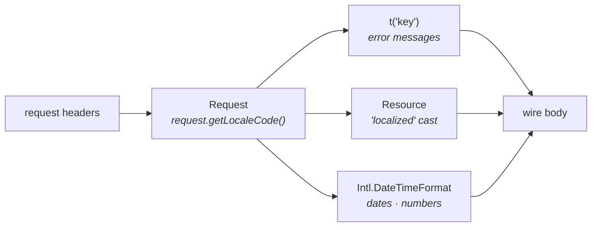

Your app speaks English and Arabic. The user passes a header, you read it once, and everything from validation errors to product names comes back translated. This recipe wires all the locale-aware layers — `Accept-Language` resolution, `t()` for error messages, the `"localized"` resource cast for per-locale fields, and `Intl` for dates and numbers.

By the end you'll have a request that, depending on the `accept-language: ar` header, returns Arabic error messages, Arabic product names, and Arabic-formatted dates — without the controllers knowing anything about locale.

## How locale flows through a request



The framework reads the locale once from the request and stashes it. Every translation helper, every `"localized"` resource field, every `request.trans(...)` call uses that same value. You configure the fallback chain once in `src/config/app.ts`; everything downstream reads from there.

## Step 1 — Configure the app locale

```ts title="src/config/app.ts"
import { Application, env } from "@warlock.js/core";

export default {
  localeCode: env("APP_LOCALE", "en"),
  fallbackLocaleCode: env("APP_FALLBACK_LOCALE", "en"),
  // ...other app config
};
```

`localeCode` is the default — the value a request gets when it doesn't specify one. `fallbackLocaleCode` is what `t()` falls back to when a key is missing in the requested locale. If your default and fallback are both `"en"`, missing Arabic keys come back as English (better than `"undefined"`).

## Step 2 — How the locale is resolved

The framework's `Request` class resolves the locale at construction time. Three sources, in order:

1. **`locale` header** — `locale: ar`
2. **`locale` query param** — `?locale=ar`
3. **The configured default** — `config.key("app.localeCode")`

```ts title="How the request resolves locale"
public get localized() {
  if (this._locale) return this._locale;

  return (this._locale = this.header("locale") || this.query["locale"]);
}

public getLocaleCode(defaultLocaleCode: string = config.key("app.localeCode") || "en") {
  return this.locale || defaultLocaleCode;
}
```

That `getLocaleCode()` is what every other locale-aware helper calls under the hood. You almost never call it yourself — the framework binds `request.trans` and `request.t` to the resolved locale during request construction.

### What about `Accept-Language`?

The standard `Accept-Language` header carries quality-weighted preferences (`en;q=0.5, ar;q=0.9`). The framework's default resolver uses the simpler `locale` header — but if your clients send `Accept-Language`, parse it in a middleware and call `request.setLocaleCode(...)`:

```ts title="src/app/shared/middleware/locale-from-accept-language.middleware.ts"
import type { Middleware } from "@warlock.js/core";

const supportedLocales = new Set(["en", "ar"]);

export const localeFromAcceptLanguage: Middleware = async (request) => {
  if (request.locale) {
    return;
  }

  const acceptLanguage = request.header("accept-language") as string | undefined;

  if (!acceptLanguage) {
    return;
  }

  const preferred = acceptLanguage
    .split(",")
    .map((entry) => entry.split(";")[0].trim().split("-")[0].toLowerCase())
    .find((code) => supportedLocales.has(code));

  if (preferred) {
    request.setLocaleCode(preferred);
  }
};
```

Wire it as a global middleware in `src/config/http.ts` so every request runs through it.

## Step 3 — Translations per module

Every module owns its translations in `utils/locales.ts` — the file is auto-loaded by the framework. The scaffold gives you this when you run `yarn warlock generate.module <name>`:

```ts title="src/app/products/utils/locales.ts"
import { groupedTranslations } from "@mongez/localization";

groupedTranslations("products", {
  notFound: {
    en: "Product not found",
    ar: "المنتج غير موجود",
  },
  outOfStock: {
    en: "This product is out of stock",
    ar: "هذا المنتج غير متوفر",
  },
  insufficientQuantity: {
    en: "Only {available} items left",
    ar: "تبقى {available} قطع فقط",
  },
  errors: {
    invalidPrice: {
      en: "Price must be a positive number",
      ar: "السعر يجب أن يكون رقمًا موجبًا",
    },
  },
});
```

A real example from the reference codebase:

```ts title="src/app/auth/utils/locales.ts"
import { groupedTranslations } from "@warlock.js/core";

groupedTranslations("auth", {
  invalidCredentials: {
    en: "Invalid email or password",
    ar: "البريد الالكتروني أو كلمة المرور غير صحيحة",
  },
  otpExpired: {
    en: "Verification code has expired",
    ar: "رمز التحقق منتهي الصلاحية",
  },
  errors: {
    missingAccessToken: {
      en: "Access token is required",
      ar: "رمز الوصول مطلوب",
    },
    invalidAccessToken: {
      en: "Invalid or expired access token",
      ar: "رمز الوصول غير صالح أو منتهي الصلاحية",
    },
  },
});
```

`@warlock.js/core` re-exports `groupedTranslations` from `@mongez/localization` — either import works. Stick with `@mongez/localization` for the canonical home; that's what the scaffolder uses.

The grouped structure means `t("auth.invalidCredentials")` looks up `auth → invalidCredentials → <currentLocale>`. Nested groups dotted-access naturally: `t("auth.errors.missingAccessToken")`.

### Placeholders

```ts
t("products.insufficientQuantity", { available: 3 });
// EN: "Only 3 items left"
// AR: "تبقى 3 قطع فقط"
```

Pass the placeholders object as the second argument. The framework injects `{key}` patterns; missing placeholders stay as literals (helpful for catching typos).

## Step 4 — Localized error messages in controllers

Use `t()` from `@warlock.js/core` everywhere you build an error response. It reads the locale from the current request automatically:

```ts title="src/app/products/controllers/show-product.controller.ts"
import { t, type RequestHandler, type Response } from "@warlock.js/core";
import { productsRepository } from "../repositories/products.repository";
import { ProductResource } from "../resources/product.resource";

export const showProductController: RequestHandler = async (request, response: Response) => {
  const product = await productsRepository.get(request.input("id"));

  if (!product) {
    return response.notFound({ error: t("products.notFound") });
  }

  return response.success({ product: new ProductResource(product).toJSON() });
};
```

The flow: the request lifecycle binds `t()` to the resolved locale before your handler runs. Your controller doesn't pass locale around — it just calls `t()` and trusts the binding.

Real example from the reference codebase:

```ts title="src/app/auth/controllers/login.controller.ts"
import { t, type RequestHandler, type Response } from "@warlock.js/core";

export const login: RequestHandler = async (request, response: Response) => {
  const result = await loginUseCase({ data: request.validated() });

  if (!result) {
    return response.unauthorized({ error: t("auth.invalidCredentials") });
  }

  return response.success(result);
};
```

Locale flips depending on the header — `locale: ar` returns the Arabic version of the same key.

### Translating thrown errors

When a service throws (e.g., `ForbiddenError`), translate at the throw site, not the catch site:

```ts title="src/app/auth/services/otp.service.ts"
import { ForbiddenError, t } from "@warlock.js/core";

if (otp.isExpired) {
  throw new ForbiddenError(t("auth.otpExpired"), {
    errorCode: AuthErrorCode.OTP_EXPIRED,
  });
}
```

The error's `message` is already localized by the time the framework's error handler picks it up. The `errorCode` payload field is the stable, machine-readable identifier — clients use that for routing logic; humans see `message`.

## Step 5 — Localized resource fields

The `"localized"` resource cast handles per-locale data fields. Cascade stores localized columns as `[{ localeCode, value }]` arrays:

```ts
// In the database
{
  name: [
    { localeCode: "en", value: "Premium Hoodie" },
    { localeCode: "ar", value: "هودي بريميوم" },
  ],
  description: [
    { localeCode: "en", value: "Soft cotton, oversized fit" },
    { localeCode: "ar", value: "قطن ناعم، مقاس واسع" },
  ],
}
```

The resource picks the locale-matching entry automatically:

```ts title="src/app/products/resources/product.resource.ts"
import { defineResource } from "@warlock.js/core";

export const ProductResource = defineResource({
  schema: {
    id: "string",
    name: "localized",
    description: "localized",
    price: "number",
    created_at: "date",
  },
});
```

The framework reads `request.locale`, finds the matching `localeCode` entry, and returns just its `value`. The wire payload comes back as plain strings:

```json
// GET /products/1 with locale: ar
{
  "product": {
    "id": "1",
    "name": "هودي بريميوم",
    "description": "قطن ناعم، مقاس واسع",
    "price": 49.99,
    "created_at": "2026-05-22T10:00:00.000Z"
  }
}
```

If the field is already a plain string (not an array), `"localized"` passes through unchanged. That's the gradual-migration case — older rows have `name: "Premium Hoodie"` (plain), newer rows have the array form. Both render correctly through the same cast.

### Adding a localized column to a model

The validation schema and migration use Cascade's localized helpers — `v.localized(v.string())` for the schema and the column definition. Refer to the [validation guide](../the-basics/validation.md) for the schema side and [migrations guide](/v/latest/cascade/the-basics/migrations/) for the column definition.

## Step 6 — Localized dates and numbers

The framework doesn't ship a date-localization helper — for good reason. JavaScript's `Intl` API does the job better than any wrapper. Use it directly:

```ts title="src/app/products/utils/format.ts"
import { useRequestStore } from "@warlock.js/core";

function currentLocale(defaultLocale = "en"): string {
  const { request } = useRequestStore();
  return request?.getLocaleCode() ?? defaultLocale;
}

export function formatDate(date: Date | string, options?: Intl.DateTimeFormatOptions): string {
  const locale = currentLocale();
  const value = typeof date === "string" ? new Date(date) : date;

  return new Intl.DateTimeFormat(locale, {
    year: "numeric",
    month: "short",
    day: "numeric",
    ...options,
  }).format(value);
}

export function formatMoney(amount: number, currency = "USD"): string {
  const locale = currentLocale();

  return new Intl.NumberFormat(locale, {
    style: "currency",
    currency,
  }).format(amount);
}
```

`useRequestStore()` from `@warlock.js/core` gives you the current request inside the async-local-storage context — works from services, utils, anywhere downstream of the controller. It returns `undefined` outside a request (e.g., during a CLI job), so the helper falls back to the default locale.

Use the helpers wherever you build display strings:

```ts
const formatted = {
  releasedOn: formatDate(product.get("releasedAt")),
  price: formatMoney(product.get("price"), product.get("currency")),
};
```

For `ar` locale, `formatDate(new Date("2026-05-22"))` returns `٢٢ مايو ٢٠٢٦`. For `en`, you get `May 22, 2026`. The browser's Intl tables handle every supported locale — you don't ship a translation file for month names.

### Why this isn't in the framework

A wrapper would have to pick options (locale, calendar, time zone, format options) for you, and every app needs different ones. `Intl` is a 5-line wrapper away from being exactly what your app needs; abstracting it adds a vocabulary mismatch with no upside.

## Step 7 — Putting it together

The full request flow for a localized product detail page:

```ts title="src/app/products/controllers/show-product.controller.ts"
import { t, type RequestHandler, type Response } from "@warlock.js/core";
import { productsRepository } from "../repositories/products.repository";
import { ProductResource } from "../resources/product.resource";
import { formatDate, formatMoney } from "../utils/format";

export const showProductController: RequestHandler = async (request, response: Response) => {
  const product = await productsRepository.get(request.input("id"));

  if (!product) {
    return response.notFound({ error: t("products.notFound") });
  }

  const productJson = new ProductResource(product).toJSON();

  return response.success({
    product: {
      ...productJson,
      formatted: {
        price: formatMoney(productJson.price, "USD"),
        createdAt: formatDate(productJson.created_at),
      },
    },
  });
};
```

With `locale: ar`:

```json
{
  "product": {
    "id": "1",
    "name": "هودي بريميوم",
    "description": "قطن ناعم، مقاس واسع",
    "price": 49.99,
    "created_at": "2026-05-22T10:00:00.000Z",
    "formatted": {
      "price": "US$ ٤٩٫٩٩",
      "createdAt": "٢٢ مايو ٢٠٢٦"
    }
  }
}
```

With `locale: en`:

```json
{
  "product": {
    "id": "1",
    "name": "Premium Hoodie",
    "description": "Soft cotton, oversized fit",
    "price": 49.99,
    "created_at": "2026-05-22T10:00:00.000Z",
    "formatted": {
      "price": "$49.99",
      "createdAt": "May 22, 2026"
    }
  }
}
```

Same controller, same service, same database row. The locale resolution at request construction picks the language; every layer below reads from there.

## Setting the locale outside a request

For background jobs, CLI commands, or anywhere outside the HTTP lifecycle, set the current locale on `@mongez/localization` directly:

```ts
import { setCurrentLocaleCode, trans } from "@mongez/localization";

setCurrentLocaleCode("ar");

const message = trans("auth.otpExpired");
// → "رمز التحقق منتهي الصلاحية"
```

`setCurrentLocaleCode` is process-global. In a queue worker that processes jobs for different tenants, set it per-job at the start of the handler.

## Gotchas

- **`t()` returns the key when nothing matches.** Calling `t("products.unknown")` returns `"products.unknown"` (or the fallback locale's value). Treat unmatched keys as a development bug, not a user-facing string.
- **`"localized"` only works on arrays of `{localeCode, value}`.** If you have `name: { en: "...", ar: "..." }` shape, that's not what the cast expects — convert at the model level via an accessor or change the storage shape.
- **Locale resolution happens *once*, at request construction.** Calling `request.setLocaleCode("ar")` later doesn't re-bind `t()` for the current request. If you need to change locale mid-request (rare), use `request.transFrom("ar", "key")` explicitly.
- **The `Sunset` header for deprecated endpoints isn't localized.** HTTP-date format is fixed. Locale belongs in body payloads, not in protocol headers.
- **Cascading translations across modules don't share keys.** `t("auth.notFound")` and `t("products.notFound")` are independent — the module name is the namespace. Don't reach into another module's translations; if a key should be shared, define it under `shared.*` in `src/app/shared/utils/locales.ts`.

## Going further

- **Full resource surface, including every cast type:** [Resources (deep) guide](../the-basics/resources-deep.md)
- **Response helpers and translated errors:** [HTTP response guide](../the-basics/http-response.md)
- **Validation messages can be localized too:** [Validation guide](../the-basics/validation.md)
