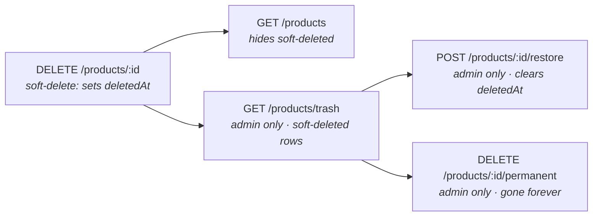

You want `DELETE /products/:id` to flag the row, not erase it — and you want admins to be able to restore it later. This recipe wires Cascade's soft-delete strategy into a `Restful` controller, adds a trash-list endpoint and a restore endpoint, gates restore behind admin auth, and points at the audit-trail recipe for the "who restored what" question.

By the end you'll have a products resource where `DELETE` sets `deletedAt`, normal queries hide soft-deleted rows, admins can list trash, restore by id, or permanently purge.

## What you're building



Five endpoints. The first four come straight out of `Restful`'s standard surface plus one extra global scope. The fifth (`/permanent`) is a custom route on the same resource. The whole thing fits in one routes file, one Restful subclass, and one global-scope wire-up.

This recipe uses Cascade's `"soft"` delete strategy. For the `"trash"` strategy (move to a separate table) and the full strategy comparison, see [delete strategies](/v/latest/cascade/digging-deeper/delete-strategies/).

## Step 1 — Enable soft delete on the model

```ts title="src/app/products/models/product/product.model.ts"
import { Model, RegisterModel } from "@warlock.js/cascade";
import { type Infer, v } from "@warlock.js/seal";

export const productSchema = v.object({
  name: v.string(),
  price: v.number().min(0),
  status: v.string(),
});

export type ProductSchema = Infer<typeof productSchema>;

@RegisterModel()
export class Product extends Model<ProductSchema> {
  public static table = "products";
  public static schema = productSchema;

  public static deleteStrategy = "soft";
  public static deletedAtColumn = "deletedAt";
}
```

Two statics flip soft delete on:

- **`deleteStrategy = "soft"`** — tells Cascade what `.destroy()` should do.
- **`deletedAtColumn = "deletedAt"`** — which column gets the timestamp. `"deletedAt"` is the default; you only set it if your schema uses a different name (`"archived_at"`, say).

Now `await product.destroy()` runs `UPDATE products SET deletedAt = NOW() WHERE id = ?` instead of `DELETE`.

If you set `deleteStrategy = "soft"` but leave `deletedAtColumn` set to `false`, `.destroy()` throws — soft delete needs somewhere to write the timestamp.

### What soft-deleted rows look like

The row is still there:

```sql
SELECT id, name, deletedAt FROM products WHERE id = 5;
-- id |    name    |       deletedAt
-- ---|------------|---------------------
--  5 | Old Hoodie | 2026-05-22 10:00:00
```

A query like `Product.find(5)` still returns it — Cascade does *not* automatically hide soft-deleted rows. Hiding is a domain decision (sometimes you want them; the trash view is the whole point of this recipe), so you opt in with a global scope.

## Step 2 — Hide soft-deleted rows from normal queries

Add a global scope so every query filters them out by default:

```ts title="src/app/products/main.ts"
import { Product } from "./models/product/product.model";

Product.addGlobalScope("notDeleted", (query) => {
  query.whereNull("deletedAt");
});
```

`main.ts` is auto-loaded by the framework once at boot — the perfect place for one-time model setup. Now:

```ts
await Product.find(5);              // null — hidden by the scope
await Product.where("status", "active").get();  // never includes soft-deleted
```

The scope **fails open**: when there's no `deletedAt` column on a row at all (a new model that hasn't been deleted), `whereNull("deletedAt")` matches and the row is included. That's what you want.

### Opting out of the scope temporarily

`Restful`'s admin endpoints need to see soft-deleted rows. Cascade exposes `.withoutGlobalScope(name)` on the query builder:

```ts
const trashed = await Product.query()
  .withoutGlobalScope("notDeleted")
  .whereNotNull("deletedAt")
  .get();
```

That's the building block for the trash list — read on.

For the full global-scope surface (`withoutGlobalScope`, `withoutGlobalScopes`, local scopes) see the [scopes guide](/v/latest/cascade/digging-deeper/scopes/).

## Step 3 — Wire the Restful resource

`Restful` from `@warlock.js/core` handles the CRUD quintet (list / get / create / update / delete) over a repository. With soft delete enabled on the model, `.delete()` runs the soft variant automatically:

```ts title="src/app/products/restful/products.restful.ts"
import { Restful, type Request, type Response } from "@warlock.js/core";
import { Product } from "../models/product/product.model";
import { productsRepository } from "../repositories/products.repository";

export class ProductsRestful extends Restful<Product> {
  protected repository = productsRepository;

  protected recordName = "product";
  protected recordsListName = "products";

  protected async beforeDelete(_request: Request, _response: Response, record: Product) {
    if (record.get("status") === "locked") {
      throw new Error("Cannot delete a locked product");
    }
  }
}

export const productsRestful = new ProductsRestful();
```

The standard endpoints come out of `router.restfulResource`:

```ts title="src/app/products/routes.ts"
import { router } from "@warlock.js/core";
import { productsRestful } from "./restful/products.restful";

router.restfulResource("/products", productsRestful);
```

That registers:

| Method | Path             | Action                                                      |
| ------ | ---------------- | ----------------------------------------------------------- |
| GET    | `/products`      | list — global scope hides soft-deleted rows                 |
| GET    | `/products/:id`  | show — returns 404 for soft-deleted rows (scope hides them) |
| POST   | `/products`      | create                                                      |
| PUT    | `/products/:id`  | update                                                      |
| DELETE | `/products/:id`  | delete — runs the soft-delete strategy                      |

`record.destroy()` inside `Restful.delete(...)` reads the model's static `deleteStrategy = "soft"` and writes the timestamp instead of removing the row. No code changes in `Restful` — the strategy is a property of the model, the action just delegates.

For the full `Restful` surface (lifecycle hooks, middleware, return shapes), see the [Restful guide](../the-basics/restful.md).

## Step 4 — The trash list endpoint

Admins should see soft-deleted rows. The endpoint bypasses the global scope and filters for `deletedAt IS NOT NULL`:

```ts title="src/app/products/controllers/list-trashed-products.controller.ts"
import type { RequestHandler, Response } from "@warlock.js/core";
import { Product } from "../models/product/product.model";
import { ProductResource } from "../resources/product.resource";

export const listTrashedProductsController: RequestHandler = async (request, response: Response) => {
  const trashed = await Product.query()
    .withoutGlobalScope("notDeleted")
    .whereNotNull("deletedAt")
    .orderBy("deletedAt", "desc")
    .get();

  return response.success({
    products: trashed.map((product) => new ProductResource(product).toJSON()),
  });
};
```

Wire the route with admin auth:

```ts title="src/app/products/routes.ts"
import { router } from "@warlock.js/core";
import { authMiddleware } from "@warlock.js/auth";
import { productsRestful } from "./restful/products.restful";
import { listTrashedProductsController } from "./controllers/list-trashed-products.controller";

router.get("/products/trash", listTrashedProductsController, {
  middleware: [authMiddleware("admin")],
});

router.restfulResource("/products", productsRestful);
```

Two notes on ordering:

- **`/products/trash` is declared before `/products/:id`.** That matters when `:id` is loose (a numeric pattern would naturally lose to a literal `trash`, but anything goes-anywhere can match). Specific routes first.
- **`authMiddleware("admin")`** restricts the route to users with `userType = "admin"`. Passing nothing means "any authed user"; passing a string or array of types narrows the gate.

A real example of the auth pattern from the reference codebase:

```ts title="authMiddleware (from @warlock.js/auth)"
export function authMiddleware(allowedUserType?: string | string[]) {
  // ...
  if (allowedTypes.length && !allowedTypes.includes(userType)) {
    return response.unauthorized({ error: t("auth.errors.unauthorized") });
  }
}
```

If the gate fails, the request never reaches your handler — `authMiddleware` returns a 401 directly.

## Step 5 — The restore endpoint

Cascade ships a `Model.restore(id)` static that clears the soft-delete timestamp:

```ts title="src/app/products/controllers/restore-product.controller.ts"
import { t, type RequestHandler, type Response } from "@warlock.js/core";
import { Product } from "../models/product/product.model";
import { ProductResource } from "../resources/product.resource";

export const restoreProductController: RequestHandler = async (request, response: Response) => {
  const id = request.input("id");

  try {
    const product = await Product.restore(id);

    return response.success({
      product: new ProductResource(product).toJSON(),
    });
  } catch {
    return response.notFound({ error: t("products.notFoundInTrash") });
  }
};
```

The call:

```ts
const product = await Product.restore(id);
```

For the `"soft"` strategy, that clears the `deletedAt` column and returns the live model. For the `"trash"` strategy, it moves the row back from the trash table. `Model.restore` throws if the record isn't found in the deletable set — that's why the try/catch.

`Restore` also accepts options:

```ts
await Product.restore(id, {
  onIdConflict: "fail",   // or "assignNew" (default) for trash strategy
  skipEvents: true,       // suppress the restoring/restored model events
});
```

`onIdConflict` matters only for the `"trash"` strategy when the original id has been reused since deletion. For pure soft delete the row's primary key never went away, so the option is a no-op.

Wire the route:

```ts title="src/app/products/routes.ts"
import { router } from "@warlock.js/core";
import { authMiddleware } from "@warlock.js/auth";
import { productsRestful } from "./restful/products.restful";
import { listTrashedProductsController } from "./controllers/list-trashed-products.controller";
import { restoreProductController } from "./controllers/restore-product.controller";

router.get("/products/trash", listTrashedProductsController, {
  middleware: [authMiddleware("admin")],
});

router.post("/products/:id/restore", restoreProductController, {
  middleware: [authMiddleware("admin")],
});

router.restfulResource("/products", productsRestful);
```

`POST /products/5/restore` clears `deletedAt`, returns the live product. Anyone other than an admin gets a 401.

## Step 6 — The permanent-delete endpoint

The model is configured for soft delete by default. To hard-delete (the GDPR case, or a "we are definitely sure now" admin action), pass `strategy: "permanent"` per call:

```ts title="src/app/products/controllers/permanently-delete-product.controller.ts"
import { t, type RequestHandler, type Response } from "@warlock.js/core";
import { Product } from "../models/product/product.model";

export const permanentlyDeleteProductController: RequestHandler = async (
  request,
  response: Response,
) => {
  const product = await Product.query()
    .withoutGlobalScope("notDeleted")
    .where("id", request.input("id"))
    .first();

  if (!product) {
    return response.notFound({ error: t("products.notFound") });
  }

  await product.destroy({ strategy: "permanent" });

  return response.success({ deleted: true });
};
```

Two things to spot:

- **`withoutGlobalScope("notDeleted")`** — the row we're hard-deleting is probably already soft-deleted, so the global scope would have hidden it. Bypass the scope to find it.
- **`destroy({ strategy: "permanent" })`** — the per-call override beats the model's configured strategy. The row is gone for good.

Wire it:

```ts
router.delete("/products/:id/permanent", permanentlyDeleteProductController, {
  middleware: [authMiddleware("admin")],
});
```

`DELETE /products/5/permanent` is now the only way to actually erase a row. The endpoint that ordinary users hit (`DELETE /products/5`) stays safe — it only soft-deletes.

## The complete routes file

```ts title="src/app/products/routes.ts"
import { router } from "@warlock.js/core";
import { authMiddleware } from "@warlock.js/auth";
import { productsRestful } from "./restful/products.restful";
import { listTrashedProductsController } from "./controllers/list-trashed-products.controller";
import { restoreProductController } from "./controllers/restore-product.controller";
import { permanentlyDeleteProductController } from "./controllers/permanently-delete-product.controller";

const adminOnly = { middleware: [authMiddleware("admin")] };

router.get("/products/trash", listTrashedProductsController, adminOnly);
router.post("/products/:id/restore", restoreProductController, adminOnly);
router.delete("/products/:id/permanent", permanentlyDeleteProductController, adminOnly);

router.restfulResource("/products", productsRestful);
```

Five lines for the admin endpoints, one line for the Restful resource. The router does the rest.

## Trash, soft, and permanent — when to reach for which

A quick decision guide for the three Cascade delete strategies:

| Strategy        | What `.destroy()` does                       | Reach for                                                |
| --------------- | -------------------------------------------- | -------------------------------------------------------- |
| `"permanent"`   | Row gone. SQL `DELETE`. Default.             | Audit logs, ephemeral session data, expired tokens       |
| `"soft"`        | `UPDATE ... SET deletedAt = NOW()`           | Restorable rows that live in the same table              |
| `"trash"`       | Copy to `{table}Trash`, then `DELETE` original | Lean live table, separate trash, GDPR-style separation   |

This recipe uses `"soft"` because:

- Products are restorable.
- We want the row in the same table so existing foreign-key constraints don't get weird (an order pointing at a soft-deleted product still works).
- The cost of soft-deleted rows polluting scans is acceptable for the volume.

For high-volume tables where soft-deleted rows would dominate, switch to `"trash"`. The strategy is a static on the model; everything else in this recipe stays the same.

## Putting it together with audit trail

Soft delete answers "can we recover this?". Audit trail answers "who deleted it, when, why?". They compose perfectly — the audit listener catches `onDeleted` events and records the strategy used:

```ts title="src/app/audit/audit-model.ts (excerpt — see the audit-trail recipe)"
ModelClass.events().onDeleted(async (model, context) => {
  await AuditLog.create({
    table: ModelClass.table,
    recordId: String(model.id),
    event: "deleted",
    changes: { strategy: context.strategy },
    actorId: options.getActor?.(),
  });
});
```

`context.strategy` comes back as `"soft"` for our case — so the audit log distinguishes soft-deletes from hard ones. Wire it in `src/app/products/main.ts`:

```ts
import { auditModel } from "app/audit/audit-model";
import { Product } from "./models/product/product.model";

Product.addGlobalScope("notDeleted", (query) => {
  query.whereNull("deletedAt");
});

auditModel(Product);
```

Now every soft-delete, restore, and permanent-delete leaves an audit trail with the strategy and the actor. The full audit pattern lives in the [audit-trail recipe](/v/latest/cascade/recipes/audit-trail/) — it's worth a read.

## Permanent-only override per call

The per-call override goes the other way too. A model configured for soft delete can still be permanently deleted by passing `strategy: "permanent"`:

```ts
await spam.destroy({ strategy: "permanent" });
```

A model configured for permanent delete can still be soft-deleted by passing `strategy: "soft"` (if it has a `deletedAtColumn` configured):

```ts
await oldUser.destroy({ strategy: "soft" });
```

The model static is the *default*. The per-call argument wins when present. Useful for one-off GDPR hard-deletes that bypass the normal soft-delete pipeline.

## Gotchas

- **`Restful`'s default delete action calls `record.destroy()` with no options.** That respects the model's configured `deleteStrategy`. If you want hard-delete from a Restful action without overriding, change the model's strategy — don't try to wedge it into `Restful`.
- **The `notDeleted` global scope must be added once at boot, in `main.ts`.** Adding it inside a service or controller is too late — the model registry has already been built and queries may have already run without the scope.
- **`Product.find(id)` returns null for soft-deleted rows when the scope is active.** That's correct behaviour — `find` is "find a live one". To check existence in trash, use `Product.query().withoutGlobalScope("notDeleted").where("id", id).first()`.
- **The `restore` static throws when the record isn't there.** Always wrap in try/catch and return a 404 — propagating the raw error to the client surfaces internal details.
- **Foreign keys and soft delete are not automatically reconciled.** If a soft-deleted product is referenced by a live order, the order still points at it. Decide per-table whether that's the right behaviour; the alternative is cascading the soft-delete to dependent rows via an `onDeleted` listener.
- **Per-call `{ strategy: "permanent" }` skips the soft-delete column.** That's the point — but it also means the audit row records `strategy: "permanent"`, not `strategy: "soft"`. Don't conflate "the model is soft-delete by default" with "every delete is soft."

## Going further

- **Full `Restful` surface — hooks, middleware, return shapes:** [Restful guide](../the-basics/restful.md)
- **Repository basics — list, find, create, the cached variants:** [Essentials → Repositories](../the-basics/05-repositories.md)
- **Cascade's full delete-strategy story (`permanent` / `soft` / `trash`):** [Delete strategies](/v/latest/cascade/digging-deeper/delete-strategies/)
- **Auditing every delete and restore:** [Audit trail recipe](/v/latest/cascade/recipes/audit-trail/)
- **Hiding soft-deleted rows via global scopes:** [Scopes guide](/v/latest/cascade/digging-deeper/scopes/)
