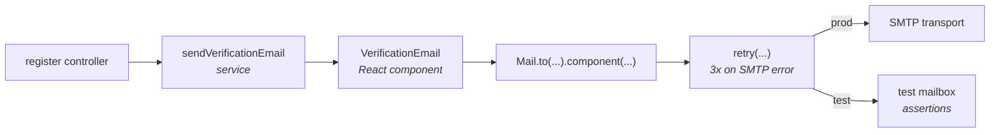

You need to send a verification email when a user signs up — a real one, with HTML, that survives an SMTP hiccup and that your tests can assert against without ever hitting the network. This recipe wires that up end to end: configure mail, write a React template, send via the `Mail` builder, retry on transient failure, and assert in tests with the test mailbox.

By the end you'll have a `sendVerificationEmail` service the rest of your app can call, a React component you can preview in your browser, and a test that proves the right email went to the right address with the right token — no real SMTP server involved.

## What you're building



The fluent `Mail` builder accepts a React component, hands it to `@react-email/render`, and produces HTML the transport ships. `retry()` from `@warlock.js/core` wraps the call so a connection blip becomes three attempts, not a 500. In test mode the same `send()` call lands in an in-memory mailbox you can read back assertion-style.

## Step 1 — Configure mail

`src/config/mail.ts` is auto-loaded by the mail connector at boot. The simple form is a single SMTP config — it becomes the default mailer:

```ts title="src/config/mail.ts"
import type { MailConfigurations } from "@warlock.js/core";
import { env } from "@warlock.js/core";

const mailConfigurations: MailConfigurations = {
  host: env("MAIL_HOST"),
  port: env("MAIL_PORT", 587),
  secure: env("MAIL_SECURE", false),
  tls: true,
  username: env("MAIL_USERNAME"),
  password: env("MAIL_PASSWORD"),
  from: {
    name: env("MAIL_FROM_NAME", "Acme"),
    address: env("MAIL_FROM_ADDRESS", "noreply@acme.com"),
  },
};

export default mailConfigurations;
```

Env vars in `.env`:

```bash title=".env"
MAIL_HOST=smtp.sendgrid.net
MAIL_PORT=587
MAIL_SECURE=false
MAIL_USERNAME=apikey
MAIL_PASSWORD=SG.xxx
MAIL_FROM_NAME="Acme Support"
MAIL_FROM_ADDRESS=support@acme.com
```

`secure: true` is for port 465 (implicit TLS). For 587 you want `secure: false` plus `tls: true` (STARTTLS upgrade). Sticking the wrong combination on a port that doesn't speak it is the most common "why am I getting `wrong version number`" cause.

The framework's mail connector picks this up in startup, calls `setMailConfigurations(...)` under the hood, and gracefully shuts down the SMTP pool on process exit. You don't import or call any of that yourself.

### Mode switching

Three modes, set once per process:

| Mode            | What it does                                          | Use for          |
| --------------- | ----------------------------------------------------- | ---------------- |
| `"production"`  | Actually opens an SMTP connection and sends           | live deployments |
| `"development"` | Logs subject + recipient to console, never connects   | local dev        |
| `"test"`        | Captures every send into an in-memory mailbox         | automated tests  |

Set the mode at boot:

```ts title="src/app/main.ts"
import { Application, setMailMode } from "@warlock.js/core";

if (Application.isProduction) {
  setMailMode("production");
} else {
  setMailMode("development");
}
```

Tests set their own mode in setup — covered below.

## Step 2 — Write the React template

Email templates live in `emails/` at the project root. Drop in `@react-email/components` (already in the reference project's dependencies) and write standard React — the framework hands the element to `@react-email/render` which knows how to produce email-safe HTML.

```tsx title="emails/verification-email.tsx"
import {
  Body,
  Button,
  Container,
  Head,
  Heading,
  Hr,
  Html,
  Text,
} from "@react-email/components";

type VerificationEmailProps = {
  userName: string;
  verificationUrl: string;
  expiresInMinutes: number;
};

export default function VerificationEmail({
  userName,
  verificationUrl,
  expiresInMinutes,
}: VerificationEmailProps) {
  return (
    <Html>
      <Head />
      <Body
        style={{
          backgroundColor: "#f6f8fb",
          fontFamily: "-apple-system, BlinkMacSystemFont, 'Segoe UI', sans-serif",
          padding: "32px 0",
        }}
      >
        <Container
          style={{
            backgroundColor: "#ffffff",
            borderRadius: "8px",
            padding: "40px",
            maxWidth: "560px",
          }}
        >
          <Heading style={{ color: "#111827", fontSize: "24px" }}>
            Verify your email, {userName}
          </Heading>

          <Text style={{ color: "#4b5563", lineHeight: "24px" }}>
            Thanks for signing up. Click the button below to confirm your address —
            this link expires in {expiresInMinutes} minutes.
          </Text>

          <Button
            href={verificationUrl}
            style={{
              backgroundColor: "#2563eb",
              color: "#ffffff",
              padding: "12px 24px",
              borderRadius: "6px",
              textDecoration: "none",
              display: "inline-block",
              marginTop: "16px",
            }}
          >
            Confirm email
          </Button>

          <Hr style={{ borderColor: "#e5e7eb", margin: "32px 0" }} />

          <Text style={{ color: "#6b7280", fontSize: "12px" }}>
            If the button doesn't work, paste this link into your browser:
            <br />
            {verificationUrl}
          </Text>
        </Container>
      </Body>
    </Html>
  );
}
```

Three notes on writing email-safe React:

- **Inline styles win.** Most email clients strip `<style>` blocks or ignore class selectors. Inline `style={...}` always renders. `@react-email/components` handles the cross-client quirks for you when you stick to their primitives (`<Body>`, `<Container>`, `<Button>`).
- **Always include the plaintext URL.** Buttons fail when images are blocked. A visible fallback link rescues that case.
- **One column, generous padding.** Outlook does not love nested flexbox.

### Previewing in your browser

The reference project ships a `react-email` dev server — point your browser at it and edit the template with hot reload:

```bash
yarn email:preview
```

Opens at `http://localhost:3000` (the preview server, not your app). Edits to `emails/*.tsx` rebuild instantly. Use this to iterate on copy and layout before you ever wire it into a service.

## Step 3 — Send via the Mail builder

Create a service that does one thing — send the verification email for a given user:

```ts title="src/app/auth/services/send-verification-email.service.ts"
import { Mail, retry } from "@warlock.js/core";
import { log } from "@warlock.js/logger";
import VerificationEmail from "../../../../emails/verification-email";

type SendVerificationOptions = {
  email: string;
  userName: string;
  token: string;
};

export async function sendVerificationEmailService(options: SendVerificationOptions) {
  const { email, userName, token } = options;

  const verificationUrl = `https://app.acme.com/verify-email?token=${token}`;

  const result = await retry(
    () =>
      Mail.to(email)
        .subject("Verify your email address")
        .component(
          <VerificationEmail
            userName={userName}
            verificationUrl={verificationUrl}
            expiresInMinutes={30}
          />,
        )
        .tag("verification")
        .send(),
    {
      count: 3,
      delay: 500,
      shouldRetry: (error) => {
        const code = (error as { code?: string })?.code;
        return code === "CONNECTION_ERROR" || code === "TIMEOUT" || code === "RATE_LIMIT";
      },
    },
  );

  if (!result.success) {
    log.warn("auth", "verification-email", `Partial rejection: ${result.rejected.join(", ")}`);
  }

  return result;
}
```

What the builder does, line by line:

| Call                       | Effect                                                       |
| -------------------------- | ------------------------------------------------------------ |
| `Mail.to(email)`           | Start a new builder, set the recipient                       |
| `.subject(...)`            | Set the subject line                                         |
| `.component(<X />)`        | React element — rendered through `@react-email/render`       |
| `.tag("verification")`     | A free-form label for analytics / debugging                  |
| `.send()`                  | Resolve config, build payload, dispatch through the pipeline |

`Mail` is a fluent builder. Every method returns `this`. The `.send()` call validates (you need at least a `to`, a `subject`, and one of `html` / `text` / `component`) and then hands off to the framework's `sendMail()` under the hood. You get back a `MailResult`:

```ts
type MailResult = {
  success: boolean;          // false if every recipient was rejected
  messageId?: string;        // transport-assigned id (when sent)
  accepted: string[];        // who got it
  rejected: string[];        // who didn't (partial-rejection case)
  response?: string;
  envelope?: { from: string; to: string[] };
};
```

### Why retry, why this shape

SMTP is famously flaky in the bottom 0.1% of connections — DNS hiccup, a transient TLS handshake failure, a 421 from the provider asking you to slow down. `retry(fn, { count, delay, shouldRetry })` from `@warlock.js/core` wraps the call: try once, on failure check `shouldRetry`, sleep `delay` ms, try again, up to `count` extra times.

The `shouldRetry` callback receives the thrown error and the attempt number. We only retry the codes that mean "transport-level transient failure" — `CONNECTION_ERROR`, `TIMEOUT`, `RATE_LIMIT`. We do *not* retry `AUTH_ERROR` (your credentials are bad, retrying makes it worse), `INVALID_ADDRESS` (the email is malformed, will fail forever), or `REJECTED` (the recipient bounced — retrying just lights the same fire).

Four attempts (`count: 3` = initial + 3 retries) at 500ms each is the right neighborhood for a transactional email. More than that and the user is already staring at a spinner; less and you don't outlast typical hiccups.

## Step 4 — Wire it into the register flow

The service is just a function. Call it from your registration use-case after the user is saved:

```ts title="src/app/auth/services/register.service.ts"
import { hashPassword } from "@warlock.js/core";
import { randomBytes } from "node:crypto";
import { User } from "app/users/models/user";
import { sendVerificationEmailService } from "./send-verification-email.service";

type RegisterInput = {
  email: string;
  password: string;
  name: string;
};

export async function registerService(input: RegisterInput) {
  const user = await User.create({
    email: input.email,
    password: await hashPassword(input.password),
    name: input.name,
    emailVerifiedAt: null,
    verificationToken: randomBytes(32).toString("hex"),
  });

  await sendVerificationEmailService({
    email: user.get("email"),
    userName: user.get("name"),
    token: user.get("verificationToken"),
  });

  return user;
}
```

`hashPassword` is the named export from `@warlock.js/core`. The verification token is a 64-char hex string — plenty of entropy, URL-safe.

If you'd rather not block the response on the email send, fire and forget:

```ts
sendVerificationEmailService({ email, userName, token }).catch((error) => {
  log.error("auth", "verification-email", error);
});
```

For high-volume signups you'll want a queue (the AMQP connector that ships with `@warlock.js/core`) — emit a job and have a worker consume it. The send service stays the same; it just runs in a worker process.

## Step 5 — Test it without sending

This is the payoff. In test mode, every `Mail.send()` call lands in an in-memory mailbox you can read back. The named test-mailbox helpers are all exported from `@warlock.js/core`:

```ts title="src/app/auth/services/send-verification-email.service.spec.ts"
import {
  assertMailSent,
  clearTestMailbox,
  findMailsTo,
  getTestMailbox,
  setMailMode,
} from "@warlock.js/core";
import { afterAll, beforeEach, describe, expect, it } from "vitest";
import { sendVerificationEmailService } from "./send-verification-email.service";

describe("sendVerificationEmailService", () => {
  beforeEach(() => {
    setMailMode("test");
    clearTestMailbox();
  });

  afterAll(() => {
    setMailMode("development");
  });

  it("sends a verification email to the user's address", async () => {
    await sendVerificationEmailService({
      email: "alice@example.com",
      userName: "Alice",
      token: "abc123",
    });

    const mails = findMailsTo("alice@example.com");

    expect(mails).toHaveLength(1);
    expect(mails[0].options.subject).toBe("Verify your email address");
  });

  it("renders the verification URL with the token in the HTML body", async () => {
    await sendVerificationEmailService({
      email: "bob@example.com",
      userName: "Bob",
      token: "token-xyz",
    });

    const mail = assertMailSent((captured) => captured.options.to === "bob@example.com");

    expect(mail.normalized.html).toContain("token-xyz");
    expect(mail.normalized.html).toContain("Bob");
  });

  it("tags the mail for analytics", async () => {
    await sendVerificationEmailService({
      email: "carol@example.com",
      userName: "Carol",
      token: "token-1",
    });

    const captured = getTestMailbox();

    expect(captured[0].options.tags).toContain("verification");
  });
});
```

The helpers, at a glance:

| Helper                              | Purpose                                                                  |
| ----------------------------------- | ------------------------------------------------------------------------ |
| `setMailMode("test")`               | Flip the process into capture mode — no SMTP connections                 |
| `clearTestMailbox()`                | Empty the mailbox between tests so each one starts clean                 |
| `getTestMailbox()`                  | All captured mails for inspection                                        |
| `findMailsTo(email)`                | Filter by recipient                                                      |
| `findMailsBySubject(substring)`     | Filter by subject substring                                              |
| `assertMailSent(predicate)`         | Find the first match, throw if nothing matches                           |
| `assertMailCount(n)`                | Throw if mailbox doesn't have exactly `n` mails                          |
| `wasMailSentTo(email)`              | Boolean — did anyone email this address?                                 |
| `wasMailSentWithSubject(subject)`   | Boolean — did we send a mail with this exact subject?                    |

Each captured entry exposes the original `options` (everything you passed to the builder), a `normalized` view (recipients as arrays, the rendered HTML if you used a component), and a `timestamp`. `normalized.html` is the right field for assertions about rendered content — `options.component` is the React element, which is not what your user sees.

### What test mode does *not* do

It doesn't verify that your SMTP server would accept the mail, that the recipient exists, or that the HTML renders correctly in Outlook 2007. Test mode is for asserting "we tried to send the right thing." For end-to-end SMTP testing, use `mailtrap` or `mailpit` in a staging environment with `setMailMode("production")` pointed at the catch-all inbox.

## Naming and from-overrides

If different parts of your app should send from different addresses (marketing@ vs noreply@), pass `.from(...)` per builder:

```ts
await Mail.to(user.email)
  .from({ name: "Acme Marketing", address: "marketing@acme.com" })
  .subject("Your weekly digest")
  .component(<WeeklyDigestEmail items={digest} />)
  .send();
```

For multi-provider apps (SendGrid for transactional, Mailgun for marketing), declare named mailers in `src/config/mail.ts` and pick one per call:

```ts title="src/config/mail.ts"
import type { MailersConfig } from "@warlock.js/core";
import { env } from "@warlock.js/core";

const mailConfigurations: MailersConfig = {
  default: {
    host: env("SENDGRID_HOST"),
    port: 587,
    username: "apikey",
    password: env("SENDGRID_API_KEY"),
    from: { name: "Acme", address: "noreply@acme.com" },
  },
  mailers: {
    marketing: {
      host: env("MAILGUN_HOST"),
      port: 587,
      username: env("MAILGUN_USER"),
      password: env("MAILGUN_PASS"),
      from: { name: "Acme Marketing", address: "marketing@acme.com" },
    },
  },
};

export default mailConfigurations;
```

Pick one with `.mailer(name)` or `Mail.mailer(name)`:

```ts
await Mail.mailer("marketing")
  .to(user.email)
  .subject("Your weekly digest")
  .component(<WeeklyDigestEmail items={digest} />)
  .send();
```

## Gotchas

- **Don't await `.send()` in a tight loop.** SMTP servers throttle hard. For bulk sends, queue the jobs and process them with bounded concurrency (`Promise.all` over a sliced batch of 10–25 is a sane default).
- **React render errors throw a `MailError` with `code: "RENDER_ERROR"`.** Most often a missing prop or a server-only API called inside the component. Your `shouldRetry` shouldn't retry it — the second attempt will fail the same way.
- **The `Tailwind` wrapper from `@react-email/tailwind` slows render by a few hundred ms.** Fine for transactional; consider extracting style strings for high-volume marketing sends.
- **`Mail.to([...])` sends one mail with multiple `To:` headers.** Each recipient sees every address. For separate sends (one per recipient), loop the builder.
- **`secure: true` + port 587 fails.** Mismatching `secure` and the port is the #1 misconfiguration. 587 = `secure: false` + `tls: true`. 465 = `secure: true`.

## Going further

- **Full mail surface** — every option, every event, every mode: [Mail guide](../digging-deeper/mail.md)
- **Building one-shot send calls quickly** — ``send-mail` skill`
- **Retry policies for any operation** — ``retry-operation` skill`
