A use-case is a named, observable, optionally benchmarked unit of business logic. You define one with the `useCase()` factory; you get back a typed async function you call from a controller, a queue worker, a CLI command, or another use-case.

The reason use-cases exist as a primitive: business work has structure. There's the authorization check, the input validation, the data transform, the actual work, the side-effects after success. If you write all of those into one service function, every controller that uses it has to wire the same lifecycle by hand. The use-case factory bakes the lifecycle in and lets you describe each piece declaratively.

This page covers the shape, the pipeline order, the context object, and how it slots into a controller. Retries, benchmarks, lifecycle event subscriptions, and history caching live in [Use-cases — deep dive](./use-cases-deep.md).

## The shape

```ts title="src/app/orders/use-cases/place-order.usecase.ts"
import { useCase } from "@warlock.js/core";
import { placeOrderSchema, type PlaceOrderInput } from "../validation/place-order.schema";
import { authGuard } from "app/shared/guards/auth.guard";

type OrderOutput = {
  orderId: string;
  total: number;
};

export const placeOrderUseCase = useCase<OrderOutput, PlaceOrderInput>({
  name: "orders.place",
  schema: placeOrderSchema,
  guards: [authGuard],
  handler: async (data, ctx) => {
    const order = await orderService.create(data, ctx.currentUser);
    return { orderId: order.id, total: order.total };
  },
});
```

Call it like any async function:

```ts
const result = await placeOrderUseCase(input, {
  ctx: { token: request.accessToken },
});
```

Two type parameters and one config object — that's the whole API surface.

## Where it lives

Use-cases live under the module's `use-cases/` folder, file named `<action>.usecase.ts`:

```
src/app/orders/use-cases/
  place-order.usecase.ts
  cancel-order.usecase.ts
  refund-order.usecase.ts
```

Naming mirrors controllers: `placeOrderUseCase`, `cancelOrderUseCase`. The export name signals what it does; the file name matches the export.

## The pipeline

Every use-case runs the same fixed pipeline:

```mermaid
flowchart TD
    start([useCase&#40;data, runtime&#41;])
    exec[onExecuting fires]
    guards[guards run<br/><i>Readonly data, sequential</i>]
    schema[schema validation<br/><i>seal validates input</i>]
    before[before middleware<br/><i>sequential, can transform data</i>]
    handler[handler runs<br/><i>the actual work</i>]
    after[after middleware<br/><i>fire-and-forget, errors logged</i>]
    completed[onCompleted fires]

    start --> exec
    exec --> guards
    guards --> schema
    schema --> before
    before --> handler
    handler --> after
    after --> completed

    guards -. throws .-> err[onError fires<br/>error re-thrown]
    schema -. invalid .-> err
    before -. throws .-> err
    handler -. throws .-> err
```



Six phases in order. Each phase reads and writes a shared `ctx` object that all later phases can see. The fixed order is the value — you don't need to think about whether to authorize before or after validation, because the framework already chose: authorize first.

### Phase 1 — guards

Guards are authorization and precondition checks. They run **before** schema validation, because there's no point validating data if the caller isn't allowed to call this use-case in the first place.

```ts
const authGuard: UseCaseGuard<PlaceOrderInput> = async (data, ctx) => {
  const user = await loadUserFromToken(ctx.token);

  if (!user) {
    throw new UnAuthorizedError("auth.invalidToken");
  }

  ctx.currentUser = user;
};
```

Three rules for guards:

1. **`data` is `Readonly`** — you can read input fields but you can't mutate them. Mutation happens in `before` middleware.
2. **Throwing aborts the pipeline** — the use-case throws and `onError` fires. Use `HttpError` subclasses (`UnAuthorizedError`, `ForbiddenError`, …) so the calling controller's catch can map to a status code, or let the framework's catch-all do it.
3. **Enrich `ctx`** — typically you set `ctx.currentUser`, `ctx.permissions`, etc. so the handler and after-middleware can read them.

Guards run sequentially in array order. Auth guard first, role guard second — the framework respects what you wrote.

### Phase 2 — schema validation

If you pass a `schema`, the framework runs it after guards succeed:

```ts
schema: placeOrderSchema,
```

On failure, it throws `BadSchemaUseCaseError` (an `HttpError` with status 400). The controller catches it via the framework's catch-all and sends a 400 with the validation errors.

The validated, parsed data becomes the input to the next phase. Schema-level transforms (`.transform(...)` in seal) take effect here.

### Phase 3 — before middleware

Now you can transform data. Each `before` middleware receives the current data and returns the (optionally transformed) data:

```ts
const normalizeAddress: UseCaseBeforeMiddleware<PlaceOrderInput> = async (data, ctx) => {
  return {
    ...data,
    address: {
      ...data.address,
      country: data.address.country.toUpperCase(),
    },
  };
};

const calculateTax: UseCaseBeforeMiddleware<PlaceOrderInput> = async (data, ctx) => {
  const tax = await taxService.compute(data.items, data.address);
  ctx.tax = tax;
  return data;
};
```

Two rules:

1. **Return the data** — even if you didn't transform it. The chain feeds output of one middleware into input of the next.
2. **Mutate `ctx` freely** — `tax`, `pricing`, anything the handler will need.

Throwing aborts the pipeline the same way a guard does.

### Phase 4 — handler

The handler is the actual work. It receives the validated + transformed data plus the enriched `ctx`:

```ts
handler: async (data, ctx) => {
  const order = await orderService.create({
    ...data,
    user_id: ctx.currentUser.id,
    tax: ctx.tax,
  });

  return { orderId: order.id, total: order.total };
};
```

Throwing aborts the pipeline. The return value is the use-case's output.

### Phase 5 — after middleware

After middleware runs on **success only**, fire-and-forget. Errors inside an after middleware are caught and logged but **never re-thrown** — they cannot affect the use-case's return value.

```ts
const sendConfirmationEmail: UseCaseAfterMiddleware<OrderOutput> = async (output, ctx) => {
  await mailer.send({
    to: ctx.currentUser.email,
    template: "order-confirmation",
    data: { orderId: output.orderId },
  });
};
```

This is the right home for analytics, webhooks, cache invalidation, and notifications — anything that shouldn't fail the user's request if the side-effect itself fails.

### Phase 6 — lifecycle events

Three callbacks fire at well-known moments:

- **`onExecuting(ctx)`** — at the start, before guards run. Use for tracing, logging the input.
- **`onCompleted(result)`** — on success, after after-middleware. Use for cross-cutting analytics or call-count tracking.
- **`onError(ctx)`** — on failure, with the thrown error. Use for centralized error logging.

You can register them on the use-case definition, or override them at the call site via the runtime options second argument. There's also a global subscription pattern for "every use-case in the app" — see [Use-cases — deep dive](./use-cases-deep.md).

## The context (`ctx`)

`ctx` is the shared dictionary every phase reads and writes. The framework seeds it with the schema and execution id; guards typically add the current user; before-middleware adds derived data; the handler reads everything.

```ts
guards: [authGuard],  // sets ctx.currentUser
before: [calculateTax],  // sets ctx.tax
handler: async (data, ctx) => {
  // both ctx.currentUser and ctx.tax are populated
};
```

It's typed as `UseCaseContext = { schema?: ObjectValidator } & Record<string, any>` — pragmatic, not strict. Add fields with descriptive names so the next reader knows where they came from.

You can also pass starter context from the call site:

```ts
await placeOrderUseCase(data, {
  ctx: { token: request.accessToken, requestId: request.id },
});
```

The use-case definition reads what it needs, ignores the rest.

## A real example end-to-end

The actual `login` use-case from the reference codebase — sixteen lines, no decorators, no DI:

```ts title="src/app/auth/use-cases/login.usecase.ts"
import type { DeviceInfo, LoginResult } from "@warlock.js/auth";
import { ForbiddenError, useCase } from "@warlock.js/core";
import { type User } from "app/users/models/user";
import { type LoginCredentials, loginService } from "../services/auth.service";

type LoginUseCase = LoginResult<User> & {
  organization: OrganizationEntity;
};

type LoginUseCaseInput = {
  data: LoginCredentials;
  deviceInfo?: DeviceInfo;
};

export const loginUseCase = useCase<LoginUseCase, LoginUseCaseInput>({
  name: "auth.login",
  async handler({ data, deviceInfo }) {
    const result = await loginService(data, deviceInfo);

    if (!result) {
      throw new ForbiddenError("Invalid credentials");
    }

    await result.user.load("organization");

    return {
      ...result,
      organization: result.user.organization?.toJSON() as OrganizationEntity,
    };
  },
});
```

Read it:

1. Two type parameters: the output (login result + organization) and the input (credentials + device info).
2. A `name` for registry, logging, history.
3. A `handler` that delegates to the auth service, throws `ForbiddenError` on bad credentials, loads the related organization, and returns the result.

No guards, schema, before, or after this time — the controller already validated, and the service handles the auth check. Use-cases are flexible; you only declare the phases you need.

The controller calls it like this:

```ts
const result = await loginUseCase({
  data: request.validated(),
  deviceInfo: {
    userAgent: request.userAgent,
    ip: request.ip,
  },
});
```

One async function call. The pipeline runs transparently.

## Runtime options

The second argument is `UseCaseRuntimeOptions` — optional overrides for this single call:

```ts
await placeOrderUseCase(input, {
  id: "order-from-cli",
  ctx: { token: cliAuthToken, source: "cli" },
  onCompleted: (result) => console.log("Done:", result.output),
});
```

| Field         | Use                                              |
| ------------- | ------------------------------------------------ |
| `id`          | Override the auto-generated execution id         |
| `ctx`         | Pre-populated context object                     |
| `onExecuting` | Invocation-level lifecycle callback              |
| `onCompleted` | Invocation-level lifecycle callback              |
| `onError`     | Invocation-level lifecycle callback              |

Invocation-level callbacks fire **first**, before the use-case-level callback, before any global subscribers. The order is: invocation → use-case definition → global.

## Transport-agnostic by design

Use-cases don't import `request` or `response`. They take plain data and return plain data. That's deliberate — the same use-case can be called from:

- A controller (HTTP)
- A queue worker (Bull / Redis-backed jobs)
- A CLI command (`yarn warlock <command>`)
- A cron-scheduled task
- A test (no mocking framework needed)
- Another use-case

If your handler reaches for `request.something`, you've coupled to HTTP — and now the queue worker has to fake a request. Keep the handler clean; do all the request-reading in the controller and pass the data in.

## When to reach for a use-case (vs a service)

A **service** is a stateless function: input in, output out.

A **use-case** is a service plus the structured pipeline around it. The cost is a tiny amount of declarative wiring; the value is consistent error handling, observability, retries, and lifecycle events without bespoke code per call site.

Reach for a use-case when:

- The work has authorization checks that should run before validation.
- You want centralized retries on transient failures.
- You want benchmark + history tracking (debugging slow endpoints).
- You want a single name that shows up in logs and the use-case registry.
- The work has fire-and-forget side-effects (email, webhook, cache invalidation) that you don't want failing the user's response.

Stick with a plain service when:

- The work is a single-call delegation (`Faq.find(id)`).
- There's no authorization beyond the route's middleware.
- You don't need retries, benchmarks, or history.

The `list-faqs.service.ts` from the reference codebase is the textbook plain-service case — it just calls `faqsRepository.listCached(filters)`. No pipeline needed.

## Gotchas

- **Guards see `Readonly<Input>`** — mutating data inside a guard is a TypeScript error. Transform in `before` middleware instead.
- **After-middleware errors are silent.** They're logged via `@warlock.js/logger` (`log.error`), but they don't escalate. If a webhook must succeed, put it in `before` (or its own controller call), not `after`.
- **Schema runs after guards, not before.** This is the opposite of some other frameworks — Warlock authorizes first, then validates. Don't rely on schema validation to gate the guard's data access; the guard runs first.
- **`benchmark: false` disables benchmarking** for that one use-case even if the app config enables it globally. (The option is `benchmark`, not `benchmarkOptions`.)
- **`name` should be unique** across the app — it's the cache key and the registry key. The framework warns on dev-mode duplicates.

## See also

- **[Controllers](./03-controllers.md)** — what calls into a use-case.
- **[Repositories](./05-repositories.md)** — what the handler typically delegates to for data access.
- **[Use-cases — deep dive](./use-cases-deep.md)** — retries, benchmarks, history caching, global event subscriptions, the `BadSchemaUseCaseError` path.
- **[Validation](./validation.md)** — writing schemas with seal.
- **[Add a CRUD module recipe](../recipes/add-a-crud-module.md)** — full CRUD module with use-cases for the mutations.

## Next

Continue to **[Repositories](./05-repositories.md)** to see the data-access layer the handler reaches for.
