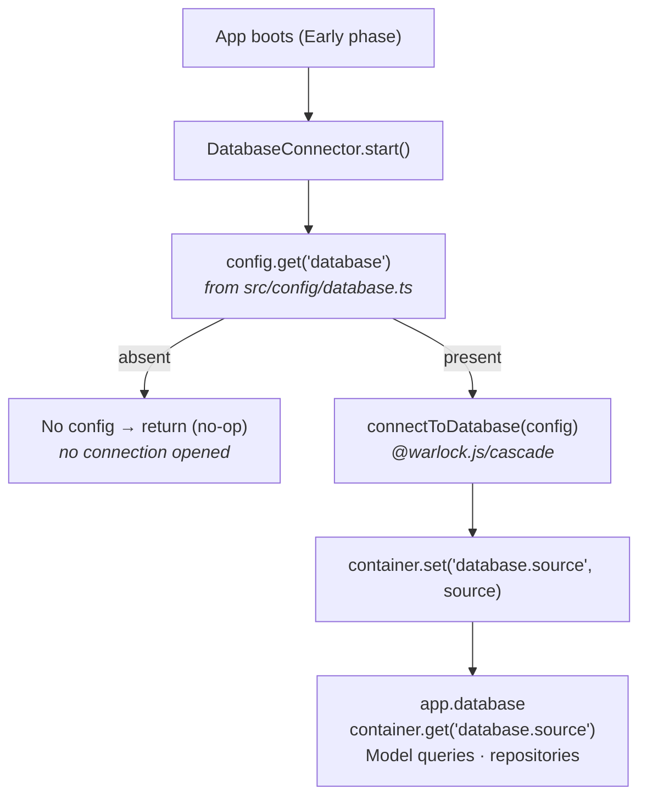

Core does not implement an ODM. It does exactly one database job: at boot it reads your database config, opens the connection, and stashes the resulting `DataSource` where the rest of the app can reach it. The ODM — models, queries, relations, migrations — is [@warlock.js/cascade](/v/latest/cascade/getting-started/01-introduction/). This page is the bridge: what core wires up, how to reach it, and where to go next for the actual data layer.

The honest scope: read this if you want to understand how the connection comes alive. To actually query the database, you'll write Cascade models and Warlock [repositories](./05-repositories.md) — neither of which lives in core.

## The 30-second look



Three takeaways:

1. **Core opens the connection, Cascade owns it.** The `DatabaseConnector` calls `connectToDatabase` from `@warlock.js/cascade` and saves the `DataSource` in the container under `"database.source"`.
2. **No `src/config/database.ts` → no connection.** The connector reads the config and silently returns if it's absent. Nothing throws; you just don't have a database.
3. **You rarely touch the `DataSource` directly.** Models and repositories are the normal access path. Reaching into the container is for the rare case that needs the raw source.

## How core boots the database

The database is one of core's built-in connectors. It runs in the **Early** phase — before your routes, models, and events import — because everything that follows depends on the connection being live. See [Bootstrap and connectors](../architecture-concepts/bootstrap-and-connectors.md) for the full boot sequence.

The connector's `start()` is small and declarative:

```ts title="How core connects the database"
public async start(): Promise<void> {
  const databaseConfig = config.get("database");

  if (!databaseConfig) {
    return;
  }

  try {
    const source = await connectToDatabase(databaseConfig);
    container.set("database.source", source);
    this.active = true;
  } catch (error) {
    console.error("Failed to connect to database:", error);
    throw error;
  }
}
```

What this tells you:

- The config key the runtime actually reads is **`database`** — pulled from `src/config/database.ts` (or `src/config/database.tsx`) via `@mongez/config`.
- If that config is absent, `start()` returns immediately. The connector is still registered, but it does nothing — **config presence is what activates the subsystem.**
- When the config is present, core hands it to `connectToDatabase` from `@warlock.js/cascade` and stores the returned `DataSource` in the container under `"database.source"`.

Because `src/config/database.ts` is one of the connector's watched files, editing it in dev triggers a restart of the database connector. The shape of that config object — driver, name, host, credentials — is Cascade's, documented in [Cascade configuration](/v/latest/cascade/getting-started/03-configuration/).

## How to reach the connection

Once the connection is up, the `DataSource` is available two equivalent ways:

```ts
import { app, container } from "@warlock.js/core";

// Preferred: the app accessor
const source = app.database;

// Equivalent: the raw container key
const same = container.get("database.source");
```

| Access                              | Returns                          | Notes                                                                 |
| ----------------------------------- | -------------------------------- | --------------------------------------------------------------------- |
| `app.database`                      | `DataSource`                     | Getter that reads the container. Present only if the config file exists. |
| `container.get("database.source")`  | `DataSource`                     | The same value the `app.database` getter reads.                       |

`app.database` is a getter over the container, so it reflects whatever the connector set. If there's no database config, the key was never set and you get back `undefined` — guard accordingly.

## The normal access path

You will almost never use the `DataSource` directly. The everyday path is:

- **Cascade models** — define a model, then call `Product.create(...)`, `Product.where(...)`, and friends. The model routes through the registered data source for you; there's no client to pass around. Start at [Your first model](/v/latest/cascade/getting-started/05-your-first-model/).
- **Repositories** — Warlock's data-access layer on top of models: filtering, pagination, and caching in one place. This is where most read/write logic lives. See [Repositories](./05-repositories.md).

Reach for `app.database` only when you genuinely need the raw source — a one-off operation that has no model, or low-level plumbing. For application data, write a model and (usually) a repository.

## Gotchas

- **No `src/config/database.ts` means no connection — and no error.** The connector no-ops when the config is absent. If `app.database` is `undefined`, the first thing to check is whether the config file exists and exports a database config under the `database` key.
- **`app.database` can be `undefined`.** It's a getter over the container; the container only has `"database.source"` once the connector successfully connects. Don't assume it's set in code that might run without a database configured.
- **Core is not the ODM.** Models, queries, relations, migrations, and the connection-options shape all live in `@warlock.js/cascade`. If you're looking for query syntax or config field names on this page, you're one repo too high — go to the Cascade docs.
- **The connector reads `database`, the config file is `database.ts`.** The runtime key is `database` (via `config.get("database")`); the filename is a convention `@mongez/config` maps to that key. Don't rename the export.

## See also

- **[Repositories](./05-repositories.md)** — the data-access layer you'll actually use day to day.
- **[Bootstrap and connectors](../architecture-concepts/bootstrap-and-connectors.md)** — the full boot sequence and every built-in connector, including this one.
- **[Connectors](../architecture-concepts/connectors.md)** — the connector model: lifecycle phases, priority, and writing your own.
- **[Cascade — Configuration](/v/latest/cascade/getting-started/03-configuration/)** — the database config object's shape (driver, name, host, credentials).
- **[Cascade — Your first model](/v/latest/cascade/getting-started/05-your-first-model/)** — defining a model and querying through the connection core opened.
