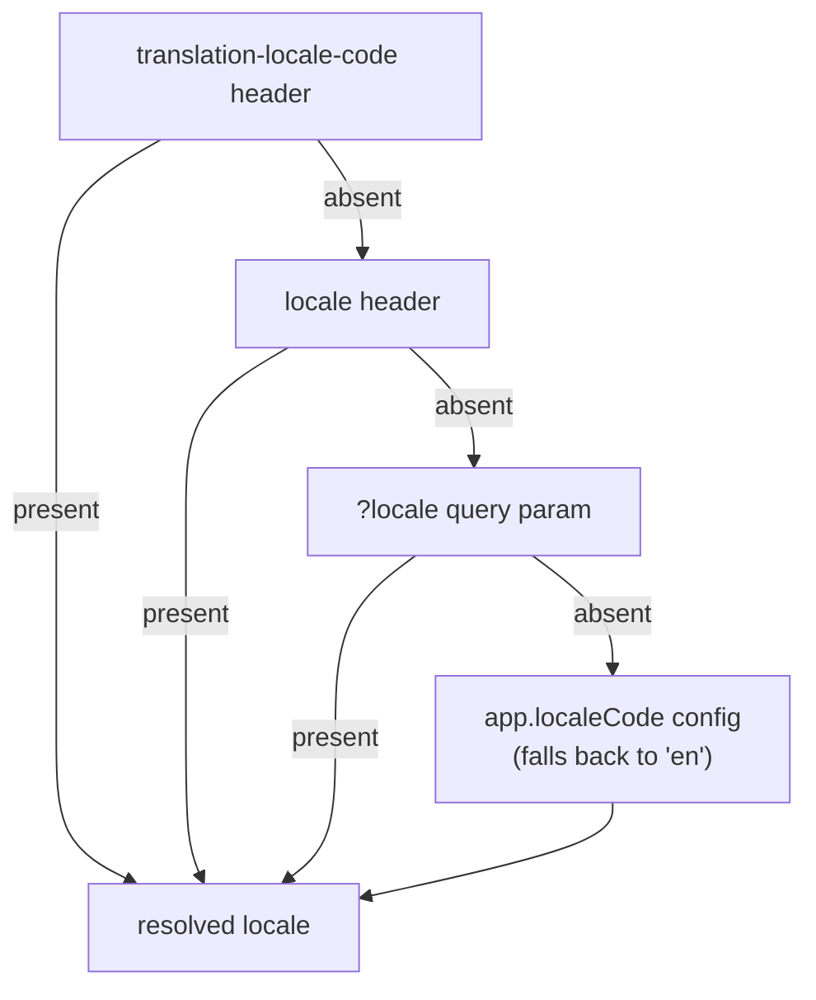

Localization in Warlock is **one resolved locale per request, plus a translation registry and a pair of multi-locale primitives** — a validator for input and a resource cast for output. The framework reads the locale once from the incoming request, binds the translation helpers to it, and every downstream layer (`t()`, the `"localized"` resource cast, `request.trans(...)`) reads from that same value. You rarely pass a locale around by hand.

This page is the concept home: how the locale is **actually** resolved (the precedence is more than the obvious header), where translations live, how to validate multi-locale input, how to ship per-locale output, and what to do outside the HTTP lifecycle. For an end-to-end worked example — wiring every layer for a real product endpoint — see the [Localized responses recipe](../recipes/localized-responses.md).

## The 30-second look

```ts
import { t } from "@warlock.js/core";

// In a controller — locale is already resolved from the request.
export const showProduct: RequestHandler = async (request, response) => {
  const product = await productsRepository.get(request.input("id"));

  if (!product) {
    return response.notFound({ error: t("products.notFound") });
  }

  // The "localized" resource cast picks the request's locale automatically.
  return response.success({ product: new ProductResource(product).toJSON() });
};
```

Three things made that work: the request resolved a locale at construction, `t()` was bound to it, and the resource cast read the same locale. The rest of this page explains each.

## Locale resolution precedence

This is the part the recipe used to under-document. The `Request.locale` getter checks **three** sources, and the very first one is a header that is easy to miss.



In precedence order:

| # | Source | Example | Read by |
| - | ------ | ------- | ------- |
| 1 | **`translation-locale-code` header** | `translation-locale-code: ar` | `request.locale` getter (checked first) |
| 2 | **`locale` header** | `locale: ar` | `request.localized` getter |
| 3 | **`?locale` query param** | `?locale=ar` | `request.localized` getter |
| 4 | **`app.localeCode` config** | defaults to `"en"` | `request.getLocaleCode()` |

The request resolves the locale like this:

```ts title="How the request resolves locale"
public get locale() {
  if (this._locale) return this._locale;

  return this.header("translation-locale-code") || this.localized;
}

public get localized() {
  if (this._locale) return this._locale;

  return (this._locale = this.header("locale") || this.query["locale"]);
}

public getLocaleCode(defaultLocaleCode: string = config.key("app.localeCode") || "en") {
  return this.locale || defaultLocaleCode;
}
```

So `translation-locale-code` wins over everything; `locale` (header or query) is the fallback; the configured default applies only when no source resolved a value. `request.setLocaleCode(code)` (or assigning `request.locale = code`) sets `_locale`, which short-circuits all of the above for the rest of the request.

> The existing [Localized responses recipe](../recipes/localized-responses.md) lists only the `locale` header / `?locale` query / config default. That is the `request.localized` chain — it omits the higher-priority `translation-locale-code` header. When in doubt, this precedence table is authoritative.

### The config key for the default locale

The runtime reads `config.key("app.localeCode")` (see `getLocaleCode()` above). So the default locale lives in `src/config/app.ts` under `localeCode`:

```ts title="src/config/app.ts"
export default {
  localeCode: "en", // default locale when a request specifies none
  locales: ["en", "ar"], // allowed locales (used to preload dayjs locale data)
};
```

Two distinct keys, don't conflate them:

| Config key | Type | Purpose |
| ---------- | ---- | ------- |
| `app.localeCode` | `string` (default `"en"`) | the **default** locale used by `getLocaleCode()` when the request resolves none |
| `app.locales` | `string[]` | the **allowed** locale list; the app config handler preloads `dayjs` locale data for each non-English entry |

Both fields are declared on the `AppConfigurations` type as `localeCode?` and `locales?`. The config handler at `src/config/config-handlers.ts` reads `config.locales` to load `dayjs/locale/<code>`; the request layer reads `app.localeCode` for the default.

## The translation registry

`@warlock.js/core` re-exports `@mongez/localization` wholesale (`export * from "@mongez/localization"` in core's barrel), so `t`, `trans`, `groupedTranslations`, and `setCurrentLocaleCode` are all importable from `@warlock.js/core` **or** `@mongez/localization` — same functions either way.

### Registering translations

Register grouped translations once, typically per module in `utils/locales.ts` (auto-loaded by the framework):

```ts title="src/app/products/utils/locales.ts"
import { groupedTranslations } from "@mongez/localization";

groupedTranslations("products", {
  notFound: {
    en: "Product not found",
    ar: "المنتج غير موجود",
  },
  outOfStock: {
    en: "This product is out of stock",
    ar: "هذا المنتج غير متوفر",
  },
});
```

The group name becomes the namespace: `t("products.notFound")` resolves `products → notFound → <currentLocale>`. Nested groups dot-access naturally (`t("products.errors.invalidPrice")`).

### Reading translations: `t()` vs `trans()`

| Helper | Locale it uses | Use when |
| ------ | -------------- | -------- |
| `t(key, placeholders?)` | the **current request's** locale | inside a request (controllers, services, resources) |
| `trans(key, placeholders?)` | the process-global "current locale" | outside a request, or when you've set the locale manually |
| `request.trans(key, placeholders?)` | this request's resolved locale (bound at construction) | the same as `t()`, but called on an explicit request instance |

Inside a request, prefer `t()`. The framework binds `request.trans`/`request.t` to `transFrom.bind(null, localeCode)` at request construction, and the core `t()` helper delegates to the current request's `trans` (falling back to the global `trans` when there is no request). You never pass the locale — the binding carries it.

```ts
import { t } from "@warlock.js/core";

return response.unauthorized({ error: t("auth.invalidCredentials") });
// locale: ar  → "البريد الالكتروني أو كلمة المرور غير صحيحة"
// locale: en  → "Invalid email or password"
```

### Placeholders

Both `t()` and `trans()` take a placeholders object as the second argument. Define the translation with `{name}`-style tokens and pass matching keys:

```ts
groupedTranslations("products", {
  insufficientQuantity: {
    en: "Only {available} items left",
    ar: "تبقى {available} قطع فقط",
  },
});

t("products.insufficientQuantity", { available: 3 });
// en → "Only 3 items left"
// ar → "تبقى 3 قطع فقط"
```

Unmatched tokens stay as literals, which makes typos visible rather than silent.

### Validation messages are localized for free

Warlock wires seal's rule/attribute translation through this same registry. Rule messages resolve from `validation.<ruleName>` and attribute names from `attributes.<field>`, both via `t()` — so they come out in the request's locale automatically. See [Validation](./validation.md#locale-aware-error-messages) for the message keys.

## Validating multi-locale input: `v.localized()`

When a client submits a field in several locales at once (e.g. a product name in both English and Arabic), validate it with `v.localized()`. `@warlock.js/core` registers this validator on seal's `v` factory at startup.

`v.localized(valueValidator?, errorMessage?)` expects an **array** of `{ localeCode, value }` objects. `localeCode` is a required string; `value` defaults to `v.scalar()` unless you pass a stricter inner validator:

```ts title="src/app/products/validation/create-product.schema.ts"
import { v, type Infer } from "@warlock.js/seal";

export const createProductSchema = v.object({
  // each entry must be { localeCode: string, value: string }
  name: v.localized(v.string().min(2)),
  description: v.localized(v.string()).optional(),
  price: v.number().min(0),
});

export type CreateProductSchema = Infer<typeof createProductSchema>;
```

A valid `name` payload:

```json
{
  "name": [
    { "localeCode": "en", "value": "Premium Hoodie" },
    { "localeCode": "ar", "value": "هودي بريميوم" }
  ]
}
```

This is the **input** half of the localized pair — it validates the multi-locale shape on the way in. The [resource cast](#localized-output-the-localized-cast) below is the **output** half that collapses that shape back down to a single string per request.

## Localized output: the `"localized"` cast

Cascade stores localized columns as `[{ localeCode, value }]` arrays — exactly the shape `v.localized()` validates. The `"localized"` resource cast collapses that array to the single value matching the current request's locale on the way out.

```ts title="src/app/products/resources/product.resource.ts"
import { defineResource } from "@warlock.js/core";

export const ProductResource = defineResource({
  schema: {
    id: "string",
    name: "localized",
    description: "localized",
    price: "number",
  },
});
```

```json
// GET /products/1 with translation-locale-code: ar
{
  "product": {
    "id": "1",
    "name": "هودي بريميوم",
    "description": "قطن ناعم، مقاس واسع",
    "price": 49.99
  }
}
```

How the locale is chosen: the resource reads `useRequestStore()?.request?.locale` — i.e. the same `request.locale` getter, so it honors the `translation-locale-code` header first, then the `locale` header/query. The matching `{ localeCode, value }` entry's `value` is returned. If the stored value is already a plain string (not an array), it passes through unchanged — the gradual-migration case. If no locale resolves, the first entry's value is used.

There is also a builder form, `resource.localized(inputKey?)`, for resources that build fields imperatively rather than via the schema map. The string cast `"localized"` and the builder do the same transform.

For the full cast surface (`"date"`, `"url"`, nested resources, array suffixes, etc.), see [Resources deep dive](./resources-deep.md).

## Explicit locale on a request: `request.transFrom()`

The bound `t()`/`request.trans` always use the request's resolved locale. When you need a **different** locale for one specific call — render an admin notification in the recipient's language while the request itself is in another — use `request.transFrom(localeCode, key, placeholders?)`:

```ts
request.transFrom("ar", "auth.otpExpired");
// → "رمز التحقق منتهي الصلاحية"  (regardless of the request's own locale)
```

This is a thin wrapper over `transFrom` from `@mongez/localization`. It does **not** change the request's locale or re-bind `t()` — it is a one-shot translation in the locale you name.

## Outside a request: `setCurrentLocaleCode` + `trans`

There is no request context in a CLI command, a scheduled job, or a queue worker — so `t()` falls back to the process-global locale. Set that locale explicitly, then use `trans()`:

```ts
import { setCurrentLocaleCode, trans } from "@warlock.js/core";

setCurrentLocaleCode("ar");

const message = trans("auth.otpExpired");
// → "رمز التحقق منتهي الصلاحية"
```

`setCurrentLocaleCode` is process-global. In a worker that handles jobs for different tenants/locales, set it at the **start of each job handler** so one job's locale never leaks into the next. For a single off-locale translation without changing global state, prefer `transFrom(localeCode, key)` directly.

## Gotchas

- **`translation-locale-code` beats the `locale` header and `?locale` query.** If a request sets both `translation-locale-code: en` and `locale: ar`, you get English. The recipe's three-source list omits this header — this page's [precedence table](#locale-resolution-precedence) is the authoritative order.
- **Locale resolves once, lazily, and is then cached on `_locale`.** The first read of `request.locale`/`request.localized` memoizes the value. Calling `request.setLocaleCode("ar")` afterward changes `_locale`, but `t()` was already bound at construction — so for an already-bound `t()` to follow a mid-request change is not guaranteed. To translate in a specific locale mid-request, use `request.transFrom("ar", "key")` explicitly.
- **The default-locale config key is `app.localeCode`, not `app.locale`.** The runtime reads `config.key("app.localeCode")`. `app.locales` (plural) is the separate allowed-list used to preload `dayjs` locale data — it is **not** the default.
- **`t()` / `trans()` return the key itself when nothing matches.** `t("products.unknown")` returns `"products.unknown"` (or the fallback locale's value). Treat an unresolved key as a development bug, not a user-facing string.
- **`v.localized()` validates an array of `{ localeCode, value }`, and the `"localized"` cast expects the same shape.** A `{ en: "...", ar: "..." }` object is neither — convert at the model level if your storage uses that shape.
- **`setCurrentLocaleCode` is process-global.** Outside a request it is the only lever, but it bleeds across jobs if you forget to set it per-job. Inside a request, never call it — use the request-bound `t()`.

## See also

- **[Localized responses recipe](../recipes/localized-responses.md)** — the end-to-end worked example: resolving the locale, translating errors, the resource cast, and `Intl` for dates/numbers, wired into one product endpoint.
- **[Validation](./validation.md)** — `v.localized()` in context, plus how rule/attribute messages localize through this same registry.
- **[Resources deep dive](./resources-deep.md)** — the full cast surface, including `"localized"` and the `.localized()` builder.
- **[HTTP request](./http-request.md)** — `request.locale`, `request.getLocaleCode()`, `request.setLocaleCode()`, and `request.transFrom()`.
