The [essentials page on use-cases](../the-basics/04-use-cases.md) gives you the shape. This is the rest of the story — every field on the config object, how the pipeline actually runs, how retries layer over benchmarks, where errors come from, and the three layers of lifecycle subscription.

Reach for this page when you're past "I made one work" and into "I want it to behave correctly when things go wrong." Most of what's here is opt-in; you can keep using the bare `useCase({ name, handler })` shape and never touch any of it. But when you do need a retry on a flaky webhook, or you want every use-case in the app to push timings into a metrics channel, this is where the wiring lives.

## The full config surface

```ts
useCase<TOutput, TInput>({
  name,
  schema,
  guards,
  before,
  handler,
  after,
  onExecuting,
  onCompleted,
  onError,
  retryOptions,
  benchmarkOptions,
});
```

Every field except `name` and `handler` is optional. The two type parameters are the output shape and the input shape — TypeScript infers the runtime types from these.

| Field              | Type                                         | When you reach for it                                                                  |
| ------------------ | -------------------------------------------- | -------------------------------------------------------------------------------------- |
| `name`             | `string`                                     | Always. The registry key, cache key, log key.                                          |
| `handler`          | `(data, ctx) => Promise<TOutput>`            | Always. The actual work.                                                               |
| `schema`           | `ObjectValidator` (from `@warlock.js/seal`)  | When input shape is non-trivial. Runs after guards.                                    |
| `guards`           | `UseCaseGuard<TInput>[]`                     | Authorization / preconditions that should kill the request before validation runs.     |
| `before`           | `UseCaseBeforeMiddleware<TInput>[]`          | Data transforms — normalise email, calculate tax, enrich with pricing.                 |
| `after`            | `UseCaseAfterMiddleware<TOutput>[]`          | Fire-and-forget side effects — emails, webhooks, cache invalidation.                   |
| `onExecuting`      | `(ctx) => void`                              | Per-use-case start hook — log every login attempt, kick off a tracing span.            |
| `onCompleted`      | `(result) => void`                           | Per-use-case success hook — push metrics, record analytics.                            |
| `onError`          | `(ctx) => void`                              | Per-use-case error hook — alerting, error budget tracking.                             |
| `retryOptions`     | `{ count, delay, shouldRetry }`              | When the handler talks to a flaky external system that's worth retrying.               |
| `benchmarkOptions` | `BenchmarkOptions \| false`                  | Latency classification + hooks. Set to `false` to disable for one use-case.            |

Two of these — `retryOptions` and `benchmarkOptions` — also accept defaults from `config.get("use-cases")`. Per-use-case settings win; the config is what you fall through to.

## The pipeline, in order

A successful run touches every phase. A failure short-circuits.

```mermaid
flowchart TD
    start([useCase&#40;data, runtime&#41;])
    execEvent[onExecuting fires<br/><i>invocation → use-case → global</i>]
    guards[guards run<br/><i>sequential, Readonly data</i>]
    schema[schema validation]
    before[before middleware<br/><i>sequential, can transform data</i>]
    handler[handler]
    after[after middleware<br/><i>fire-and-forget, errors logged</i>]
    history[history snapshot written]
    completedEvent[onCompleted fires<br/><i>invocation → use-case → global</i>]

    start --> execEvent
    execEvent --> guards
    guards --> schema
    schema --> before
    before --> handler
    handler --> after
    after --> history
    history --> completedEvent

    guards -. throws .-> errorEvent[onError fires<br/>error re-thrown]
    schema -. invalid .-> errorEvent
    before -. throws .-> errorEvent
    handler -. throws .-> errorEvent
```



The order is fixed. You can't reorder phases. That's the value — every use-case in the app behaves the same way.

### Phase 1 — `onExecuting`

The first thing that runs. Fires three times in a row: invocation-level callback first (passed at the call site), then the use-case-level callback (declared in `useCase({...})`), then every global subscriber. Each one is awaited before the next runs.

Use it for tracing — `tracer.startSpan(name, { attributes: { useCaseId: ctx.id } })`. Use it for boot-time logging — `log.info("usecase.start", { name, id })`. Don't use it to mutate `ctx` in a way the handler relies on; that's what guards and `before` are for.

The context shape:

```ts
type UseCaseOnExecutingContext = {
  ctx: UseCaseContext;
  id: string;
  name: string;
  data: any;
  schema: ObjectValidator;
  startedAt: Date;
};
```

### Phase 2 — guards

Guards are authorization. They run before schema validation because there's no point running schema validation on input from a caller who isn't allowed to be here.

```ts
const authGuard: UseCaseGuard<PlaceOrderInput> = async (data, ctx) => {
  const user = await loadUserFromToken(ctx.token);

  if (!user) {
    throw new UnAuthorizedError("auth.invalidToken");
  }

  ctx.currentUser = user;
};
```

Three rules:

1. **`data` is `Readonly<TInput>`** — TypeScript enforces it, and the framework freezes the object before passing it. Mutation goes in `before` middleware.
2. **Throwing aborts the pipeline.** `onError` fires, the error re-throws to the caller. Pick the right `HttpError` subclass (`UnAuthorizedError`, `ForbiddenError`, `ConflictError`) so the framework's catch-all maps it to the right status code.
3. **Enrich `ctx`.** Set `ctx.currentUser`, `ctx.permissions`, `ctx.organization` — anything later phases need.

Guards run sequentially in array order. Auth first, then role, then rate limit — the order matters and the framework respects it.

The internal type is straightforward:

```ts
type UseCaseGuard<TInput> = (
  data: Readonly<TInput>,
  ctx: UseCaseContext,
) => void | Promise<void>;
```

### Phase 3 — schema validation

If you pass `schema`, the framework runs `v.validate(schema, data)` from `@warlock.js/seal`. On failure it throws `BadSchemaUseCaseError` (status 400, `code: "BAD_SCHEMA_USE_CASE"`, full error payload):

```ts
export class BadSchemaUseCaseError extends HttpError {
  public constructor(result: ValidationResult) {
    super(400, "Invalid input data", {
      code: "BAD_SCHEMA_USE_CASE",
      errors: result.errors,
    });
  }
}
```

The framework's catch-all maps `HttpError` subclasses to the right response automatically — your controller doesn't need a try/catch. The validated and parsed `data` is what gets passed to the next phase, so any `.transform(...)` calls in the schema take effect here.

### Phase 4 — before middleware

Now you can transform data. Each middleware receives the current data, optionally enriches `ctx`, and returns the (possibly transformed) data:

```ts
const normalizeAddress: UseCaseBeforeMiddleware<PlaceOrderInput> = async (data, ctx) => {
  return {
    ...data,
    address: {
      ...data.address,
      country: data.address.country.toUpperCase(),
    },
  };
};

const calculateTax: UseCaseBeforeMiddleware<PlaceOrderInput> = async (data, ctx) => {
  ctx.tax = await taxService.compute(data.items, data.address);
  return data;
};
```

The middleware contract:

```ts
type UseCaseBeforeMiddleware<TInput> = (
  data: TInput,
  ctx: UseCaseContext,
) => TInput | Promise<TInput>;
```

Output of one middleware becomes input of the next. Throwing aborts the pipeline the same way a guard does.

### Phase 5 — handler

The actual work. It receives the validated + transformed data plus the enriched `ctx`:

```ts
handler: async (data, ctx) => {
  const order = await orderService.create({
    ...data,
    user_id: ctx.currentUser.id,
    tax: ctx.tax,
  });

  return { orderId: order.id, total: order.total };
};
```

Throwing aborts the pipeline. The return value becomes the use-case's output.

### Phase 6 — after middleware

Runs on success only. Errors are caught and logged via `console.error("[use-case] After middleware error in <name>:", err)`. They never re-throw and never affect the return value:

```ts
const sendConfirmationEmail: UseCaseAfterMiddleware<OrderOutput> = async (output, ctx) => {
  await mailer.send({
    to: ctx.currentUser.email,
    template: "order-confirmation",
    data: { orderId: output.orderId },
  });
};
```

This is the right home for fire-and-forget work — analytics, webhooks, cache invalidation, notifications. Anything that shouldn't fail the user's request if the side-effect itself fails.

The contract:

```ts
type UseCaseAfterMiddleware<TOutput> = (
  output: TOutput,
  ctx: UseCaseContext,
) => void | Promise<void>;
```

### Phase 7 — history + `onCompleted`

After after-middleware, the framework writes a snapshot to cache (more on history below) and then fires the `onCompleted` callbacks — invocation, use-case, global, in that order. The shape passed in:

```ts
type UseCaseResult<TOutput> = {
  output?: TOutput;
  ctx: UseCaseContext;
  startedAt: Date;
  endedAt: Date;
  id: string;
  name: string;
  calls: number;
  retries?: { count, currentRetry?, delay? };
  benchmarkResult?: { latency, state };
};
```

### Phase 8 — `onError`

On failure, the framework builds an error snapshot (the result shape minus `output`, plus `error: Error`), fires the three-tier `onError` chain, then re-throws:

```ts
type UseCaseErrorResult = Omit<UseCaseResult, "output"> & {
  error: Error;
};
```

The use-case throws to its caller. If the caller is a controller, the framework's catch-all maps `HttpError` subclasses to responses. Anything else becomes a 500.

## The context (`ctx`)

`ctx` is the shared dictionary every phase reads and writes. The framework seeds it with `schema` (if defined) and `id` (the execution id); you populate the rest.

```ts
type UseCaseContext = {
  schema?: ObjectValidator;
} & Record<string, any>;
```

It's `Record<string, any>` on purpose — pragmatic, not strict. The intent is for `ctx` to carry the things that are "request-scoped" without polluting the input shape:

- The current user, the current organization, the current permissions — set in guards, read in the handler.
- Computed values that handlers and after-middleware both need — tax totals, pricing breakdowns.
- Request correlation — request id, trace id, the IP address.

You can also seed `ctx` from the call site:

```ts
await placeOrderUseCase(data, {
  ctx: { token: request.accessToken, requestId: request.id },
});
```

The use-case definition reads what it needs and ignores the rest.

## Runtime options — overrides at the call site

The second argument is `UseCaseRuntimeOptions`. Use it for per-call overrides:

```ts
await placeOrderUseCase(input, {
  id: "order-from-cli",
  ctx: { token: cliAuthToken, source: "cli" },
  onCompleted: (result) => console.log("Done:", result.output),
  onError: (ctx) => alertCliUser(ctx.error),
});
```

| Field         | Use                                                                  |
| ------------- | -------------------------------------------------------------------- |
| `id`          | Override the auto-generated execution id (default: `uc-<name>-...`)  |
| `ctx`         | Pre-populate the context                                             |
| `onExecuting` | Invocation-level start callback (fires first, before use-case-level) |
| `onCompleted` | Invocation-level success callback                                    |
| `onError`     | Invocation-level error callback                                      |

The invocation-level callbacks fire **first**, then the use-case-level callbacks, then the global subscribers. That's the order for every lifecycle event.

## Retries

`retryOptions` wraps the pipeline (excluding `after` middleware) in a retry loop:

```ts
useCase({
  name: "billing.charge-card",
  retryOptions: {
    count: 3,
    delay: 500,
    shouldRetry: (error) => !(error instanceof ValidationError),
  },
  handler: async (data) => paymentGateway.charge(data),
});
```

The shape:

```ts
type RetryOptions = {
  count?: number;
  delay?: number;
  shouldRetry?: (error: unknown, attempt: number) => boolean;
};
```

| Field         | Default | What it does                                                                              |
| ------------- | ------- | ----------------------------------------------------------------------------------------- |
| `count`       | `0`     | Number of retries **after** the first failure. Total attempts = `count + 1`.              |
| `delay`       | `0`     | Milliseconds to wait between attempts. The final failure does not wait.                   |
| `shouldRetry` | none    | Predicate. Return `false` to bail out early — useful for "don't retry on 4xx".            |

If every attempt fails, the last error is what re-throws. `onError` fires once with that final error; intermediate failures aren't reported separately.

Two things to watch:

- **Retries don't replay `after` middleware on success.** After only runs once, after the final successful attempt.
- **`shouldRetry` runs after `onError`'s normal path doesn't.** A failed attempt where `shouldRetry` returns `false` re-throws immediately without retry — `onError` fires once with that error, same as any other terminal failure.

A real shape for a flaky external API:

```ts
useCase({
  name: "shipments.create-label",
  retryOptions: {
    count: 5,
    delay: 1000,
    shouldRetry: (error) => {
      if (error instanceof BadSchemaUseCaseError) return false;
      if (error instanceof HttpError && error.statusCode < 500) return false;
      return true;
    },
  },
  handler: async (data) => shippingApi.createLabel(data),
});
```

Five retries with one-second delays — but skip the retry on any 4xx response, because retrying a "your input is bad" error doesn't help.

## Benchmark

`benchmarkOptions` wraps the pipeline in a timing measurement. Set it to `true` to use config defaults, an object to customize, or `false` to disable for one use-case:

```ts
useCase({
  name: "catalog.import",
  benchmarkOptions: {
    latencyRange: { excellent: 200, poor: 2000 },
    onComplete: (result) => metrics.record("catalog.import.duration", result.latency),
    tags: { domain: "catalog" },
  },
  handler: async (data) => catalogService.import(data),
});
```

The full shape:

```ts
type BenchmarkOptions<T> = {
  enabled?: boolean;
  latencyRange?: { excellent: number; poor: number };
  onComplete?: (result: BenchmarkSuccessResult<T>) => void;
  onError?: (result: BenchmarkErrorResult) => void;
  onFinish?: (result: BenchmarkSuccessResult<T> | BenchmarkErrorResult) => void;
  tags?: Record<string, string>;
  shouldBenchmarkError?: (error: unknown) => boolean;
  profiler?: BenchmarkProfiler | false;
  snapshotContainer?: BenchmarkSnapshots | false;
};
```

The interesting fields:

- **`latencyRange`** — thresholds for the `state` classification. Latency `<= excellent` is `"excellent"`. Latency `>= poor` is `"poor"`. In between is `"good"`. Default is whatever `config.get("benchmark")` exposes; fall back to no classification (`"good"` always).
- **`shouldBenchmarkError`** — predicate for "should this error be counted in stats." Return `false` for validation errors and other "the caller did something wrong" failures; return `true` for technical failures you actually want metrics on.
- **`profiler`** — an optional `BenchmarkProfiler` instance that aggregates samples into stats (p50/p90/p95/p99, error rate). Push it to a channel (Datadog, OTel, console) periodically.
- **`onComplete` / `onError` / `onFinish`** — per-call hooks that fire after the measurement. `onFinish` runs for both success and error.

The benchmark result lands on `UseCaseResult.benchmarkResult` as `{ latency, state }`, which is what the lifecycle callbacks see.

## Lifecycle events — three layers

Three places to subscribe to the same events. They all fire for every use-case execution; pick the layer based on scope.

### Invocation-level (per call)

Passed in `UseCaseRuntimeOptions` — these fire first:

```ts
await placeOrderUseCase(input, {
  onCompleted: (result) => console.log("This one done:", result.output),
});
```

Use for: one-off tracing, CLI feedback, test assertions.

### Use-case-level (per use-case)

Declared in the `useCase({...})` config — these fire second:

```ts
useCase({
  name: "auth.login",
  onCompleted: (result) => analytics.track("login", { userId: result.output?.user.id }),
  onError: (ctx) => alerting.warn("login.failed", { reason: ctx.error.message }),
  handler: loginHandler,
});
```

Use for: per-use-case metrics, per-use-case alerts, per-use-case logging context.

### Global (every use-case)

Subscribed via `globalUseCasesEvents` — these fire third:

```ts
import { globalUseCasesEvents } from "@warlock.js/core";

globalUseCasesEvents.onCompleted((result) => {
  metrics.record(`usecase.${result.name}.duration`, result.benchmarkResult?.latency ?? 0);
  metrics.increment(`usecase.${result.name}.success`);
});

globalUseCasesEvents.onError((ctx) => {
  log.error("usecase.error", {
    name: ctx.name,
    id: ctx.id,
    error: ctx.error.message,
    stack: ctx.error.stack,
  });
});

const subscription = globalUseCasesEvents.onExecuting((ctx) => {
  log.debug("usecase.start", { name: ctx.name, id: ctx.id });
});

// Later, in tests or for teardown:
subscription.unsubscribe();
```

Use for: cross-cutting concerns — every use-case pushed into the same metrics surface, the same audit log, the same tracing system. Register these once at boot (in `src/app/<module>/main.ts` or a dedicated `events.ts` file).

The signatures:

```ts
globalUseCasesEvents.onExecuting((ctx: UseCaseOnExecutingContext) => void);
globalUseCasesEvents.onCompleted(<T>(result: UseCaseResult<T>) => void);
globalUseCasesEvents.onError((ctx: UseCaseErrorResult) => void);
```

Each returns `{ unsubscribe: () => void }` — useful in tests.

## Execution history

Every successful run writes a snapshot to the cache:

```
use-case:history:<name>:<id>           → UseCaseResult
use-case:history:<name>:list           → string[]   (list of ids)
```

The TTL comes from `config.get("use-cases").history.ttl` (default 1 hour). Set `history.enabled: false` to turn it off globally. Set `history.ttl: false` to fall back to the cache driver's default.

Read history programmatically:

```ts
import { getUseCaseHistory } from "@warlock.js/core";

const recentLogins = await getUseCaseHistory("auth.login");
const slowOnes = recentLogins.filter((entry) => entry.benchmarkResult?.state === "poor");
```

Useful for debugging slow endpoints in dev. In production, prefer pushing benchmark snapshots into a real metrics backend via `globalUseCasesEvents.onCompleted` — the cache is bounded by TTL and not a substitute for proper observability.

## App-level config

`config.get("use-cases")` is the source for defaults that apply to every use-case unless the per-use-case config overrides them. Live in `src/config/use-cases.ts`:

```ts title="src/config/use-cases.ts"
import { defineConfig } from "@warlock.js/core";

export default defineConfig({
  "use-cases": {
    benchmarkOptions: {
      enabled: true,
      latencyRange: { excellent: 100, poor: 1000 },
    },
    retryOptions: {
      count: 0,
      delay: 0,
    },
    history: {
      enabled: true,
      ttl: 3600,
    },
  },
});
```

Resolution order is per-use-case → app config → framework defaults (`benchmark.enabled = true`, `retry.count = 0`, `history.enabled = true`, `history.ttl = 3600`).

## The registry

Every `useCase()` call registers itself. You can read the registry at runtime:

```ts
import { getUseCase, getUseCases } from "@warlock.js/core";

const login = getUseCase("auth.login");
const everything = getUseCases();

for (const [name, entry] of everything) {
  console.log(name, entry.calls);
  // { success: 12, failed: 1, total: 13 }
}
```

The registry is in-memory (the history goes to the cache). Useful for:

- A `/admin/usecases` dashboard route in dev that lists names, descriptions, call counts.
- A CLI command that prints a "what's defined" table.
- Tests that assert a use-case is registered before exercising it.

Dev-mode warning: registering the same name twice logs `Use case "<name>" is already registered. Overwriting.` It's a guardrail for catching accidental duplicate names — the second registration wins.

## Error classes

The framework provides one use-case-specific error class plus the generic `HttpError` family:

| Error                  | When it fires                                         | Status |
| ---------------------- | ----------------------------------------------------- | ------ |
| `BadSchemaUseCaseError` | Schema validation failed                              | 400    |
| `UnAuthorizedError`    | Guard threw this (typical for auth failures)          | 401    |
| `ForbiddenError`       | Guard threw this (typical for permission failures)    | 403    |
| `ConflictError`        | Guard or handler threw this (uniqueness / conflicts)  | 409    |
| `ResourceNotFoundError`| Handler threw this (record missing)                   | 404    |
| Any other `Error`      | Anywhere — re-thrown as 500 by the framework catch-all | 500    |

All `HttpError` subclasses map to the right status code automatically. You only catch them yourself if you have something specific to do — most controllers don't have a try/catch at all.

## A rich end-to-end example

A realistic "place an order" use-case. Auth check, schema validation, address normalization, tax calculation, the actual order creation, then two fire-and-forget side effects:

```ts title="src/app/orders/use-cases/place-order.usecase.ts"
import { ForbiddenError, useCase } from "@warlock.js/core";
import { v } from "@warlock.js/seal";
import { type User } from "app/users/models/user";
import { orderService } from "../services/order.service";
import { taxService } from "app/tax/services/tax.service";
import { mailer } from "app/shared/services/mailer";

type PlaceOrderInput = {
  items: { catalogItemId: string; quantity: number }[];
  address: {
    line1: string;
    city: string;
    country: string;
    zip: string;
  };
};

type PlaceOrderOutput = {
  orderId: string;
  total: number;
  tax: number;
};

const placeOrderSchema = v.object({
  items: v
    .array(
      v.object({
        catalogItemId: v.string(),
        quantity: v.number().min(1),
      }),
    )
    .min(1),
  address: v.object({
    line1: v.string(),
    city: v.string(),
    country: v.string().length(2),
    zip: v.string(),
  }),
});

const authGuard = async (_data: Readonly<PlaceOrderInput>, ctx: Record<string, any>) => {
  const user: User | null = await loadUserFromToken(ctx.token);

  if (!user) {
    throw new ForbiddenError("Sign in to place an order");
  }

  ctx.currentUser = user;
};

const rateLimitGuard = async (_data: Readonly<PlaceOrderInput>, ctx: Record<string, any>) => {
  const recent = await orderService.recentCountByUser(ctx.currentUser.id);

  if (recent > 20) {
    throw new ForbiddenError("Slow down — too many recent orders");
  }
};

const normalizeAddress = (data: PlaceOrderInput) => ({
  ...data,
  address: { ...data.address, country: data.address.country.toUpperCase() },
});

const calculateTax = async (data: PlaceOrderInput, ctx: Record<string, any>) => {
  ctx.tax = await taxService.compute(data.items, data.address);
  return data;
};

const sendConfirmation = async (output: PlaceOrderOutput, ctx: Record<string, any>) => {
  await mailer.send({
    to: ctx.currentUser.email,
    template: "order-confirmation",
    data: { orderId: output.orderId, total: output.total },
  });
};

const notifyWarehouse = async (output: PlaceOrderOutput) => {
  await fetch("https://warehouse.internal/orders", {
    method: "POST",
    body: JSON.stringify({ orderId: output.orderId }),
  });
};

export const placeOrderUseCase = useCase<PlaceOrderOutput, PlaceOrderInput>({
  name: "orders.place",
  schema: placeOrderSchema,
  guards: [authGuard, rateLimitGuard],
  before: [normalizeAddress, calculateTax],
  handler: async (data, ctx) => {
    const order = await orderService.create({
      ...data,
      user_id: ctx.currentUser.id,
      tax: ctx.tax,
    });

    return { orderId: order.id, total: order.total, tax: ctx.tax };
  },
  after: [sendConfirmation, notifyWarehouse],
  retryOptions: {
    count: 2,
    delay: 500,
    shouldRetry: (error) => {
      if (error instanceof ForbiddenError) return false;
      return true;
    },
  },
  benchmarkOptions: {
    latencyRange: { excellent: 300, poor: 2000 },
  },
  onError: (ctx) => {
    if (ctx.error.message.includes("warehouse")) {
      alerting.fire("warehouse.unreachable", { orderId: ctx.id });
    }
  },
});
```

And the controller:

```ts title="src/app/orders/controllers/place-order.controller.ts"
import type { RequestHandler } from "@warlock.js/core";
import { placeOrderUseCase } from "../use-cases/place-order.usecase";

export const placeOrderController: RequestHandler = async (request, response) => {
  const result = await placeOrderUseCase(request.validated(), {
    ctx: { token: request.accessToken },
  });

  return response.successCreate({ order: result });
};
```

One async call. The pipeline runs transparently. The controller stays at three lines of code.

## When to use a use-case vs a plain service

A **service** is a function: input in, output out. No pipeline.

A **use-case** is a service plus the framework's structured pipeline around it — guards, schema validation, retries, benchmarks, lifecycle events.

Reach for a use-case when **at least one of these is true**:

- You want authorization to run before validation, before the work.
- You want retries with a predicate (`shouldRetry`) on transient failures.
- You want fire-and-forget side effects that can fail without failing the user's response.
- You want benchmark + history tracking — slow endpoint debugging, capacity planning.
- You want a single named event surface for global subscribers (`globalUseCasesEvents`).
- You want the call to show up in the registry by name (`getUseCase("orders.place")`).

Stick with a plain service when:

- It's a single delegation (`Faq.find(id)`) — no pipeline value to add.
- The work runs inside a `request` handler that's already guarded by route middleware.
- You don't need retries, benchmarks, history, or lifecycle events.

The `listFaqsService` from the reference codebase is the textbook plain-service case — it just calls `faqsRepository.listCached(filters)`. No use-case needed; the controller calls the service directly.

## Gotchas

- **Guards see `Readonly<TInput>`.** TypeScript catches mutation at compile time, and the framework `Object.freeze`s the value at runtime. Transform in `before` middleware.
- **Schema runs after guards, not before.** Opposite of some frameworks. Don't rely on schema-validated data inside a guard — the guard runs first.
- **After-middleware errors are silent.** Logged via `console.error` with the prefix `[use-case] After middleware error in "<name>":`. They don't escalate. If a side-effect must succeed, put it in `before` or as a separate controller call.
- **`benchmarkOptions: false` disables benchmarking for that one use-case** even if the app config enables it globally.
- **`history.ttl: false` is "use cache default,"** not "no expiry." Set `enabled: false` if you want no history at all.
- **`name` should be unique across the app.** Duplicates warn in dev mode and the second one wins — usually a bug.
- **Retries don't replay `after`.** After runs once, after the final successful attempt.
- **The invocation `id` is `uc-<name>-<random>` by default.** Override it via `runtime.id` when you want to correlate logs across the use-case and an external system.

## See also

- **[Use-cases (essentials)](../the-basics/04-use-cases.md)** — the shape, the pipeline order, the everyday usage.
- **[Repositories deep dive](./repositories-deep.md)** — the layer the handler typically delegates to.
- **[Resources deep dive](./resources-deep.md)** — the layer that shapes the use-case's output for the wire.
- **[Validation](./validation.md)** — writing schemas with seal.
- **[Restful](./restful.md)** — when CRUD handlers replace controller-per-action wiring.
